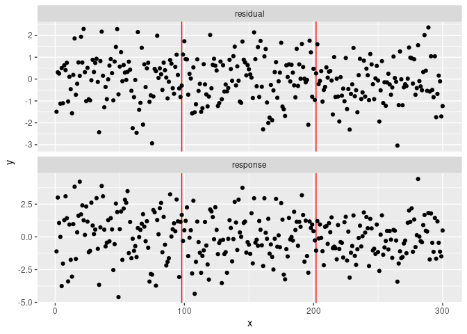
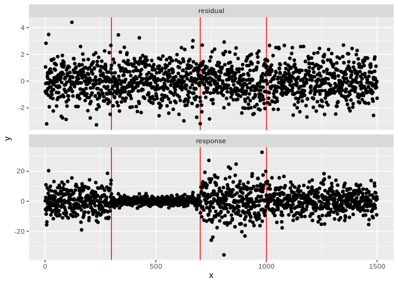
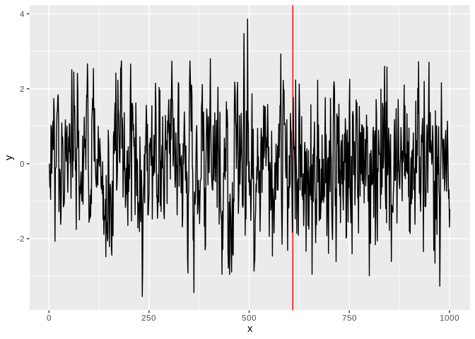
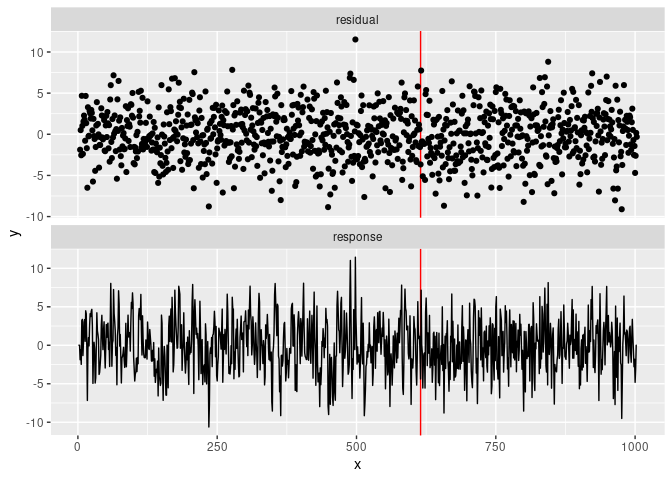

<!-- README.md is generated from README.Rmd. Please edit that file -->

# fastcpd <a href="https://fastcpd.xingchi.li"></a>

[](https://cran.r-project.org/package=fastcpd)
[](https://cran.r-project.org/package=fastcpd)
[](https://github.com/doccstat/fastcpd/actions)
[](https://app.codecov.io/gh/doccstat/fastcpd?branch=main)
[](https://github.com/doccstat/fastcpd)
[](https://doccstat.r-universe.dev)
[](https://www.codefactor.io/repository/github/doccstat/fastcpd)

## Overview

The fastcpd (**fast** **c**hange **p**oint **d**etection) is a fast
implmentation of change point detection methods in R. The **fastcpd**
package is designed to find change points in a fast manner. It is easy
to install and extensible to all kinds of change point problems with a
user specified cost function apart from the built-in cost functions.

To learn more behind the algorithms:

- [Sequential Gradient Descent and Quasi-Newton’s Method for
  Change-Point
  Analysis](https://proceedings.mlr.press/v206/zhang23b.html)

## Installation

``` r
# Install from CRAN
install.packages("fastcpd")
```

<details close>
<summary>
Development version
</summary>

``` r
# Development version from r-universe with CRAN version as a fallback
install.packages(
  "fastcpd",
  repos = c("https://doccstat.r-universe.dev", "https://cloud.r-project.org")
)

## install.packages("pak")
pak::pak("doccstat/fastcpd")

## install.packages("devtools")
devtools::install_github("doccstat/fastcpd")
```

</details>
<details close>
<summary>
With mamba or conda (available soon)
</summary>

``` bash
# conda-forge is a fork from CRAN and may not be up-to-date

# Use mamba
mamba install r-fastcpd
# Use conda
conda install -c conda-forge r-fastcpd
```

</details>

### FAQ

<details close>
<summary>
Package dependencies
</summary>

`fastcpd` depends on the following packages:

- [Rcpp](https://github.com/RcppCore/Rcpp), for C++ source code
  compilation.
- [RcppArmadillo](https://github.com/RcppCore/RcppArmadillo), for fast
  linear algebra.
- [fastglm](https://github.com/jaredhuling/fastglm), for fast
  generalized linear models.
- [DescTools](https://github.com/AndriSignorell/DescTools), for
  Winsorizing Poisson data.
- [glmnet](https://glmnet.stanford.edu/), for penalized regression.
- [ggplot2](https://github.com/tidyverse/ggplot2), for data
  visualization.

If you’re compiling from source, you can run the following command to
see the complete set of system packages needed on your machine.

``` r
pak::pkg_sysreqs("doccstat/fastcpd")
#> ── Install scripts ───────────────────────────────────────────── Ubuntu 20.04
#> apt-get -y update
#> apt-get -y install libcurl4-openssl-dev libssl-dev zlib1g-dev make
#>
#> ── Packages and their system dependencies ───────────────────────────────────
#> curl       – libcurl4-openssl-dev, libssl-dev
#> data.table – zlib1g-dev
#> fs         – make
#> openssl    – libssl-dev
```

</details>
<details close>
<summary>
I countered problems related to gfortran on Mac OSX or Linux!
</summary>

The package should be able to install on Mac and any Linux distribution
without any problems if all the dependencies are installed. However, if
you encountered problems related to gfortran, it might be because
`RcppArmadillo` is not installed previously. Try [Mac OSX stackoverflow
solution](https://stackoverflow.com/a/72997915) or [Linux stackover
solution](https://stackoverflow.com/a/15540919) if you have trouble
installing `RcppArmadillo`.

</details>

## Cheatsheet

[](https://github.com/doccstat/fastcpd/blob/main/man/figures/cheatsheets.pdf)

<!-- TODO(doccstat): Leave only one example. -->

## Examples

[Documentation](https://fastcpd.xingchi.li/reference/fastcpd.html)

<!-- This example section is a direct copy from `fastcpd` documentation -->
<details open>
<summary>
Click to fold
</summary>

### linear regression

``` r
library(fastcpd)
set.seed(1)
p <- 3
x <- mvtnorm::rmvnorm(300, rep(0, p), diag(p))
theta_0 <- rbind(c(1, 1.2, -1), c(-1, 0, 0.5), c(0.5, -0.3, 0.2))
y <- c(
  x[1:100, ] %*% theta_0[1, ] + rnorm(100, 0, 1),
  x[101:200, ] %*% theta_0[2, ] + rnorm(100, 0, 1),
  x[201:300, ] %*% theta_0[3, ] + rnorm(100, 0, 1)
)
result <- fastcpd(
  formula = y ~ . - 1,
  data = data.frame(y = y, x = x),
  family = "gaussian"
)
plot(result)
```

<!-- -->

``` r
summary(result)
#> 
#> Call:
#> fastcpd(formula = y ~ . - 1, data = data.frame(y = y, x = x), 
#>     family = "gaussian")
#> 
#> Change points:
#> 98 202 
#> 
#> Cost values:
#> 53.44023 53.1441 45.04974 
#> 
#> Parameters:
#>    segment 1   segment 2  segment 3
#> 1  0.9704022 -1.07884004  0.5925092
#> 2  1.1786074 -0.01757927 -0.5287126
#> 3 -0.9258587  0.63906143  0.1929411
```

### linear regression with one-dimensional covariate

``` r
library(fastcpd)
set.seed(1)
p <- 1
x <- mvtnorm::rmvnorm(300, rep(0, p), diag(p))
theta_0 <- matrix(c(1, -1, 0.5))
y <- c(
  x[1:100, ] * theta_0[1, ] + rnorm(100, 0, 1),
  x[101:200, ] * theta_0[2, ] + rnorm(100, 0, 1),
  x[201:300, ] * theta_0[3, ] + rnorm(100, 0, 1)
)
result <- fastcpd(
  formula = y ~ . - 1,
  data = data.frame(y = y, x = x),
  family = "gaussian"
)
plot(result)
```

<!-- -->

``` r
summary(result)
#> 
#> Call:
#> fastcpd(formula = y ~ . - 1, data = data.frame(y = y, x = x), 
#>     family = "gaussian")
#> 
#> Change points:
#> 100 194 
#> 
#> Cost values:
#> 48.71927 57.20738 63.15088 
#> 
#> Parameters:
#>   segment 1  segment 2 segment 3
#> 1 0.9520606 -0.8054074 0.3692224
```

### linear regression with noise variance not equal to 1

``` r
library(fastcpd)
set.seed(1)
p <- 4
n <- 300
cp <- c(100, 200)
x <- mvtnorm::rmvnorm(n, rep(0, p), diag(p))
theta_0 <- rbind(c(1, 3.2, -1, 0), c(-1, -0.5, 2.5, -2), c(0.8, -0.3, 1, 1))
y <- c(
  x[1:cp[1], ] %*% theta_0[1, ] + rnorm(cp[1], 0, sd = 3),
  x[(cp[1] + 1):cp[2], ] %*% theta_0[2, ] + rnorm(cp[2] - cp[1], 0, sd = 3),
  x[(cp[2] + 1):n, ] %*% theta_0[3, ] + rnorm(n - cp[2], 0, sd = 3)
)

result <- fastcpd(
  data = data.frame(y = y, x = x),
  family = "gaussian"
)
summary(result)
#> 
#> Call:
#> fastcpd(data = data.frame(y = y, x = x), family = "gaussian")
#> 
#> Change points:
#> 100 201 
#> 
#> Cost values:
#> 499.5254 328.5244 459.3819 
#> 
#> Parameters:
#>    segment 1  segment 2  segment 3
#> 1  0.7054739 -0.5373328 0.23439463
#> 2  0.8005173 -0.8915565 0.87884516
#> 3  3.6097492 -0.5539604 0.03698789
#> 4 -1.3438206  2.2831450 1.01253653
#> 5  0.1352143 -2.0567371 1.28948015
```

### logistic regression

``` r
library(fastcpd)
set.seed(1)
x <- matrix(rnorm(1500, 0, 1), ncol = 5)
theta <- rbind(rnorm(5, 0, 1), rnorm(5, 2, 1))
y <- c(
  rbinom(125, 1, 1 / (1 + exp(-x[1:125, ] %*% theta[1, ]))),
  rbinom(175, 1, 1 / (1 + exp(-x[126:300, ] %*% theta[2, ])))
)
result <- suppressWarnings(fastcpd(
  formula = y ~ . - 1,
  data = data.frame(y = y, x = x),
  family = "binomial"
))
summary(result)
#> 
#> Call:
#> fastcpd(formula = y ~ . - 1, data = data.frame(y = y, x = x), 
#>     family = "binomial")
#> 
#> Change points:
#> 126 
#> 
#> Cost values:
#> 56.90525 30.76875 
#> 
#> Parameters:
#>    segment 1 segment 2
#> 1  0.7259293  1.878525
#> 2 -1.0294802  2.704376
#> 3  1.0576503  3.702310
#> 4 -0.8812767  2.258796
#> 5  0.2419351  2.524173
```

### poisson regression

``` r
library(fastcpd)
set.seed(1)
p <- 3
x <- mvtnorm::rmvnorm(1500, rep(0, p), diag(p))
delta <- rnorm(p)
theta_0 <- c(1, 1.2, -1)
y <- c(
  rpois(300, exp(x[1:300, ] %*% theta_0)),
  rpois(400, exp(x[301:700, ] %*% (theta_0 + delta))),
  rpois(300, exp(x[701:1000, ] %*% theta_0)),
  rpois(100, exp(x[1001:1100, ] %*% (theta_0 - delta))),
  rpois(200, exp(x[1101:1300, ] %*% theta_0)),
  rpois(200, exp(x[1301:1500, ] %*% (theta_0 + delta)))
)
result <- fastcpd(
  formula = y ~ . - 1,
  data = data.frame(y = y, x = x),
  beta = (p + 1) * log(1500) / 2,
  k = function(x) 0,
  family = "poisson",
  epsilon = 1e-5
)
summary(result)
#> 
#> Call:
#> fastcpd(formula = y ~ . - 1, data = data.frame(y = y, x = x), 
#>     beta = (p + 1) * log(1500)/2, k = function(x) 0, family = "poisson", 
#>     epsilon = 1e-05)
#> 
#> Change points:
#> 329 728 1021 1107 1325 
#> 
#> Cost values:
#> 14425.87 13971.23 697.2187 107.5353 380.7153 51.93594 
#> 
#> Parameters:
#>     segment 1  segment 2  segment 3  segment 4 segment 5  segment 6
#> 1  2.60927673  1.9255183  0.7405125 -0.3965022  1.117753  2.5479308
#> 2  0.02398457  0.1068924  1.4721444  1.8677797  1.019035  0.4947115
#> 3 -1.34361104 -2.7353603 -0.8906937  0.4651667 -1.178933 -2.5038966
result_two_epochs <- fastcpd(
  formula = y ~ . - 1,
  data = data.frame(y = y, x = x),
  beta = (p + 1) * log(1500) / 2,
  k = function(x) 1,
  family = "poisson",
  epsilon = 1e-4
)
summary(result_two_epochs)
#> 
#> Call:
#> fastcpd(formula = y ~ . - 1, data = data.frame(y = y, x = x), 
#>     beta = (p + 1) * log(1500)/2, k = function(x) 1, family = "poisson", 
#>     epsilon = 1e-04)
#> 
#> Change points:
#> 328 716 1020 1102 1323 
#> 
#> Cost values:
#> 14417.14 2976.961 717.4614 31.48528 296.6285 53.94423 
#> 
#> Parameters:
#>     segment 1  segment 2  segment 3  segment 4 segment 5  segment 6
#> 1  2.60955822  2.4484869  0.7832980 -0.5008107  1.105317  2.5479958
#> 2  0.02371536  0.4084502  1.4456715  1.9282798  1.057743  0.4951862
#> 3 -1.34277129 -2.5426556 -0.8989812  0.5197285 -1.128259 -2.5035143
```

### penalized linear regression

``` r
library(fastcpd)
set.seed(1)
n <- 1500
p_true <- 6
p <- 50
x <- mvtnorm::rmvnorm(1500, rep(0, p), diag(p))
theta_0 <- rbind(
  runif(p_true, -5, -2),
  runif(p_true, -3, 3),
  runif(p_true, 2, 5),
  runif(p_true, -5, 5)
)
theta_0 <- cbind(theta_0, matrix(0, ncol = p - p_true, nrow = 4))
y <- c(
  x[1:300, ] %*% theta_0[1, ] + rnorm(300, 0, 1),
  x[301:700, ] %*% theta_0[2, ] + rnorm(400, 0, 1),
  x[701:1000, ] %*% theta_0[3, ] + rnorm(300, 0, 1),
  x[1001:1500, ] %*% theta_0[4, ] + rnorm(500, 0, 1)
)
result <- fastcpd(
  formula = y ~ . - 1,
  data = data.frame(y = y, x = x),
  family = "lasso"
)
plot(result)
```

<!-- -->

``` r
summary(result)
#> 
#> Call:
#> fastcpd(formula = y ~ . - 1, data = data.frame(y = y, x = x), 
#>     family = "lasso")
#> 
#> Change points:
#> 300 700 1000 
#> 
#> Cost values:
#> 202.6103 254.6904 183.5909 302.4998 
#> 
#> Parameters:
#> 50 x 4 sparse Matrix of class "dgCMatrix"
#>       segment 1  segment 2 segment 3  segment 4
#>  [1,] -2.892654  0.3344843  4.046784  .        
#>  [2,] -2.831352 -0.3687367  3.907948  3.1109044
#>  [3,] -2.817023 -0.1990682  2.574074  2.7732194
#>  [4,] -1.926208  0.4740742  3.322680 -0.5366242
#>  [5,] -3.066517 -0.4659526  2.092768 -3.3781507
#>  [6,] -1.842233  0.4168482  4.798087  .        
#>  [7,]  .         .          .         .        
#>  [8,]  .         .          .         .        
#>  [9,]  .         .          .         .        
#> [10,]  .         .          .         .        
#> [11,]  .         .          .         .        
#> [12,]  .         .          .         .        
#> [13,]  .         .          .         .        
#> [14,]  .         .          .         .        
#> [15,]  .         .          .         .        
#> [16,]  .         .          .         .        
#> [17,]  .         .          .         .        
#> [18,]  .         .          .         .        
#> [19,]  .         .          .         .        
#> [20,]  .         .          .         .        
#> [21,]  .         .          .         .        
#> [22,]  .         .          .         .        
#> [23,]  .         .          .         .        
#> [24,]  .         .          .         .        
#> [25,]  .         .          .         .        
#> [26,]  .         .          .         .        
#> [27,]  .         .          .         .        
#> [28,]  .         .          .         .        
#> [29,]  .         .          .         .        
#> [30,]  .         .          .         .        
#> [31,]  .         .          .         .        
#> [32,]  .         .          .         .        
#> [33,]  .         .          .         .        
#> [34,]  .         .          .         .        
#> [35,]  .         .          .         .        
#> [36,]  .         .          .         .        
#> [37,]  .         .          .         .        
#> [38,]  .         .          .         .        
#> [39,]  .         .          .         .        
#> [40,]  .         .          .         .        
#> [41,]  .         .          .         .        
#> [42,]  .         .          .         .        
#> [43,]  .         .          .         .        
#> [44,]  .         .          .         .        
#> [45,]  .         .          .         .        
#> [46,]  .         .          .         .        
#> [47,]  .         .          .         .        
#> [48,]  .         .          .         .        
#> [49,]  .         .          .         .        
#> [50,]  .         .          .         .
```

### ar(1) model

``` r
library(fastcpd)
set.seed(1)
n <- 1000
p <- 1
x <- rep(0, n + 1)
for (i in 1:600) {
  x[i + 1] <- 0.6 * x[i] + rnorm(1)
}
for (i in 601:1000) {
  x[i + 1] <- 0.3 * x[i] + rnorm(1)
}
result <- fastcpd(
  formula = ~ . - 1,
  data = data.frame(x = x),
  p = 1,
  family = "ar"
)
summary(result)
#> 
#> Call:
#> fastcpd(formula = ~. - 1, data = data.frame(x = x), family = "ar", 
#>     p = 1)
#> 
#> Change points:
#> 609 
#> 
#> Cost values:
#> 304.2952 228.4288 
#> 
#> Parameters:
#>   segment 1 segment 2
#> 1 0.5648258 0.2227463
plot(result)
```

<!-- -->

### ar(3) model with innovation standard deviation 3

``` r
library(fastcpd)
set.seed(1)
n <- 1000
p <- 1
x <- rep(0, n + 3)
for (i in 1:600) {
  x[i + 3] <- 0.6 * x[i + 2] - 0.2 * x[i + 1] + 0.1 * x[i] + rnorm(1, 0, 3)
}
for (i in 601:1000) {
  x[i + 1] <- 0.3 * x[i + 2] + 0.4 * x[i + 1] + 0.2 * x[i] + rnorm(1, 0, 3)
}
result <- fastcpd(
  formula = ~ . - 1,
  data = data.frame(x = x),
  p = 3,
  family = "ar"
)
summary(result)
#> 
#> Call:
#> fastcpd(formula = ~. - 1, data = data.frame(x = x), family = "ar", 
#>     p = 3)
#> 
#> Change points:
#> 615 
#> 
#> Cost values:
#> 2753.547 2022.597 
#> 
#> Parameters:
#>     segment 1   segment 2
#> 1  0.57616905  0.13006290
#> 2 -0.21476408 -0.03084403
#> 3  0.07938272 -0.04544551
plot(result)
```

<!-- -->

### custom logistic regression

``` r
library(fastcpd)
set.seed(1)
p <- 5
x <- matrix(rnorm(375 * p, 0, 1), ncol = p)
theta <- rbind(rnorm(p, 0, 1), rnorm(p, 2, 1))
y <- c(
  rbinom(200, 1, 1 / (1 + exp(-x[1:200, ] %*% theta[1, ]))),
  rbinom(175, 1, 1 / (1 + exp(-x[201:375, ] %*% theta[2, ])))
)
data <- data.frame(y = y, x = x)
result_builtin <- suppressWarnings(fastcpd(
  formula = y ~ . - 1,
  data = data,
  family = "binomial"
))
logistic_loss <- function(data, theta) {
  x <- data[, -1]
  y <- data[, 1]
  u <- x %*% theta
  nll <- -y * u + log(1 + exp(u))
  nll[u > 10] <- -y[u > 10] * u[u > 10] + u[u > 10]
  sum(nll)
}
logistic_loss_gradient <- function(data, theta) {
  x <- data[nrow(data), -1]
  y <- data[nrow(data), 1]
  c(-(y - 1 / (1 + exp(-x %*% theta)))) * x
}
logistic_loss_hessian <- function(data, theta) {
  x <- data[nrow(data), -1]
  prob <- 1 / (1 + exp(-x %*% theta))
  (x %o% x) * c((1 - prob) * prob)
}
result_custom <- fastcpd(
  formula = y ~ . - 1,
  data = data,
  epsilon = 1e-5,
  cost = logistic_loss,
  cost_gradient = logistic_loss_gradient,
  cost_hessian = logistic_loss_hessian
)
cat(
  "Change points detected by built-in logistic regression model: ",
  result_builtin@cp_set, "\n",
  "Change points detected by custom logistic regression model: ",
  result_custom@cp_set, "\n",
  sep = ""
)
#> Change points detected by built-in logistic regression model: 200
#> Change points detected by custom logistic regression model: 201
result_custom_two_epochs <- fastcpd(
  formula = y ~ . - 1,
  data = data,
  k = function(x) 1,
  epsilon = 1e-5,
  cost = logistic_loss,
  cost_gradient = logistic_loss_gradient,
  cost_hessian = logistic_loss_hessian
)
summary(result_custom_two_epochs)
#> 
#> Call:
#> fastcpd(formula = y ~ . - 1, data = data, k = function(x) 1, 
#>     epsilon = 1e-05, cost = logistic_loss, cost_gradient = logistic_loss_gradient, 
#>     cost_hessian = logistic_loss_hessian)
#> 
#> Change points:
#> 200 
#> 
#> Parameters:
#>    segment 1  segment 2
#> 1 -0.6235240  2.0066479
#> 2 -1.6767614  1.6278889
#> 3 -1.7973433  4.6422022
#> 4 -0.4842969 -0.1521062
#> 5  2.0797875  2.4047092
```

### custom cost function mean change

``` r
library(fastcpd)
set.seed(1)
p <- 1
data <- rbind(
  mvtnorm::rmvnorm(300, mean = rep(0, p), sigma = diag(100, p)),
  mvtnorm::rmvnorm(400, mean = rep(50, p), sigma = diag(100, p)),
  mvtnorm::rmvnorm(300, mean = rep(2, p), sigma = diag(100, p))
)
segment_count_guess <- 10
block_size <- max(floor(sqrt(nrow(data)) / (segment_count_guess + 1)), 2)
block_count <- floor(nrow(data) / block_size)
data_all_vars <- rep(0, block_count)
for (block_index in seq_len(block_count)) {
  block_start <- (block_index - 1) * block_size + 1
  block_end <- if (block_index < block_count) {
    block_index * block_size
  } else {
    nrow(data)
  }
  data_all_vars[block_index] <- var(data[block_start:block_end, ])
}
data_all_var <- mean(data_all_vars)
mean_loss <- function(data) {
  n <- nrow(data)
  n / 2 * (
    log(data_all_var) + log(2 * pi) +
      sum((data - colMeans(data))^2 / data_all_var) / n
  )
}
mean_loss_result <- fastcpd(
  formula = ~ . - 1,
  data = data.frame(data),
  beta = (p + 1) * log(nrow(data)) / 2,
  p = p,
  cost = mean_loss
)
summary(mean_loss_result)
#> 
#> Call:
#> fastcpd(formula = ~. - 1, data = data.frame(data), beta = (p + 
#>     1) * log(nrow(data))/2, p = p, cost = mean_loss)
#> 
#> Change points:
#> 300 700
```

### custom cost function multivariate mean change

``` r
library(fastcpd)
set.seed(1)
p <- 3
data <- rbind(
  mvtnorm::rmvnorm(300, mean = rep(0, p), sigma = diag(100, p)),
  mvtnorm::rmvnorm(400, mean = rep(50, p), sigma = diag(100, p)),
  mvtnorm::rmvnorm(300, mean = rep(2, p), sigma = diag(100, p))
)
segment_count_guess <- 5
block_size <- max(floor(sqrt(nrow(data)) / (segment_count_guess + 1)), 2)
block_count <- floor(nrow(data) / block_size)
data_all_covs <- array(NA, dim = c(block_count, p, p))
for (block_index in seq_len(block_count)) {
  block_start <- (block_index - 1) * block_size + 1
  block_end <- if (block_index < block_count) {
    block_index * block_size
  } else {
    nrow(data)
  }
  data_all_covs[block_index, , ] <- cov(data[block_start:block_end, ])
}
data_all_cov <- colMeans(data_all_covs)
mean_loss <- function(data) {
  n <- nrow(data)
  demeaned_data <- sweep(data, 2, colMeans(data))
  n / 2 * (
    log(det(data_all_cov)) + p * log(2 * pi) +
      sum(diag(solve(data_all_cov, crossprod(demeaned_data)))) / n
  )
}
mean_loss_result <- fastcpd(
  formula = ~ . - 1,
  data = data.frame(data),
  beta = (p + 1) * log(nrow(data)) / 2,
  p = p,
  cost = mean_loss
)
summary(mean_loss_result)
#> 
#> Call:
#> fastcpd(formula = ~. - 1, data = data.frame(data), beta = (p + 
#>     1) * log(nrow(data))/2, p = p, cost = mean_loss)
#> 
#> Change points:
#> 300 700
```

### custom cost function variance change

``` r
library(fastcpd)
set.seed(1)
p <- 1
data <- rbind.data.frame(
  mvtnorm::rmvnorm(300, mean = rep(0, p), sigma = diag(1, p)),
  mvtnorm::rmvnorm(400, mean = rep(0, p), sigma = diag(50, p)),
  mvtnorm::rmvnorm(300, mean = rep(0, p), sigma = diag(2, p))
)
data_all_mean <- colMeans(data)
var_loss <- function(data) {
  n <- nrow(data)
  data_cov <- crossprod(sweep(data, 2, data_all_mean)) / (n - 1)
  n / 2 * (log(data_cov) + log(2 * pi) + (n - 1) / n)
}
var_loss_result <- fastcpd(
  formula = ~ . - 1,
  data = data,
  beta = (p + 1) * log(nrow(data)) / 2,
  p = p,
  cost = var_loss
)
summary(var_loss_result)
#> 
#> Call:
#> fastcpd(formula = ~. - 1, data = data, beta = (p + 1) * log(nrow(data))/2, 
#>     p = p, cost = var_loss)
#> 
#> Change points:
#> 300 699
```

### custom cost function multivariate variance change

``` r
library(fastcpd)
set.seed(1)
p <- 3
data <- rbind.data.frame(
  mvtnorm::rmvnorm(
    300, rep(0, p), crossprod(matrix(runif(p^2) * 2 - 1, p))
  ),
  mvtnorm::rmvnorm(
    400, rep(0, p), crossprod(matrix(runif(p^2) * 2 - 1, p))
  ),
  mvtnorm::rmvnorm(
    300, rep(0, p), crossprod(matrix(runif(p^2) * 2 - 1, p))
  )
)
data_all_mean <- colMeans(data)
var_loss <- function(data) {
  n <- nrow(data)
  p <- ncol(data)
  if (n < p) {
    data_cov <- diag(p)
  } else {
    data_cov <- crossprod(sweep(data, 2, data_all_mean)) / (n - 1)
  }
  n / 2 * (log(det(data_cov)) + p * log(2 * pi) + p * (n - 1) / n)
}
var_loss_result <- fastcpd(
  formula = ~ . - 1,
  data = data,
  beta = (p^2 + 1) * log(nrow(data)) / 2,
  trim = 0.1,
  p = p^2,
  cost = var_loss
)
summary(var_loss_result)
#> 
#> Call:
#> fastcpd(formula = ~. - 1, data = data, beta = (p^2 + 1) * log(nrow(data))/2, 
#>     trim = 0.1, p = p^2, cost = var_loss)
#> 
#> Change points:
#> 300 700
```

### custom cost function mean or variance change

``` r
library(fastcpd)
set.seed(1)
p <- 1
data <- rbind.data.frame(
  mvtnorm::rmvnorm(300, mean = rep(0, p), sigma = diag(1, p)),
  mvtnorm::rmvnorm(400, mean = rep(10, p), sigma = diag(1, p)),
  mvtnorm::rmvnorm(300, mean = rep(0, p), sigma = diag(50, p)),
  mvtnorm::rmvnorm(300, mean = rep(0, p), sigma = diag(1, p)),
  mvtnorm::rmvnorm(400, mean = rep(10, p), sigma = diag(1, p)),
  mvtnorm::rmvnorm(300, mean = rep(10, p), sigma = diag(50, p))
)
meanvar_loss <- function(data) {
  n <- nrow(data)
  data_cov <- 1
  if (n > 1) {
    data_cov <- var(data)
  }
  n / 2 * (log(data_cov) + log(2 * pi) + (n - 1) / n)
}
meanvar_loss_result <- fastcpd(
  formula = ~ . - 1,
  data = data,
  beta = (p^2 + p + 1) * log(nrow(data)) / 2,
  p = p^2 + p,
  cost = meanvar_loss
)
summary(meanvar_loss_result)
#> 
#> Call:
#> fastcpd(formula = ~. - 1, data = data, beta = (p^2 + p + 1) * 
#>     log(nrow(data))/2, p = p^2 + p, cost = meanvar_loss)
#> 
#> Change points:
#> 300 700 1000 1300 1700
```

### custom cost function multivariate mean or variance change

``` r
library(fastcpd)
set.seed(1)
p <- 3
data <- rbind.data.frame(
  mvtnorm::rmvnorm(300, mean = rep(0, p), sigma = diag(1, p)),
  mvtnorm::rmvnorm(400, mean = rep(10, p), sigma = diag(1, p)),
  mvtnorm::rmvnorm(300, mean = rep(0, p), sigma = diag(50, p)),
  mvtnorm::rmvnorm(300, mean = rep(0, p), sigma = diag(1, p)),
  mvtnorm::rmvnorm(400, mean = rep(10, p), sigma = diag(1, p)),
  mvtnorm::rmvnorm(300, mean = rep(10, p), sigma = diag(50, p))
)
meanvar_loss <- function(data) {
  n <- nrow(data)
  p <- ncol(data)
  if (n <= p) {
    data_cov <- diag(p)
  } else {
    data_cov <- cov(data)
  }
  n / 2 * (log(det(data_cov)) + p * log(2 * pi) + p * (n - 1) / n)
}
meanvar_loss_result <- fastcpd(
  formula = ~ . - 1,
  data = data,
  beta = (p^2 + p + 1) * log(nrow(data)) / 2,
  trim = 0.01,
  p = p^2 + p,
  cost = meanvar_loss
)
summary(meanvar_loss_result)
#> 
#> Call:
#> fastcpd(formula = ~. - 1, data = data, beta = (p^2 + p + 1) * 
#>     log(nrow(data))/2, trim = 0.01, p = p^2 + p, cost = meanvar_loss)
#> 
#> Change points:
#> 300 700 1000 1300 1700
```

### custom cost function huber regression

``` r
library(fastcpd)
set.seed(1)
n <- 400 + 300 + 500
p <- 5
x <- mvtnorm::rmvnorm(n, mean = rep(0, p), sigma = diag(p))
theta <- rbind(
  mvtnorm::rmvnorm(1, mean = rep(0, p - 3), sigma = diag(p - 3)),
  mvtnorm::rmvnorm(1, mean = rep(5, p - 3), sigma = diag(p - 3)),
  mvtnorm::rmvnorm(1, mean = rep(9, p - 3), sigma = diag(p - 3))
)
theta <- cbind(theta, matrix(0, 3, 3))
theta <- theta[rep(seq_len(3), c(400, 300, 500)), ]
y_true <- rowSums(x * theta)
factor <- c(
  2 * stats::rbinom(400, size = 1, prob = 0.95) - 1,
  2 * stats::rbinom(300, size = 1, prob = 0.95) - 1,
  2 * stats::rbinom(500, size = 1, prob = 0.95) - 1
)
y <- factor * y_true + stats::rnorm(n)
data <- cbind.data.frame(y, x)
huber_threshold <- 1
huber_loss <- function(data, theta) {
  residual <- data[, 1] - data[, -1, drop = FALSE] %*% theta
  indicator <- abs(residual) <= huber_threshold
  sum(
    residual^2 / 2 * indicator +
      huber_threshold * (
        abs(residual) - huber_threshold / 2
      ) * (1 - indicator)
  )
}
huber_loss_gradient <- function(data, theta) {
  residual <- c(data[nrow(data), 1] - data[nrow(data), -1] %*% theta)
  if (abs(residual) <= huber_threshold) {
    -residual * data[nrow(data), -1]
  } else {
    -huber_threshold * sign(residual) * data[nrow(data), -1]
  }
}
huber_loss_hessian <- function(data, theta) {
  residual <- c(data[nrow(data), 1] - data[nrow(data), -1] %*% theta)
  if (abs(residual) <= huber_threshold) {
    outer(data[nrow(data), -1], data[nrow(data), -1])
  } else {
    0.01 * diag(length(theta))
  }
}
huber_regression_result <- fastcpd(
  formula = y ~ . - 1,
  data = data,
  beta = (p + 1) * log(n) / 2,
  cost = huber_loss,
  cost_gradient = huber_loss_gradient,
  cost_hessian = huber_loss_hessian
)
summary(huber_regression_result)
#> 
#> Call:
#> fastcpd(formula = y ~ . - 1, data = data, beta = (p + 1) * log(n)/2, 
#>     cost = huber_loss, cost_gradient = huber_loss_gradient, cost_hessian = huber_loss_hessian)
#> 
#> Change points:
#> 401 726 
#> 
#> Parameters:
#>     segment 1   segment 2    segment 3
#> 1 -0.52615415  2.77991463  8.744706508
#> 2 -1.02443443  5.06390528  9.506534878
#> 3 -0.09220421  0.01647923 -0.008908851
#> 4 -0.01326592 -0.08103008 -0.047909865
#> 5  0.02526703  0.01329142  0.025171681
```

</details>

## Contact us

Encountered a bug or unintended behavior?

1.  File a ticket at [GitHub
    Issues](https://github.com/doccstat/fastcpd/issues).
2.  Contact the authors specified in
    [DESCRIPTION](https://github.com/doccstat/fastcpd/blob/main/DESCRIPTION#L5-L10).

## Stargazers over time

[](https://starchart.cc/doccstat/fastcpd)

## Codecov Icicle

[](https://app.codecov.io/gh/doccstat/fastcpd?branch=main)
