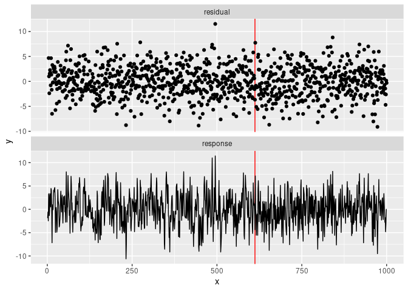
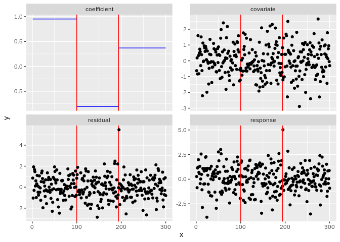

<!-- README.md is generated from README.Rmd. Please edit that file -->

# fastcpd <a href="https://fastcpd.xingchi.li"></a>

[](https://cran.r-project.org/package=fastcpd)
[](https://cran.r-project.org/package=fastcpd)
[](https://github.com/doccstat/fastcpd/actions)
[](https://app.codecov.io/gh/doccstat/fastcpd?branch=main)
[](https://github.com/doccstat/fastcpd)
[](https://doccstat.r-universe.dev)
[](https://www.codefactor.io/repository/github/doccstat/fastcpd)

## Overview

The fastcpd (**fast** **c**hange **p**oint **d**etection) is a fast
implmentation of change point detection methods in R. The **fastcpd**
package is designed to find change points in a fast manner. It is easy
to install and extensible to all kinds of change point problems with a
user specified cost function apart from the built-in cost functions.

To learn more behind the algorithms:

- [Sequential Gradient Descent and Quasi-Newton’s Method for
  Change-Point
  Analysis](https://proceedings.mlr.press/v206/zhang23b.html)

## Installation

``` r
# Install from CRAN
install.packages("fastcpd")
```

<details close>
<summary>
Development version
</summary>

``` r
# Development version from r-universe with CRAN version as a fallback
install.packages(
  "fastcpd",
  repos = c("https://doccstat.r-universe.dev", "https://cloud.r-project.org")
)

## install.packages("pak")
pak::pak("doccstat/fastcpd")

## install.packages("devtools")
devtools::install_github("doccstat/fastcpd")
```

</details>
<details close>
<summary>
With mamba or conda (available soon)
</summary>

``` bash
# conda-forge is a fork from CRAN and may not be up-to-date

# Use mamba
mamba install r-fastcpd
# Use conda
conda install -c conda-forge r-fastcpd
```

</details>

### FAQ

<details close>
<summary>
Package dependencies
</summary>

`fastcpd` depends on the following packages:

- [Rcpp](https://github.com/RcppCore/Rcpp), for C++ source code
  compilation.
- [RcppArmadillo](https://github.com/RcppCore/RcppArmadillo), for fast
  linear algebra.
- [fastglm](https://github.com/jaredhuling/fastglm), for fast
  generalized linear models.
- [glmnet](https://glmnet.stanford.edu/), for penalized regression.
- [ggplot2](https://github.com/tidyverse/ggplot2), for data
  visualization.

If you’re compiling from source, you can run the following command to
see the complete set of system packages needed on your machine.

``` r
pak::pkg_sysreqs("doccstat/fastcpd")
#> ── Install scripts ───────────────────────────────────────────── Ubuntu 20.04
#> apt-get -y update
#> apt-get -y install libcurl4-openssl-dev libssl-dev zlib1g-dev make
#>
#> ── Packages and their system dependencies ───────────────────────────────────
#> curl       – libcurl4-openssl-dev, libssl-dev
#> data.table – zlib1g-dev
#> fs         – make
#> openssl    – libssl-dev
```

</details>
<details close>
<summary>
I countered problems related to gfortran on Mac OSX or Linux!
</summary>

The package should be able to install on Mac and any Linux distribution
without any problems if all the dependencies are installed. However, if
you encountered problems related to gfortran, it might be because
`RcppArmadillo` is not installed previously. Try [Mac OSX stackoverflow
solution](https://stackoverflow.com/a/72997915) or [Linux stackover
solution](https://stackoverflow.com/a/15540919) if you have trouble
installing `RcppArmadillo`.

</details>

## Cheatsheet

[](https://github.com/doccstat/fastcpd/blob/main/man/figures/cheatsheets.pdf)

## Usage

It is hard to demonstrate all the features of `fastcpd` in a single
example due to the flexibility of the package. For more examples, please
refer to the [function
reference](https://fastcpd.xingchi.li/reference/index.html).

``` r
set.seed(1)
n <- 1000
x <- rep(0, n + 3)
for (i in 1:600) {
  x[i + 3] <- 0.6 * x[i + 2] - 0.2 * x[i + 1] + 0.1 * x[i] + rnorm(1, 0, 3)
}
for (i in 601:1000) {
  x[i + 1] <- 0.3 * x[i + 2] + 0.4 * x[i + 1] + 0.2 * x[i] + rnorm(1, 0, 3)
}
result <- fastcpd::fastcpd.ar(x[3 + seq_len(n)], 3)
summary(result)
#> 
#> Call:
#> fastcpd::fastcpd.ar(data = x[3 + seq_len(n)], order = 3)
#> 
#> Change points:
#> 612 
#> 
#> Cost values:
#> 2748.404 2022.597 
#> 
#> Parameters:
#>     segment 1   segment 2
#> 1  0.57656238  0.13006290
#> 2 -0.21582749 -0.03084403
#> 3  0.07985424 -0.04544551
plot(result)
```

<!-- -->

## Examples

<!-- This example section is a direct copy from `fastcpd` documentation -->
<details close>
<summary>
Click to open
</summary>

### linear regression with one-dimensional covariate

``` r
library(fastcpd)
set.seed(1)
p <- 1
x <- mvtnorm::rmvnorm(300, rep(0, p), diag(p))
theta_0 <- matrix(c(1, -1, 0.5))
y <- c(
  x[1:100, ] * theta_0[1, ] + rnorm(100, 0, 1),
  x[101:200, ] * theta_0[2, ] + rnorm(100, 0, 1),
  x[201:300, ] * theta_0[3, ] + rnorm(100, 0, 1)
)
result <- fastcpd(
  formula = y ~ . - 1,
  data = data.frame(y = y, x = x),
  family = "lm"
)
plot(result)
```

<!-- -->

``` r
summary(result)
#> 
#> Call:
#> fastcpd(formula = y ~ . - 1, data = data.frame(y = y, x = x), 
#>     family = "lm")
#> 
#> Change points:
#> 99 197 
#> 
#> Cost values:
#> 48.36336 65.71493 46.37389 
#> 
#> Parameters:
#>   segment 1  segment 2 segment 3
#> 1  0.956995 -0.8488617 0.4562731
```

### custom logistic regression

``` r
library(fastcpd)
set.seed(1)
p <- 5
x <- matrix(rnorm(375 * p, 0, 1), ncol = p)
theta <- rbind(rnorm(p, 0, 1), rnorm(p, 2, 1))
y <- c(
  rbinom(200, 1, 1 / (1 + exp(-x[1:200, ] %*% theta[1, ]))),
  rbinom(175, 1, 1 / (1 + exp(-x[201:375, ] %*% theta[2, ])))
)
data <- data.frame(y = y, x = x)
result_builtin <- suppressWarnings(fastcpd(
  formula = y ~ . - 1,
  data = data,
  family = "binomial"
))
logistic_loss <- function(data, theta) {
  x <- data[, -1]
  y <- data[, 1]
  u <- x %*% theta
  nll <- -y * u + log(1 + exp(u))
  nll[u > 10] <- -y[u > 10] * u[u > 10] + u[u > 10]
  sum(nll)
}
logistic_loss_gradient <- function(data, theta) {
  x <- data[nrow(data), -1]
  y <- data[nrow(data), 1]
  c(-(y - 1 / (1 + exp(-x %*% theta)))) * x
}
logistic_loss_hessian <- function(data, theta) {
  x <- data[nrow(data), -1]
  prob <- 1 / (1 + exp(-x %*% theta))
  (x %o% x) * c((1 - prob) * prob)
}
result_custom <- fastcpd(
  formula = y ~ . - 1,
  data = data,
  epsilon = 1e-5,
  cost = logistic_loss,
  cost_gradient = logistic_loss_gradient,
  cost_hessian = logistic_loss_hessian
)
cat(
  "Change points detected by built-in logistic regression model: ",
  result_builtin@cp_set, "\n",
  "Change points detected by custom logistic regression model: ",
  result_custom@cp_set, "\n",
  sep = ""
)
#> Change points detected by built-in logistic regression model: 200
#> Change points detected by custom logistic regression model: 201
result_custom_two_epochs <- fastcpd(
  formula = y ~ . - 1,
  data = data,
  k = function(x) 1,
  epsilon = 1e-5,
  cost = logistic_loss,
  cost_gradient = logistic_loss_gradient,
  cost_hessian = logistic_loss_hessian
)
summary(result_custom_two_epochs)
#> 
#> Call:
#> fastcpd(formula = y ~ . - 1, data = data, k = function(x) 1, 
#>     epsilon = 1e-05, cost = logistic_loss, cost_gradient = logistic_loss_gradient, 
#>     cost_hessian = logistic_loss_hessian)
#> 
#> Change points:
#> 200 
#> 
#> Parameters:
#>    segment 1  segment 2
#> 1 -0.6235240  2.0066479
#> 2 -1.6767614  1.6278889
#> 3 -1.7973433  4.6422022
#> 4 -0.4842969 -0.1521062
#> 5  2.0797875  2.4047092
```

### custom cost function huber regression

``` r
library(fastcpd)
set.seed(1)
n <- 400 + 300 + 500
p <- 5
x <- mvtnorm::rmvnorm(n, mean = rep(0, p), sigma = diag(p))
theta <- rbind(
  mvtnorm::rmvnorm(1, mean = rep(0, p - 3), sigma = diag(p - 3)),
  mvtnorm::rmvnorm(1, mean = rep(5, p - 3), sigma = diag(p - 3)),
  mvtnorm::rmvnorm(1, mean = rep(9, p - 3), sigma = diag(p - 3))
)
theta <- cbind(theta, matrix(0, 3, 3))
theta <- theta[rep(seq_len(3), c(400, 300, 500)), ]
y_true <- rowSums(x * theta)
factor <- c(
  2 * stats::rbinom(400, size = 1, prob = 0.95) - 1,
  2 * stats::rbinom(300, size = 1, prob = 0.95) - 1,
  2 * stats::rbinom(500, size = 1, prob = 0.95) - 1
)
y <- factor * y_true + stats::rnorm(n)
data <- cbind.data.frame(y, x)
huber_threshold <- 1
huber_loss <- function(data, theta) {
  residual <- data[, 1] - data[, -1, drop = FALSE] %*% theta
  indicator <- abs(residual) <= huber_threshold
  sum(
    residual^2 / 2 * indicator +
      huber_threshold * (
        abs(residual) - huber_threshold / 2
      ) * (1 - indicator)
  )
}
huber_loss_gradient <- function(data, theta) {
  residual <- c(data[nrow(data), 1] - data[nrow(data), -1] %*% theta)
  if (abs(residual) <= huber_threshold) {
    -residual * data[nrow(data), -1]
  } else {
    -huber_threshold * sign(residual) * data[nrow(data), -1]
  }
}
huber_loss_hessian <- function(data, theta) {
  residual <- c(data[nrow(data), 1] - data[nrow(data), -1] %*% theta)
  if (abs(residual) <= huber_threshold) {
    outer(data[nrow(data), -1], data[nrow(data), -1])
  } else {
    0.01 * diag(length(theta))
  }
}
huber_regression_result <- fastcpd(
  formula = y ~ . - 1,
  data = data,
  beta = (p + 1) * log(n) / 2,
  cost = huber_loss,
  cost_gradient = huber_loss_gradient,
  cost_hessian = huber_loss_hessian
)
summary(huber_regression_result)
#> 
#> Call:
#> fastcpd(formula = y ~ . - 1, data = data, beta = (p + 1) * log(n)/2, 
#>     cost = huber_loss, cost_gradient = huber_loss_gradient, cost_hessian = huber_loss_hessian)
#> 
#> Change points:
#> 401 726 
#> 
#> Parameters:
#>     segment 1   segment 2    segment 3
#> 1 -0.52615415  2.77991463  8.744706508
#> 2 -1.02443443  5.06390528  9.506534878
#> 3 -0.09220421  0.01647923 -0.008908851
#> 4 -0.01326592 -0.08103008 -0.047909865
#> 5  0.02526703  0.01329142  0.025171681
```

</details>

## Make contributions

We welcome contributions from everyone. Please follow the instructions
below to make contributions.

1.  Fork the repo.

2.  Create a new branch from `main` branch.

3.  Make changes and commit them.

    1.  Please follow the [Google’s R style
        guide](https://google.github.io/styleguide/Rguide.html) for
        naming variables and functions.
    2.  If you are adding a new family of models with new cost functions
        with corresponding gradient and Hessian, please add them to
        `src/fastcpd_class_cost.cc` with proper example and tests in
        `vignettes/gallery.Rmd` and `tests/testthat/test-gallery.R`.
    3.  Add the family name to `src/fastcpd_constants.h`.
    4.  \[Recommended\] Add a new wrapper function in
        `R/fastcpd_wrappers.R` for the new family of models and move the
        examples to the new wrapper function as roxygen examples.
    5.  Add the new wrapper function to the corresponding section in
        `_pkgdown.yml`.

4.  Push the changes to your fork.

5.  Create a pull request.

6.  Make sure the pull request does not create new warnings or errors in
    `devtools::check()`.

## Contact us

Encountered a bug or unintended behavior?

1.  File a ticket at [GitHub
    Issues](https://github.com/doccstat/fastcpd/issues).
2.  Contact the authors specified in
    [DESCRIPTION](https://github.com/doccstat/fastcpd/blob/main/DESCRIPTION#L5-L10).

## Stargazers over time

[](https://starchart.cc/doccstat/fastcpd)

## Codecov Icicle

[](https://app.codecov.io/gh/doccstat/fastcpd?branch=main)
