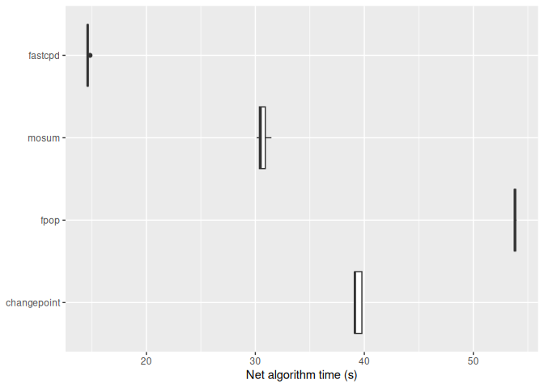

<!-- README.md is generated from README.Rmd. Please edit that file -->

# Fast Change Point Detection <a href="https://fastcpd.xingchi.li"></a>

[](https://app.codecov.io/gh/doccstat/fastcpd?branch=main)
[](https://www.codefactor.io/repository/github/doccstat/fastcpd)
[](https://cran.r-project.org/package=fastcpd)
[](https://doi.org/10.48550/arXiv.2404.05933)
[](https://github.com/doccstat/fastcpd/actions)
[](https://doccstat.r-universe.dev)
[](https://pypi.org/project/fastcpd/)
[](https://pypi.org/project/fastcpd/)

## Documentation: [x2r.io](https://x2r.io/fastcpd/reference/)

<details close>
<summary>
Installation
</summary>

``` r
# install.packages("pak")
pak::pak("doccstat/fastcpd")
# or install from CRAN
install.packages("fastcpd")
```

``` shell
# python -m ensurepip --upgrade
pip install .
# or install from PyPI
pip install fastcpd
```

</details>

## Comparison

``` r
set.seed(1)
n <- 10^8
mean_data <- c(rnorm(n / 2, 0, 1), rnorm(n / 2, 50, 1))
print(run_isolated(fastcpd::fastcpd.mean(mean_data, cp_only = TRUE, variance_estimation = 1)))
#>    user  system elapsed 
#>   6.938   5.040  11.779
print(run_isolated(mosum::mosum(c(mean_data), G = 40)))
#>    user  system elapsed 
#>   9.034   6.854  15.964
print(run_isolated(changepoint::cpt.mean(mean_data, method = "PELT")))
#>    user  system elapsed 
#>  31.515   6.507  38.127
print(run_isolated(fpop::Fpop(mean_data, 2 * log(n))))
#>    user  system elapsed 
#>  44.527   2.978  47.632
```

<!-- -->

## References

- [fastcpd: Fast Change Point Detection in
  R](https://doi.org/10.48550/arXiv.2404.05933)
- [Sequential Gradient Descent and Quasi-Newton’s Method for
  Change-Point
  Analysis](https://proceedings.mlr.press/v206/zhang23b.html)

## FAQ

<details close>
<summary>
Should I install suggested packages?
</summary>

The suggested packages are not required for the main functionality of
the package. They are only required for the vignettes. If you want to
learn more about the package comparison and other vignettes, you could
either check out vignettes on
[CRAN](https://CRAN.R-project.org/package=fastcpd) or [pkgdown generated
documentation](https://fastcpd.xingchi.li/articles/).

</details>
<details close>
<summary>
I countered problems related to gfortran on Mac OSX or Linux!
</summary>

The package should be able to install on Mac and any Linux distribution
without any problems if all the dependencies are installed. However, if
you encountered problems related to gfortran, it might be because
`RcppArmadillo` is not installed previously. Try [Mac OSX stackoverflow
solution](https://stackoverflow.com/a/72997915) or [Linux stackover
solution](https://stackoverflow.com/a/15540919) if you have trouble
installing `RcppArmadillo`.

</details>
<details close>
<summary>
We welcome contributions from everyone. Please follow the instructions
below to make contributions.
</summary>

1.  Fork the repo.

2.  Create a new branch from `main` branch.

3.  Make changes and commit them.

    1.  Please follow the [Google’s R style
        guide](https://google.github.io/styleguide/Rguide.html) for
        naming variables and functions.
    2.  If you are adding a new family of models with new cost functions
        with corresponding gradient and Hessian, please add them to
        `src/fastcpd_class_cost.cc` with proper example and tests in
        `vignettes/gallery.Rmd` and `tests/testthat/test-gallery.R`.
    3.  Add the family name to `src/fastcpd_constants.h`.
    4.  \[Recommended\] Add a new wrapper function in
        `R/fastcpd_wrappers.R` for the new family of models and move the
        examples to the new wrapper function as roxygen examples.
    5.  Add the new wrapper function to the corresponding section in
        `_pkgdown.yml`.

4.  Push the changes to your fork.

5.  Create a pull request.

6.  Make sure the pull request does not create new warnings or errors in
    `devtools::check()`.

</details>
<details close>
<summary>
Trouble installing Python package.
</summary>

Python headers are required to install the Python package. If you are
using Ubuntu, you can install the headers with:

``` shell
sudo apt install python3-dev
```

</details>
<details close>
<summary>
Encountered a bug or unintended behavior?
</summary>

1.  File a ticket at [GitHub
    Issues](https://github.com/doccstat/fastcpd/issues).
2.  Contact the authors specified in
    [DESCRIPTION](https://github.com/doccstat/fastcpd/blob/main/DESCRIPTION#L5-L10).

</details>

## Stargazers over time

[](https://starchart.cc/doccstat/fastcpd)
