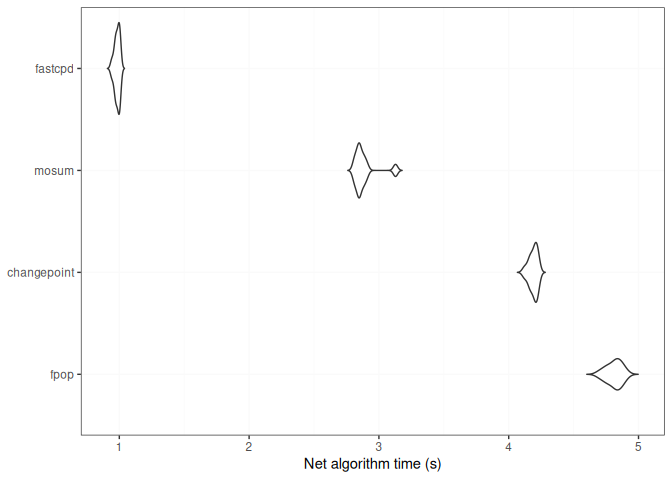
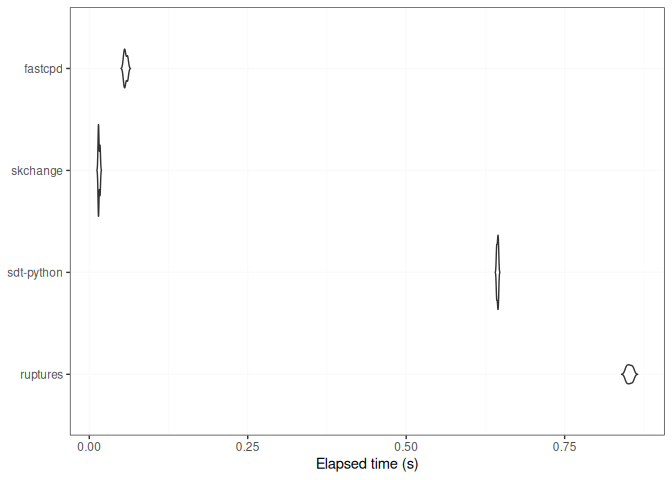

<!-- README.md is generated from README.Rmd. Please edit that file -->

# Fast Change Point Detection <a href="https://fastcpd.xingchi.li"></a>

[](https://app.codecov.io/gh/doccstat/fastcpd-r?branch=main)
[](https://www.codefactor.io/repository/github/doccstat/fastcpd-r)
[](https://cran.r-project.org/package=fastcpd)
[](https://doi.org/10.48550/arXiv.2404.05933)
[](https://github.com/doccstat/fastcpd-r/actions/workflows/check-standard.yaml)
[](https://doccstat.r-universe.dev)
[](https://pypi.org/project/fastcpd/)
[](https://pypi.org/project/fastcpd/)

## Documentation: [x2r.io](https://x2r.io/fastcpd/reference/)

Python and standalone C++ sources are published separately in
[`fastcpd-py`](https://github.com/doccstat/fastcpd-py) and
[`fastcpd-cpp`](https://github.com/doccstat/fastcpd-cpp).

<details>
<summary>
Installation: R, Python, and C++
</summary>

R package:

``` r
install.packages("fastcpd")
```

Python package:

``` shell
python -m pip install fastcpd
```

C++ library (requires Armadillo and Abseil 20260526 or newer):

``` shell
git clone https://github.com/doccstat/fastcpd-cpp.git
cmake -S fastcpd-cpp -B fastcpd-cpp/build -DFASTCPD_BUILD_EXAMPLES=OFF
cmake --build fastcpd-cpp/build --parallel
cmake --install fastcpd-cpp/build --prefix fastcpd-install
```

</details>

## Comparison

### R

``` r
set.seed(1)
n <- 10^7
mean_data <- c(rnorm(n / 2, 0, 1), rnorm(n / 2, 50, 1))
print(run_isolated(fastcpd::detect_mean(mean_data, cp_only = TRUE, variance_estimation = 1)))
#>    user  system elapsed 
#>   0.743   0.240   1.048
print(run_isolated(mosum::mosum(c(mean_data), G = 40)))
#>    user  system elapsed 
#>   1.303   0.754   2.117
print(run_isolated(changepoint::cpt.mean(mean_data, method = "PELT")))
#>    user  system elapsed 
#>   3.347   0.715   4.104
print(run_isolated(fpop::Fpop(mean_data, 2 * log(n))))
#>    user  system elapsed 
#>   4.162   0.308   4.481
```

<!-- -->

### Python

The following exact L2 PELT comparison evaluates every possible
change-point location. `ruptures` uses SSE while `fastcpd` uses SSE/2,
so its penalty is doubled to match the objective.

``` python
import time

import numpy as np
import ruptures as rpt
from fastcpd import detect_mean

rng = np.random.default_rng(1)
n = 1_000
x = np.r_[rng.normal(0, 1, n // 2), rng.normal(50, 1, n // 2)]


def benchmark(call, times=5):
    elapsed = []
    result = None
    for _ in range(times):
        start = time.perf_counter()
        result = call()
        elapsed.append(time.perf_counter() - start)
    return result, elapsed


fastcpd_result, fastcpd_elapsed = benchmark(
    lambda: detect_mean(
        x,
        beta=np.log(n),
        cost_adjustment="BIC",
        variance_estimation=1,
        cp_only=True,
    )
)
ruptures_result, ruptures_elapsed = benchmark(
    lambda: rpt.Pelt(model="l2", min_size=1, jump=1)
    .fit(x)
    .predict(pen=2 * np.log(n))
)

results = (
    ("fastcpd", fastcpd_result.cp_set.tolist(), fastcpd_elapsed),
    ("ruptures", ruptures_result[:-1], ruptures_elapsed),
)
for name, change_points, elapsed in results:
    points = ",".join(map(str, change_points))
    for seconds in elapsed:
        print(f"{name}\t{points}\t{seconds:.9f}")
```

| Package  | Change points | Median elapsed (s) |
|:---------|--------------:|-------------------:|
| fastcpd  |           500 |             0.0016 |
| ruptures |           500 |             3.8267 |

<!-- -->

### C++

The Python package uses the same standalone C++17 core. The header-only
C++23 [`signal-kernels`](https://github.com/HarperZ9/signal-kernels)
library also provides PELT with L1, L2, and Poisson costs, but its
packaged CMake build is currently Windows/MSVC-only, so no like-for-like
timing is reported. See the [`fastcpd-cpp`
examples](https://github.com/doccstat/fastcpd-cpp/tree/main/examples/cpp)
for native usage.

## References

- [fastcpd: Fast Change Point Detection in
  R](https://doi.org/10.48550/arXiv.2404.05933)
- [Sequential Gradient Descent and Quasi-Newton’s Method for
  Change-Point
  Analysis](https://proceedings.mlr.press/v206/zhang23b.html)
