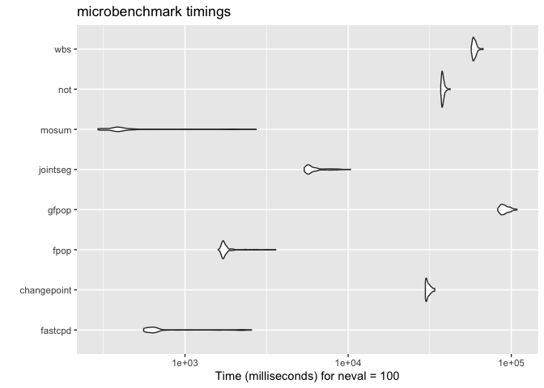

<!-- README.md is generated from README.Rmd. Please edit that file -->

# fastcpd: Fast Change Point Detection in R <a href="https://fastcpd.xingchi.li"></a>

[](https://app.codecov.io/gh/doccstat/fastcpd?branch=main)
[](https://www.codefactor.io/repository/github/doccstat/fastcpd)
[](https://cran.r-project.org/package=fastcpd)
[](https://doi.org/10.48550/arXiv.2404.05933)
[](https://cran.r-project.org/package=fastcpd)
[](https://github.com/doccstat/fastcpd)
[](https://github.com/doccstat/fastcpd/actions)
[](https://doccstat.r-universe.dev)

## Overview

The fastcpd (**fast** **c**hange **p**oint **d**etection) is a fast
implmentation of change point detection methods in R. The **fastcpd**
package is designed to find change points in a fast manner. It is easy
to install and extensible to all kinds of change point problems with a
user specified cost function apart from the built-in cost functions.

To learn more behind the algorithms:

- [fastcpd: Fast Change Point Detection in
  R](https://doi.org/10.48550/arXiv.2404.05933)
- [Sequential Gradient Descent and Quasi-Newton’s Method for
  Change-Point
  Analysis](https://proceedings.mlr.press/v206/zhang23b.html)

## Installation

``` r
# Install from r-universe with CRAN version as a fallback
install.packages(
  "fastcpd",
  repos = c("https://doccstat.r-universe.dev", "https://cloud.r-project.org")
)
```

<details close>
<summary>
Development version
</summary>

``` r
## install.packages("pak")
pak::pak("doccstat/fastcpd")

## install.packages("devtools")
devtools::install_github("doccstat/fastcpd")
```

</details>
<details close>
<summary>
With mamba or conda (available soon)
</summary>

``` bash
# conda-forge is a fork from CRAN and may not be up-to-date

# Use mamba
mamba install r-fastcpd
# Use conda
conda install -c conda-forge r-fastcpd
```

</details>

### FAQ

<details close>
<summary>
Should I install suggested packages?
</summary>

The suggested packages are not required for the main functionality of
the package. They are only required for the vignettes. If you want to
learn more about the package comparison and other vignettes, you could
either check out vignettes on
[CRAN](https://CRAN.R-project.org/package=fastcpd) or [pkgdown generated
documentation](https://fastcpd.xingchi.li/articles/).

</details>
<details close>
<summary>
I countered problems related to gfortran on Mac OSX or Linux!
</summary>

The package should be able to install on Mac and any Linux distribution
without any problems if all the dependencies are installed. However, if
you encountered problems related to gfortran, it might be because
`RcppArmadillo` is not installed previously. Try [Mac OSX stackoverflow
solution](https://stackoverflow.com/a/72997915) or [Linux stackover
solution](https://stackoverflow.com/a/15540919) if you have trouble
installing `RcppArmadillo`.

</details>

## Cheatsheet

[](https://github.com/doccstat/fastcpd/blob/main/man/figures/cheatsheets.pdf)

### R Shiny App

Available soon:
[rshiny.fastcpd.xingchi.li](https://rshiny.fastcpd.xingchi.li)

## Usage

``` r
set.seed(1)
n <- 1000
x <- rep(0, n + 3)
for (i in 1:600) {
  x[i + 3] <- 0.6 * x[i + 2] - 0.2 * x[i + 1] + 0.1 * x[i] + rnorm(1, 0, 3)
}
for (i in 601:1000) {
  x[i + 3] <- 0.3 * x[i + 2] + 0.4 * x[i + 1] + 0.2 * x[i] + rnorm(1, 0, 3)
}
result <- fastcpd::fastcpd.ar(x[3 + seq_len(n)], 3, r.progress = FALSE)
summary(result)
#> 
#> Call:
#> fastcpd::fastcpd.ar(data = x[3 + seq_len(n)], order = 3, r.progress = FALSE)
#> 
#> Change points:
#> 614 
#> 
#> Cost values:
#> 2754.116 2038.945 
#> 
#> Parameters:
#>     segment 1 segment 2
#> 1  0.57120256 0.2371809
#> 2 -0.20985108 0.4031244
#> 3  0.08221978 0.2290323
plot(result)
```

<!-- -->

<details open>
<summary>
Tip
</summary>

It is hard to demonstrate all the features of `fastcpd` in a single
example due to the flexibility of the package. For more examples, please
refer to the [function
reference](https://fastcpd.xingchi.li/reference/index.html).

</details>
<details open>
<summary>
Note
</summary>

`r.progress = FALSE` is used to suppress the progress bar. Users are
expected to see the progress bar when running the code by default.

</details>

``` r
library(microbenchmark)
set.seed(1)
n <- 5 * 10^6
mean_data <- c(rnorm(n / 2, 0, 1), rnorm(n / 2, 50, 1))
ggplot2::autoplot(microbenchmark(
  fastcpd = fastcpd::fastcpd.mean(mean_data, r.progress = FALSE, cp_only = TRUE, variance_estimation = 1),
  changepoint = changepoint::cpt.mean(mean_data, method = "PELT"),
  fpop = fpop::Fpop(mean_data, 2 * log(n)),
  gfpop = gfpop::gfpop(
    data = mean_data,
    mygraph = gfpop::graph(
      penalty = 2 * log(length(mean_data)) * gfpop::sdDiff(mean_data) ^ 2,
      type = "updown"
    ),
    type = "mean"
  ),
  jointseg = jointseg::jointSeg(mean_data, K = 12),
  mosum = mosum::mosum(c(mean_data), G = 40),
  not = not::not(mean_data, contrast = "pcwsConstMean"),
  wbs = wbs::wbs(mean_data)
))
#> Warning in microbenchmark(fastcpd = fastcpd::fastcpd.mean(mean_data, r.progress
#> = FALSE, : less accurate nanosecond times to avoid potential integer overflows
```

<!-- -->

## Examples

### Main function

- [`fastcpd`](https://fastcpd.xingchi.li/reference/fastcpd.html)

### Wrapper functions

#### Time series

- AR(p):
  [`fastcpd_ar`](https://fastcpd.xingchi.li/reference/fastcpd_ar.html)
- ARIMA(p, d, q):
  [`fastcpd_arima`](https://fastcpd.xingchi.li/reference/fastcpd_arima.html)
- ARMA(p, q):
  [`fastcpd_arma`](https://fastcpd.xingchi.li/reference/fastcpd_arma.html)
- GARCH(p, q):
  [`fastcpd_garch`](https://fastcpd.xingchi.li/reference/fastcpd_garch.html)
- VAR(p):
  [`fastcpd_var`](https://fastcpd.xingchi.li/reference/fastcpd_var.html)
- General time series:
  [`fastcpd_ts`](https://fastcpd.xingchi.li/reference/fastcpd_ts.html)

#### Unlabeled data

- Mean change:
  [`fastcpd_mean`](https://fastcpd.xingchi.li/reference/fastcpd_mean.html)
- Variance change:
  [`fastcpd_variance`](https://fastcpd.xingchi.li/reference/fastcpd_variance.html)
- Mean and/or variance change:
  [`fastcpd_meanvariance`](https://fastcpd.xingchi.li/reference/fastcpd_meanvariance.html)

#### Regression data

- Logistic regression:
  [`fastcpd_binomial`](https://fastcpd.xingchi.li/reference/fastcpd_binomial.html)
- Penalized linear regression:
  [`fastcpd_lasso`](https://fastcpd.xingchi.li/reference/fastcpd_lasso.html)
- Linear regression:
  [`fastcpd_lm`](https://fastcpd.xingchi.li/reference/fastcpd_lm.html)
- Poisson regression:
  [`fastcpd_poisson`](https://fastcpd.xingchi.li/reference/fastcpd_poisson.html)

### Utility functions

#### Variance estimation

- Variance estimation in ARMA models:
  [`variance_arma`](https://fastcpd.xingchi.li/reference/variance_arma.html)
- Variance estimation in linear models:
  [`variance_lm`](https://fastcpd.xingchi.li/reference/variance_lm.html)
- Variance estimation in mean change models:
  [`variance_mean`](https://fastcpd.xingchi.li/reference/variance_mean.html)
- Variance estimation in median change models:
  [`variance_median`](https://fastcpd.xingchi.li/reference/variance_median.html)

#### Class methods

- Plot: [`plot`](https://fastcpd.xingchi.li/reference/plot.html)
- Print: [`print`](https://fastcpd.xingchi.li/reference/print.html)
- Show: [`show`](https://fastcpd.xingchi.li/reference/show.html)
- Summary:
  [`summary`](https://fastcpd.xingchi.li/reference/summary.html)

### Data

- Bitcoin Market Price (USD):
  [`bitcoin`](https://fastcpd.xingchi.li/reference/bitcoin.html)
- Occupancy Detection Data Set:
  [`occupancy`](https://fastcpd.xingchi.li/reference/occupancy.html)
- Transcription Profiling of 57 Human Bladder Carcinoma Samples:
  [`transcriptome`](https://fastcpd.xingchi.li/reference/transcriptome.html)
- UK Seatbelts Data:
  [`uk_seatbelts`](https://fastcpd.xingchi.li/reference/uk_seatbelts.html)
- Well-log Dataset from Numerical Bayesian Methods Applied to Signal
  Processing:
  [`well_log`](https://fastcpd.xingchi.li/reference/well_log.html)

### Main class

- [`fastcpd`](https://fastcpd.xingchi.li/reference/fastcpd-class.html)

## Make contributions

<details close>
<summary>
We welcome contributions from everyone. Please follow the instructions
below to make contributions.
</summary>

1.  Fork the repo.

2.  Create a new branch from `main` branch.

3.  Make changes and commit them.

    1.  Please follow the [Google’s R style
        guide](https://google.github.io/styleguide/Rguide.html) for
        naming variables and functions.
    2.  If you are adding a new family of models with new cost functions
        with corresponding gradient and Hessian, please add them to
        `src/fastcpd_class_cost.cc` with proper example and tests in
        `vignettes/gallery.Rmd` and `tests/testthat/test-gallery.R`.
    3.  Add the family name to `src/fastcpd_constants.h`.
    4.  \[Recommended\] Add a new wrapper function in
        `R/fastcpd_wrappers.R` for the new family of models and move the
        examples to the new wrapper function as roxygen examples.
    5.  Add the new wrapper function to the corresponding section in
        `_pkgdown.yml`.

4.  Push the changes to your fork.

5.  Create a pull request.

6.  Make sure the pull request does not create new warnings or errors in
    `devtools::check()`.

</details>

## Contact us

<details close>
<summary>
Encountered a bug or unintended behavior?
</summary>

1.  File a ticket at [GitHub
    Issues](https://github.com/doccstat/fastcpd/issues).
2.  Contact the authors specified in
    [DESCRIPTION](https://github.com/doccstat/fastcpd/blob/main/DESCRIPTION#L5-L10).

</details>

## Stargazers over time

[](https://starchart.cc/doccstat/fastcpd)

## Codecov Icicle

[](https://app.codecov.io/gh/doccstat/fastcpd?branch=main)
