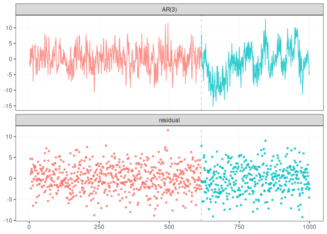
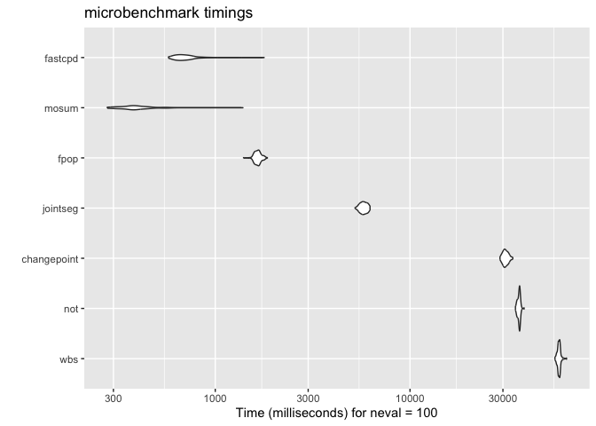
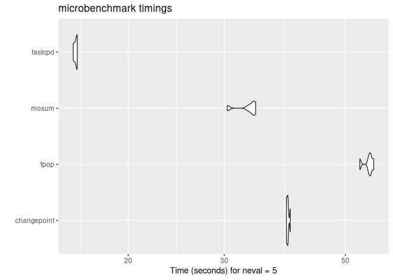

# Fast Change Point Detection

[](https://app.codecov.io/gh/doccstat/fastcpd?branch=main)
[](https://www.codefactor.io/repository/github/doccstat/fastcpd)
[](https://cran.r-project.org/package=fastcpd)
[](https://doi.org/10.48550/arXiv.2404.05933)
[](https://github.com/doccstat/fastcpd/actions)
[](https://doccstat.r-universe.dev)
[](https://pypi.org/project/fastcpd/)
[](https://pypi.org/project/fastcpd/)

## Overview

The fastcpd (**fast** **c**hange **p**oint **d**etection) is a fast
implmentation of change point detection methods in R/Python.

### Documentation

- R documentation: [fastcpd.xingchi.li](https://fastcpd.xingchi.li)
- Python documentation:
  [fastcpd.xingchi.li/python](https://fastcpd.xingchi.li/python)

## Installation

### R

``` r
# install.packages("devtools")
devtools::install_github("doccstat/fastcpd")
# or install from CRAN
install.packages("fastcpd")
```

### Python WIP

``` shell
# python -m ensurepip --upgrade
pip install .
# or install from PyPI
pip install fastcpd
```

## Usage

### R

``` r
set.seed(1)
n <- 1000
x <- rep(0, n + 3)
for (i in 1:600) {
  x[i + 3] <- 0.6 * x[i + 2] - 0.2 * x[i + 1] + 0.1 * x[i] + rnorm(1, 0, 3)
}
for (i in 601:1000) {
  x[i + 3] <- 0.3 * x[i + 2] + 0.4 * x[i + 1] + 0.2 * x[i] + rnorm(1, 0, 3)
}
result <- fastcpd::fastcpd.ar(x[3 + seq_len(n)], 3, r.progress = FALSE)
summary(result)
#> 
#> Call:
#> fastcpd::fastcpd.ar(data = x[3 + seq_len(n)], order = 3, r.progress = FALSE)
#> 
#> Change points:
#> 614 
#> 
#> Cost values:
#> 2754.116 2038.945 
#> 
#> Parameters:
#>     segment 1 segment 2
#> 1  0.57120256 0.2371809
#> 2 -0.20985108 0.4031244
#> 3  0.08221978 0.2290323
plot(result)
```



### Python WIP

``` python
import fastcpd.segmentation
from numpy import concatenate
from numpy.random import normal, multivariate_normal
covariance_mat = [[100, 0, 0], [0, 100, 0], [0, 0, 100]]
data = concatenate((multivariate_normal([0, 0, 0], covariance_mat, 300),
                    multivariate_normal([50, 50, 50], covariance_mat, 400),
                    multivariate_normal([2, 2, 2], covariance_mat, 300)))
fastcpd.segmentation.mean(data)

import fastcpd.variance_estimation
fastcpd.variance_estimation.mean(data)
```

### Comparison

``` r
library(microbenchmark)
set.seed(1)
n <- 5 * 10^6
mean_data <- c(rnorm(n / 2, 0, 1), rnorm(n / 2, 50, 1))
ggplot2::autoplot(microbenchmark(
  wbs = wbs::wbs(mean_data),
  not = not::not(mean_data, contrast = "pcwsConstMean"),
  changepoint = changepoint::cpt.mean(mean_data, method = "PELT"),
  jointseg = jointseg::jointSeg(mean_data, K = 12),
  fpop = fpop::Fpop(mean_data, 2 * log(n)),
  mosum = mosum::mosum(c(mean_data), G = 40),
  fastcpd = fastcpd::fastcpd.mean(mean_data, r.progress = FALSE, cp_only = TRUE, variance_estimation = 1)
))
#> Warning in microbenchmark(wbs = wbs::wbs(mean_data), not = not::not(mean_data,
#> : less accurate nanosecond times to avoid potential integer overflows
```



``` r
library(microbenchmark)
set.seed(1)
n <- 10^8
mean_data <- c(rnorm(n / 2, 0, 1), rnorm(n / 2, 50, 1))
system.time(fastcpd::fastcpd.mean(mean_data, r.progress = FALSE, cp_only = TRUE, variance_estimation = 1))
#>    user  system elapsed 
#>  11.753   9.150  26.455 
system.time(mosum::mosum(c(mean_data), G = 40))
#>    user  system elapsed 
#>   5.518  11.516  38.368 
system.time(fpop::Fpop(mean_data, 2 * log(n)))
#>    user  system elapsed 
#>  35.926   5.231  58.269 
system.time(changepoint::cpt.mean(mean_data, method = "PELT"))
#>    user  system elapsed 
#>  32.342   9.681  66.056 
ggplot2::autoplot(microbenchmark(
  changepoint = changepoint::cpt.mean(mean_data, method = "PELT"),
  fpop = fpop::Fpop(mean_data, 2 * log(n)),
  mosum = mosum::mosum(c(mean_data), G = 40),
  fastcpd = fastcpd::fastcpd.mean(mean_data, r.progress = FALSE, cp_only = TRUE, variance_estimation = 1),
  times = 10
))
```



Some packages are not included in the `microbenchmark` comparison due to
either memory constraints or long running time.

``` r
# Device: Mac mini (M1, 2020)
# Memory: 8 GB
system.time(CptNonPar::np.mojo(mean_data, G = floor(length(mean_data) / 6)))
#> Error: vector memory limit of 16.0 Gb reached, see mem.maxVSize()
#> Timing stopped at: 0.061 0.026 0.092
system.time(ecp::e.divisive(matrix(mean_data)))
#> Error: vector memory limit of 16.0 Gb reached, see mem.maxVSize()
#> Timing stopped at: 0.076 0.044 0.241
system.time(strucchange::breakpoints(y ~ 1, data = data.frame(y = mean_data)))
#> Timing stopped at: 265.1 145.8 832.5
system.time(breakfast::breakfast(mean_data))
#> Timing stopped at: 45.9 89.21 562.3
```

## Cheatsheet

[](https://github.com/doccstat/fastcpd/blob/main/man/figures/cheatsheets.pdf)

### References

- [fastcpd: Fast Change Point Detection in
  R](https://doi.org/10.48550/arXiv.2404.05933)
- [Sequential Gradient Descent and Quasi-Newton’s Method for
  Change-Point
  Analysis](https://proceedings.mlr.press/v206/zhang23b.html)

## FAQ

Should I install suggested packages?

The suggested packages are not required for the main functionality of
the package. They are only required for the vignettes. If you want to
learn more about the package comparison and other vignettes, you could
either check out vignettes on
[CRAN](https://CRAN.R-project.org/package=fastcpd) or [pkgdown generated
documentation](https://fastcpd.xingchi.li/articles/).

I countered problems related to gfortran on Mac OSX or Linux!

The package should be able to install on Mac and any Linux distribution
without any problems if all the dependencies are installed. However, if
you encountered problems related to gfortran, it might be because
`RcppArmadillo` is not installed previously. Try [Mac OSX stackoverflow
solution](https://stackoverflow.com/a/72997915) or [Linux stackover
solution](https://stackoverflow.com/a/15540919) if you have trouble
installing `RcppArmadillo`.

We welcome contributions from everyone. Please follow the instructions
below to make contributions.

1.  Fork the repo.

2.  Create a new branch from `main` branch.

3.  Make changes and commit them.

    1.  Please follow the [Google’s R style
        guide](https://google.github.io/styleguide/Rguide.html) for
        naming variables and functions.
    2.  If you are adding a new family of models with new cost functions
        with corresponding gradient and Hessian, please add them to
        `src/fastcpd_class_cost.cc` with proper example and tests in
        `vignettes/gallery.Rmd` and `tests/testthat/test-gallery.R`.
    3.  Add the family name to `src/fastcpd_constants.h`.
    4.  \[Recommended\] Add a new wrapper function in
        `R/fastcpd_wrappers.R` for the new family of models and move the
        examples to the new wrapper function as roxygen examples.
    5.  Add the new wrapper function to the corresponding section in
        `_pkgdown.yml`.

4.  Push the changes to your fork.

5.  Create a pull request.

6.  Make sure the pull request does not create new warnings or errors in
    `devtools::check()`.

Trouble installing Python package.

Python headers are required to install the Python package. If you are
using Ubuntu, you can install the headers with:

``` shell
sudo apt install python3-dev
```

Encountered a bug or unintended behavior?

1.  File a ticket at [GitHub
    Issues](https://github.com/doccstat/fastcpd/issues).
2.  Contact the authors specified in
    [DESCRIPTION](https://github.com/doccstat/fastcpd/blob/main/DESCRIPTION#L5-L10).

## Stargazers over time

[](https://starchart.cc/doccstat/fastcpd)

## Acknowledgements

Special thanks to [clODE](https://github.com/patrickfletcher/clODE).
