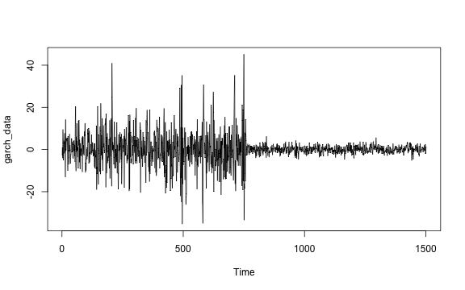
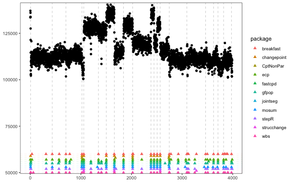
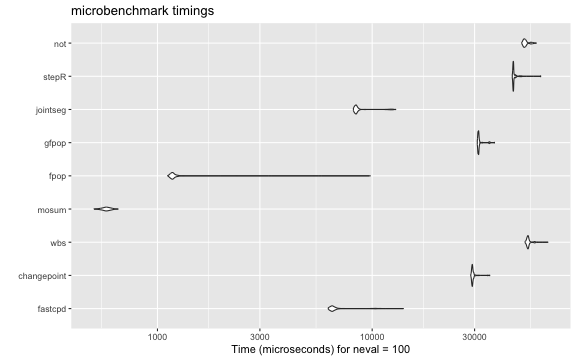

# Data setup

## Univariate mean change


``` r
# Univariate mean change
set.seed(1)
p <- 1
mean_data_1 <- rbind(
  mvtnorm::rmvnorm(300, mean = rep(0, p), sigma = diag(100, p)),
  mvtnorm::rmvnorm(400, mean = rep(50, p), sigma = diag(100, p)),
  mvtnorm::rmvnorm(300, mean = rep(2, p), sigma = diag(100, p))
)

plot.ts(mean_data_1)
```


## Univariate mean and/or variance change


``` r
# Univariate mean and/or variance change
set.seed(1)
p <- 1
mv_data_1 <- rbind(
  mvtnorm::rmvnorm(300, mean = rep(0, p), sigma = diag(1, p)),
  mvtnorm::rmvnorm(400, mean = rep(10, p), sigma = diag(1, p)),
  mvtnorm::rmvnorm(300, mean = rep(0, p), sigma = diag(100, p)),
  mvtnorm::rmvnorm(300, mean = rep(0, p), sigma = diag(1, p)),
  mvtnorm::rmvnorm(400, mean = rep(10, p), sigma = diag(1, p)),
  mvtnorm::rmvnorm(300, mean = rep(10, p), sigma = diag(100, p))
)

plot.ts(mv_data_1)
```


## Multivariate mean change


``` r
# Multivariate mean change
set.seed(1)
p <- 3
mean_data_3 <- rbind(
  mvtnorm::rmvnorm(300, mean = rep(0, p), sigma = diag(100, p)),
  mvtnorm::rmvnorm(400, mean = rep(50, p), sigma = diag(100, p)),
  mvtnorm::rmvnorm(300, mean = rep(2, p), sigma = diag(100, p))
)

plot.ts(mean_data_3)
```


## Multivariate mean and/or variance change


``` r
# Multivariate mean and/or variance change
set.seed(1)
p <- 3
mv_data_3 <- rbind(
  mvtnorm::rmvnorm(300, mean = rep(0, p), sigma = diag(1, p)),
  mvtnorm::rmvnorm(400, mean = rep(100, p), sigma = diag(1, p)),
  mvtnorm::rmvnorm(300, mean = rep(0, p), sigma = diag(400, p)),
  mvtnorm::rmvnorm(300, mean = rep(0, p), sigma = diag(1, p)),
  mvtnorm::rmvnorm(400, mean = rep(100, p), sigma = diag(1, p)),
  mvtnorm::rmvnorm(300, mean = rep(100, p), sigma = diag(400, p))
)

plot.ts(mv_data_3)
```


## Linear regression


``` r
# Linear regression
set.seed(1)
n <- 300
p <- 4
x <- mvtnorm::rmvnorm(n, rep(0, p), diag(p))
theta_0 <- rbind(c(1, 3.2, -1, 0), c(-1, -0.5, 2.5, -2), c(0.8, 0, 1, 2))
y <- c(
  x[1:100, ] %*% theta_0[1, ] + rnorm(100, 0, 3),
  x[101:200, ] %*% theta_0[2, ] + rnorm(100, 0, 3),
  x[201:n, ] %*% theta_0[3, ] + rnorm(100, 0, 3)
)
lm_data <- data.frame(y = y, x = x)

plot.ts(lm_data)
```


## Logistic regression


``` r
# Logistic regression
set.seed(1)
n <- 500
p <- 4
x <- mvtnorm::rmvnorm(n, rep(0, p), diag(p))
theta <- rbind(rnorm(p, 0, 1), rnorm(p, 2, 1))
y <- c(
  rbinom(300, 1, 1 / (1 + exp(-x[1:300, ] %*% theta[1, ]))),
  rbinom(200, 1, 1 / (1 + exp(-x[301:n, ] %*% theta[2, ])))
)
binomial_data <- data.frame(y = y, x = x)

plot.ts(binomial_data)
```


## Poisson regression


``` r
# Poisson regression
set.seed(1)
n <- 1100
p <- 3
x <- mvtnorm::rmvnorm(n, rep(0, p), diag(p))
delta <- rnorm(p)
theta_0 <- c(1, 0.3, -1)
y <- c(
  rpois(500, exp(x[1:500, ] %*% theta_0)),
  rpois(300, exp(x[501:800, ] %*% (theta_0 + delta))),
  rpois(200, exp(x[801:1000, ] %*% theta_0)),
  rpois(100, exp(x[1001:1100, ] %*% (theta_0 - delta)))
)
poisson_data <- data.frame(y = y, x = x)

plot.ts(log(poisson_data$y))
```


``` r
plot.ts(poisson_data[, -1])
```


## Lasso


``` r
# Lasso
set.seed(1)
n <- 480
p_true <- 6
p <- 50
x <- mvtnorm::rmvnorm(n, rep(0, p), diag(p))
theta_0 <- rbind(
  runif(p_true, -5, -2),
  runif(p_true, -3, 3),
  runif(p_true, 2, 5),
  runif(p_true, -5, 5)
)
theta_0 <- cbind(theta_0, matrix(0, ncol = p - p_true, nrow = 4))
y <- c(
  x[1:80, ] %*% theta_0[1, ] + rnorm(80, 0, 1),
  x[81:200, ] %*% theta_0[2, ] + rnorm(120, 0, 1),
  x[201:320, ] %*% theta_0[3, ] + rnorm(120, 0, 1),
  x[321:n, ] %*% theta_0[4, ] + rnorm(160, 0, 1)
)
lasso_data <- data.frame(y = y, x = x)

plot.ts(lasso_data[, seq_len(p_true + 1)])
```


## AR(3)


``` r
# AR(3)
set.seed(1)
n <- 1000
x <- rep(0, n + 3)
for (i in 1:600) {
  x[i + 3] <- 0.6 * x[i + 2] - 0.2 * x[i + 1] + 0.1 * x[i] + rnorm(1, 0, 3)
}
for (i in 601:1000) {
  x[i + 3] <- 0.3 * x[i + 2] + 0.4 * x[i + 1] + 0.2 * x[i] + rnorm(1, 0, 3)
}
ar_data <- x[-seq_len(3)]

plot.ts(ar_data)
```


## GARCH(1, 1)


``` r
# GARCH(1, 1)
set.seed(1)
n <- 1501
sigma_2 <- rep(1, n + 1)
x <- rep(0, n + 1)
for (i in seq_len(750)) {
  sigma_2[i + 1] <- 20 + 0.8 * x[i]^2 + 0.1 * sigma_2[i]
  x[i + 1] <- rnorm(1, 0, sqrt(sigma_2[i + 1]))
}
for (i in 751:n) {
  sigma_2[i + 1] <- 1 + 0.1 * x[i]^2 + 0.5 * sigma_2[i]
  x[i + 1] <- rnorm(1, 0, sqrt(sigma_2[i + 1]))
}
garch_data <- x[-1]

plot.ts(garch_data)
```



## VAR(2)


``` r
# VAR(2)
set.seed(1)
n <- 800
p <- 2
theta_1 <- matrix(c(-0.3, 0.6, -0.5, 0.4, 0.2, 0.2, 0.2, -0.2), nrow = p)
theta_2 <- matrix(c(0.3, -0.4, 0.1, -0.5, -0.5, -0.2, -0.5, 0.2), nrow = p)
x <- matrix(0, n + 2, p)
for (i in 1:500) {
  x[i + 2, ] <- theta_1 %*% c(x[i + 1, ], x[i, ]) + rnorm(p, 0, 1)
}
for (i in 501:n) {
  x[i + 2, ] <- theta_2 %*% c(x[i + 1, ], x[i, ]) + rnorm(p, 0, 1)
}
var_data <- x[-seq_len(2), ]

plot.ts(var_data)
```


# Univariate mean change

The true change points are 300 and 700.
Some methods are plotted due to the un-retrievable change points.


``` r
results[["mean_data_1"]][["fastcpd"]] <-
  fastcpd::fastcpd.mean(mean_data_1, r.progress = FALSE)@cp_set
```


``` r
results[["mean_data_1"]][["fastcpd"]]
#> [1] 300 700
```


``` r
results[["mean_data_1"]][["CptNonPar"]] <-
  CptNonPar::np.mojo(mean_data_1, G = floor(length(mean_data_1) / 6))$cpts
```


``` r
results[["mean_data_1"]][["CptNonPar"]]
#> [1] 300 700
```


``` r
results[["mean_data_1"]][["strucchange"]] <-
  strucchange::breakpoints(y ~ 1, data = data.frame(y = mean_data_1))$breakpoints
```


``` r
results[["mean_data_1"]][["strucchange"]]
#> [1] 300 700
```


``` r
results[["mean_data_1"]][["ecp"]] <- ecp::e.divisive(mean_data_1)$estimates
```


``` r
results[["mean_data_1"]][["ecp"]]
#> [1]    1  301  701 1001
```


``` r
results[["mean_data_1"]][["changepoint"]] <-
  changepoint::cpts(changepoint::cpt.mean(c(mean_data_1)/mad(mean_data_1), method = "PELT"))
```


``` r
results[["mean_data_1"]][["changepoint"]]
#> [1] 300 700
```


``` r
results[["mean_data_1"]][["breakfast"]] <-
  breakfast::breakfast(mean_data_1)$cptmodel.list[[6]]$cpts
```


``` r
results[["mean_data_1"]][["breakfast"]]
#> [1] 300 700
```


``` r
results[["mean_data_1"]][["wbs"]] <-
  wbs::wbs(mean_data_1)$cpt$cpt.ic$mbic.penalty
```


``` r
results[["mean_data_1"]][["wbs"]]
#> [1] 300 700
```


``` r
results[["mean_data_1"]][["mosum"]] <-
  mosum::mosum(c(mean_data_1), G = 40)$cpts.info$cpts
```


``` r
results[["mean_data_1"]][["mosum"]]
#> [1] 300 700
```


``` r
results[["mean_data_1"]][["fpop"]] <-
  fpop::Fpop(mean_data_1, nrow(mean_data_1))$t.est
```


``` r
results[["mean_data_1"]][["fpop"]]
#> [1]  300  700 1000
```


``` r
results[["mean_data_1"]][["gfpop"]] <-
  gfpop::gfpop(
    data = mean_data_1,
    mygraph = gfpop::graph(
      penalty = 2 * log(nrow(mean_data_1)) * gfpop::sdDiff(mean_data_1) ^ 2,
      type = "updown"
    ),
    type = "mean"
  )$changepoints
```


``` r
results[["mean_data_1"]][["gfpop"]]
#> [1]  300  700 1000
```


``` r
results[["mean_data_1"]][["jointseg"]] <-
  jointseg::jointSeg(mean_data_1, K = 2)$bestBkp
```


``` r
results[["mean_data_1"]][["jointseg"]]
#> [1] 300 700
```


``` r
results[["mean_data_1"]][["stepR"]] <-
  stepR::stepFit(mean_data_1, alpha = 0.5)$rightEnd
```


``` r
results[["mean_data_1"]][["stepR"]]
#> [1]  300  700 1000
```


``` r
results[["mean_data_1"]][["cpm"]] <-
  cpm::processStream(mean_data_1, cpmType = "Student")$changePoints
```


``` r
results[["mean_data_1"]][["cpm"]]
#> [1] 299 699
```


``` r
results[["mean_data_1"]][["segmented"]] <-
  segmented::stepmented(
    as.numeric(mean_data_1), npsi = 2
  )$psi[, "Est."]
```


``` r
results[["mean_data_1"]][["segmented"]]
#> psi1.index psi2.index 
#>   300.0813   700.1513
```


``` r
results[["mean_data_1"]][["mcp"]] <- mcp::mcp(
  list(y ~ 1, ~ 1, ~ 1),
  data = data.frame(y = mean_data_1, x = seq_len(nrow(mean_data_1))),
  par_x = "x"
)
#> Error : .onLoad failed in loadNamespace() for 'rjags', details:
#>   call: dyn.load(file, DLLpath = DLLpath, ...)
#>   error: unable to load shared object '/Library/Frameworks/R.framework/Versions/4.4-arm64/Resources/library/rjags/libs/rjags.so':
#>   dlopen(/Library/Frameworks/R.framework/Versions/4.4-arm64/Resources/library/rjags/libs/rjags.so, 0x000A): Library not loaded: /usr/local/lib/libjags.4.dylib
#>   Referenced from: <CAF5E1DC-317A-34FE-988A-FB6F7C73D89E> /Library/Frameworks/R.framework/Versions/4.4-arm64/Resources/library/rjags/libs/rjags.so
#>   Reason: tried: '/usr/local/lib/libjags.4.dylib' (no such file), '/System/Volumes/Preboot/Cryptexes/OS/usr/local/lib/libjags.4.dylib' (no such file), '/usr/local/lib/libjags.4.dylib' (no such file), '/Library/Frameworks/R.framework/Resources/lib/libjags.4.dylib' (no such file), '/Library/Java/JavaVirtualMachines/jdk-11.0.18+10/Contents/Home/lib/server/libjags.4.dylib' (no such file), '/var/folders/lw/np6nlqmn527g1n2ysqssf00c0000gn/T/rstudio-fallback-library-path-1577547578/libjags.4.dylib' (no such file)
```


``` r
if (requireNamespace("mcp", quietly = TRUE)) {
  plot(results[["mean_data_1"]][["mcp"]])
}
#> Error in samples[[1]]: subscript out of bounds
```


``` r
results[["mean_data_1"]][["not"]] <-
  not::not(mean_data_1, contrast = "pcwsConstMean")
```


``` r
if (requireNamespace("not", quietly = TRUE)) {
  plot(results[["mean_data_1"]][["not"]])
}
```


``` r
results[["mean_data_1"]][["bcp"]] <- bcp::bcp(mean_data_1)
```


``` r
if (requireNamespace("bcp", quietly = TRUE)) {
  plot(results[["mean_data_1"]][["bcp"]])
}
```


# Univariate mean and/or variance change

The true change points are 300, 700, 1000, 1300 and 1700.
Some methods are plotted due to the un-retrievable change points.


``` r
results[["mv_data_1"]][["fastcpd"]] <-
  fastcpd::fastcpd.mv(mv_data_1, r.progress = FALSE)@cp_set
```


``` r
results[["mv_data_1"]][["fastcpd"]]
#> [1]  300  700 1001 1300 1700
```


``` r
results[["mv_data_1"]][["ecp"]] <- ecp::e.divisive(mv_data_1)$estimates
```


``` r
results[["mv_data_1"]][["ecp"]]
#> [1]    1  301  701 1001 1301 1701 2001
```


``` r
results[["mv_data_1"]][["changepoint"]] <-
  changepoint::cpts(changepoint::cpt.meanvar(c(mv_data_1), method = "PELT"))
```


``` r
results[["mv_data_1"]][["changepoint"]]
#> [1]  300  700 1000 1300 1700
```


``` r
results[["mv_data_1"]][["CptNonPar"]] <-
  CptNonPar::np.mojo(mv_data_1, G = floor(length(mv_data_1) / 6))$cpts
```


``` r
results[["mv_data_1"]][["CptNonPar"]]
#> [1]  333  700 1300
```


``` r
results[["mv_data_1"]][["cpm"]] <-
  cpm::processStream(mv_data_1, cpmType = "GLR")$changePoints
```


``` r
results[["mv_data_1"]][["cpm"]]
#>  [1]  293  300  403  408  618  621  696 1000 1021 1024 1293 1300 1417 1693 1700 1981
```


``` r
results[["mv_data_1"]][["mcp"]] <- mcp::mcp(
  list(y ~ 1, ~ 1, ~ 1, ~ 1, ~ 1, ~ 1),
  data = data.frame(y = mv_data_1, x = seq_len(nrow(mv_data_1))),
  par_x = "x"
)
#> Error : .onLoad failed in loadNamespace() for 'rjags', details:
#>   call: dyn.load(file, DLLpath = DLLpath, ...)
#>   error: unable to load shared object '/Library/Frameworks/R.framework/Versions/4.4-arm64/Resources/library/rjags/libs/rjags.so':
#>   dlopen(/Library/Frameworks/R.framework/Versions/4.4-arm64/Resources/library/rjags/libs/rjags.so, 0x000A): Library not loaded: /usr/local/lib/libjags.4.dylib
#>   Referenced from: <CAF5E1DC-317A-34FE-988A-FB6F7C73D89E> /Library/Frameworks/R.framework/Versions/4.4-arm64/Resources/library/rjags/libs/rjags.so
#>   Reason: tried: '/usr/local/lib/libjags.4.dylib' (no such file), '/System/Volumes/Preboot/Cryptexes/OS/usr/local/lib/libjags.4.dylib' (no such file), '/usr/local/lib/libjags.4.dylib' (no such file), '/Library/Frameworks/R.framework/Resources/lib/libjags.4.dylib' (no such file), '/Library/Java/JavaVirtualMachines/jdk-11.0.18+10/Contents/Home/lib/server/libjags.4.dylib' (no such file), '/var/folders/lw/np6nlqmn527g1n2ysqssf00c0000gn/T/rstudio-fallback-library-path-1577547578/libjags.4.dylib' (no such file)
```


``` r
if (requireNamespace("mcp", quietly = TRUE)) {
  plot(results[["mv_data_1"]][["mcp"]])
}
#> Error in samples[[1]]: subscript out of bounds
```


``` r
results[["mv_data_1"]][["not"]] <-
  not::not(mv_data_1, contrast = "pcwsConstMeanVar")
```


``` r
if (requireNamespace("not", quietly = TRUE)) {
  plot(results[["mv_data_1"]][["not"]])
}
```


# Multivariate mean change

The true change points are 300 and 700.
Some methods are plotted due to the un-retrievable change points.


``` r
results[["mean_data_3"]][["fastcpd"]] <-
  fastcpd::fastcpd.mean(mean_data_3, r.progress = FALSE)@cp_set
```


``` r
results[["mean_data_3"]][["fastcpd"]]
#> [1] 300 700
```


``` r
results[["mean_data_3"]][["CptNonPar"]] <-
  CptNonPar::np.mojo(mean_data_3, G = floor(nrow(mean_data_3) / 6))$cpts
```


``` r
results[["mean_data_3"]][["CptNonPar"]]
#> [1] 300 700
```


``` r
results[["mean_data_3"]][["jointseg"]] <-
  jointseg::jointSeg(mean_data_3, K = 2)$bestBkp
```


``` r
results[["mean_data_3"]][["jointseg"]]
#> [1] 300 700
```


``` r
results[["mean_data_3"]][["strucchange"]] <-
  strucchange::breakpoints(
    cbind(y.1, y.2, y.3) ~ 1, data = data.frame(y = mean_data_3)
  )$breakpoints
```


``` r
results[["mean_data_3"]][["strucchange"]]
#> [1] 300 700
```


``` r
results[["mean_data_3"]][["ecp"]] <- ecp::e.divisive(mean_data_3)$estimates
```


``` r
results[["mean_data_3"]][["ecp"]]
#> [1]    1  301  701 1001
```


``` r
results[["mean_data_3"]][["bcp"]] <- bcp::bcp(mean_data_3)
```


``` r
if (requireNamespace("bcp", quietly = TRUE)) {
  plot(results[["mean_data_3"]][["bcp"]])
}
```


# Multivariate mean and/or variance change

The true change points are 300, 700, 1000, 1300 and 1700.
Some methods are plotted due to the un-retrievable change points.


``` r
results[["mv_data_3"]][["fastcpd"]] <-
  fastcpd::fastcpd.mv(mv_data_3, r.progress = FALSE)@cp_set
```


``` r
results[["mv_data_3"]][["fastcpd"]]
#> [1]  300  700 1013 1300 1700
```


``` r
results[["mv_data_3"]][["ecp"]] <- ecp::e.divisive(mv_data_3)$estimates
```


``` r
results[["mv_data_3"]][["ecp"]]
#> [1]    1  301  701 1001 1301 1701 2001
```


# Linear regression

The true change points are 100 and 200.


``` r
results[["lm_data"]][["fastcpd"]] <-
  fastcpd::fastcpd.lm(lm_data, r.progress = FALSE)@cp_set
```


``` r
results[["lm_data"]][["fastcpd"]]
#> [1]  97 201
```


``` r
results[["lm_data"]][["strucchange"]] <-
  strucchange::breakpoints(y ~ . - 1, data = lm_data)$breakpoints
```


``` r
results[["lm_data"]][["strucchange"]]
#> [1] 100 201
```


``` r
results[["lm_data"]][["segmented"]] <-
  segmented::segmented(
    lm(
      y ~ . - 1, data.frame(y = lm_data$y, x = lm_data[, -1], index = seq_len(nrow(lm_data)))
    ),
    seg.Z = ~ index
  )$psi[, "Est."]
```


``` r
results[["lm_data"]][["segmented"]]
#> [1] 233
```


# Logistic regression

The true change point is 300.


``` r
results[["binomial_data"]][["fastcpd"]] <-
  fastcpd::fastcpd.binomial(binomial_data, r.progress = FALSE)@cp_set
```


``` r
results[["binomial_data"]][["fastcpd"]]
#> [1] 302
```


``` r
results[["binomial_data"]][["strucchange"]] <-
  strucchange::breakpoints(y ~ . - 1, data = binomial_data)$breakpoints
```


``` r
results[["binomial_data"]][["strucchange"]]
#> [1] 297
```


# Poisson regression

The true change points are 500, 800 and 1000.


``` r
results[["poisson_data"]][["fastcpd"]] <-
  fastcpd::fastcpd.poisson(poisson_data, r.progress = FALSE)@cp_set
```


``` r
results[["poisson_data"]][["fastcpd"]]
#> [1]  506  838 1003
```


``` r
results[["poisson_data"]][["strucchange"]] <-
  strucchange::breakpoints(y ~ . - 1, data = poisson_data)$breakpoints
```


``` r
results[["poisson_data"]][["strucchange"]]
#> [1] 935
```


# Lasso

The true change points are 80, 200 and 320.


``` r
results[["lasso_data"]][["fastcpd"]] <-
  fastcpd::fastcpd.lasso(lasso_data, r.progress = FALSE)@cp_set
```


``` r
results[["lasso_data"]][["fastcpd"]]
#> [1]  79 199 321
```


``` r
results[["lasso_data"]][["strucchange"]] <-
  strucchange::breakpoints(y ~ . - 1, data = lasso_data)$breakpoints
```


``` r
results[["lasso_data"]][["strucchange"]]
#> [1]  80 200 321
```


# AR(3)

The true change point is 600.
Some methods are plotted due to the un-retrievable change points.


``` r
results[["ar_data"]][["fastcpd"]] <-
  fastcpd::fastcpd.ar(ar_data, 3, r.progress = FALSE)@cp_set
```


``` r
results[["ar_data"]][["fastcpd"]]
#> [1] 614
```


``` r
results[["ar_data"]][["CptNonPar"]] <-
  CptNonPar::np.mojo(ar_data, G = floor(length(ar_data) / 6))$cpts
```


``` r
results[["ar_data"]][["CptNonPar"]]
#> numeric(0)
```


``` r
results[["ar_data"]][["segmented"]] <-
  segmented::segmented(
    lm(
      y ~ x + 1, data.frame(y = ar_data, x = seq_along(ar_data))
    ),
    seg.Z = ~ x
  )$psi[, "Est."]
```


``` r
results[["ar_data"]][["segmented"]]
#> [1] 690.0001
```


``` r
results[["ar_data"]][["mcp"]] <-
  mcp::mcp(
    list(y ~ 1 + ar(3), ~ 0 + ar(3)),
    data = data.frame(y = ar_data, x = seq_along(ar_data)),
    par_x = "x"
  )
#> Error : .onLoad failed in loadNamespace() for 'rjags', details:
#>   call: dyn.load(file, DLLpath = DLLpath, ...)
#>   error: unable to load shared object '/Library/Frameworks/R.framework/Versions/4.4-arm64/Resources/library/rjags/libs/rjags.so':
#>   dlopen(/Library/Frameworks/R.framework/Versions/4.4-arm64/Resources/library/rjags/libs/rjags.so, 0x000A): Library not loaded: /usr/local/lib/libjags.4.dylib
#>   Referenced from: <CAF5E1DC-317A-34FE-988A-FB6F7C73D89E> /Library/Frameworks/R.framework/Versions/4.4-arm64/Resources/library/rjags/libs/rjags.so
#>   Reason: tried: '/usr/local/lib/libjags.4.dylib' (no such file), '/System/Volumes/Preboot/Cryptexes/OS/usr/local/lib/libjags.4.dylib' (no such file), '/usr/local/lib/libjags.4.dylib' (no such file), '/Library/Frameworks/R.framework/Resources/lib/libjags.4.dylib' (no such file), '/Library/Java/JavaVirtualMachines/jdk-11.0.18+10/Contents/Home/lib/server/libjags.4.dylib' (no such file), '/var/folders/lw/np6nlqmn527g1n2ysqssf00c0000gn/T/rstudio-fallback-library-path-1577547578/libjags.4.dylib' (no such file)
```


``` r
if (requireNamespace("mcp", quietly = TRUE)) {
  plot(results[["ar_data"]][["mcp"]])
}
#> Error in `sample_n()`:
#> ! `tbl` must be a data frame, not `NULL`.
```

# GARCH(1, 1)

The true change point is 750.


``` r
results[["garch_data"]][["fastcpd"]] <-
  fastcpd::fastcpd.garch(garch_data, c(1, 1), r.progress = FALSE)@cp_set
```


``` r
results[["garch_data"]][["fastcpd"]]
#> [1] 759
```


``` r
results[["garch_data"]][["CptNonPar"]] <-
  CptNonPar::np.mojo(garch_data, G = floor(length(garch_data) / 6))$cpts
```


``` r
results[["garch_data"]][["CptNonPar"]]
#> [1] 759
```


``` r
results[["garch_data"]][["strucchange"]] <-
  strucchange::breakpoints(x ~ 1, data = data.frame(x = garch_data))$breakpoints
```


``` r
results[["garch_data"]][["strucchange"]]
#> [1] NA
```


# VAR(2)

The true change points is 500.


``` r
results[["var_data"]][["fastcpd"]] <-
  fastcpd::fastcpd.var(var_data, 2, r.progress = FALSE)@cp_set
```


``` r
results[["var_data"]][["fastcpd"]]
#> [1] 500
```


``` r
results[["var_data"]][["VARDetect"]] <- VARDetect::tbss(var_data)$cp
```


``` r
results[["var_data"]][["VARDetect"]]
#> [1] 501
```


# Detection comparison using `well_log`


``` r
well_log <- fastcpd::well_log
```


``` r
well_log <- well_log[well_log > 1e5]

results[["well_log"]] <- list(
  fastcpd = fastcpd::fastcpd.mean(well_log, trim = 0.003)@cp_set,
  changepoint = changepoint::cpts(changepoint::cpt.mean(well_log/mad(well_log), method = "PELT")),
  CptNonPar =
    CptNonPar::np.mojo(well_log, G = floor(length(well_log) / 6))$cpts,
  strucchange = strucchange::breakpoints(
    y ~ 1, data = data.frame(y = well_log)
  )$breakpoints,
  ecp = ecp::e.divisive(matrix(well_log))$estimates,
  breakfast = breakfast::breakfast(well_log)$cptmodel.list[[6]]$cpts,
  wbs = wbs::wbs(well_log)$cpt$cpt.ic$mbic.penalty,
  mosum = mosum::mosum(c(well_log), G = 40)$cpts.info$cpts,
  # fpop = fpop::Fpop(well_log, length(well_log))$t.est,  # meaningless
  gfpop = gfpop::gfpop(
    data = well_log,
    mygraph = gfpop::graph(
      penalty = 2 * log(length(well_log)) * gfpop::sdDiff(well_log) ^ 2,
      type = "updown"
    ),
    type = "mean"
  )$changepoints,
  jointseg = jointseg::jointSeg(well_log, K = 12)$bestBkp,
  stepR = stepR::stepFit(well_log, alpha = 0.5)$rightEnd
)
```


``` r
results[["well_log"]]
#> $fastcpd
#>  [1]   12  572  704  779 1021 1057 1198 1348 1406 1502 1665 1842 2023 2385 2445 2507 2567 2749 2926 3076 3523 3622 3709 3820 3976
#> 
#> $changepoint
#>  [1]    6 1021 1057 1502 1661 1842 2023 2385 2445 2507 2567 2745
#> 
#> $CptNonPar
#> [1] 1021 1681 2022 2738
#> 
#> $strucchange
#> [1] 1057 1660 2568 3283
#> 
#> $ecp
#>  [1]    1   33  315  435  567  705  803 1026 1058 1348 1503 1662 1843 2024 2203 2386 2446 2508 2569 2745 2780 2922 3073 3136 3252 3465 3500 3554 3623 3710 3821 3868 3990
#> 
#> $breakfast
#>  [1]   33  310  434  572  704  779 1021 1057 1347 1502 1659 1842 2021 2032 2202 2384 2446 2507 2567 2747 2779 2926 3094 3106 3125 3283 3464 3499 3622 3709 3806 3835 3848 3877 3896
#> [36] 3976
#> 
#> $wbs
#>  [1] 2568 1057 1661 1842 2385 2023 1502 2445 2744    6 2507 1021 3709 3820 1402  434 1408 1200 3131  704  776 3509 3622 3976  314 3104 1347 3251 3464 3094 2752 2921 3848 3906 1663
#> [36]   60 3904 2202  566 1197   12    7 2747
#> 
#> $mosum
#>  [1]    6  434  704 1017 1057 1325 1502 1661 1842 2023 2385 2445 2507 2567 2744 3060 3438 3509 3610 3697 3820 3867 3976
#> 
#> $gfpop
#>  [1]    6    7    8   12  314  434  556  560  704  776 1021 1057 1197 1200 1347 1364 1405 1407 1491 1502 1661 1842 2023 2385 2445 2507 2567 2664 2747 2752 2921 3094 3104 3125 3251
#> [36] 3464 3499 3622 3709 3820 3976 3989
#> 
#> $jointseg
#>  [1]    6 1021 1057 1502 1661 1842 2022 2384 2445 2507 2568 2738
#> 
#> $stepR
#>  [1]    7   14  314  434  566  704  776 1021 1057 1197 1200 1347 1405 1407 1502 1661 1694 1842 2023 2202 2385 2445 2507 2567 2747 2752 2921 3094 3104 3125 3251 3464 3499 3609 3658
#> [36] 3709 3820 3867 3905 3976 3989
```


``` r
package_list <- sort(names(results[["well_log"]]), decreasing = TRUE)
comparison_table <- NULL
for (package_index in seq_along(package_list)) {
  package <- package_list[[package_index]]
  comparison_table <- rbind(
    comparison_table,
    data.frame(
      change_point = results[["well_log"]][[package]],
      package = package,
      y_offset = (package_index - 1) * 1000
    )
  )
}

most_selected <- sort(table(comparison_table$change_point), decreasing = TRUE)
most_selected <- sort(as.numeric(names(most_selected[most_selected >= 4])))
for (i in seq_len(length(most_selected) - 1)) {
  if (most_selected[i + 1] - most_selected[i] < 2) {
    most_selected[i] <- NA
    most_selected[i + 1] <- most_selected[i + 1] - 0.5
  }
}
(most_selected <- most_selected[!is.na(most_selected)])
#>  [1]    6  434  704 1021 1057 1347 1502 1661 1842 2023 2385 2445 2507 2567 2747 3094 3464 3622 3709 3820 3976
```


``` r
if (requireNamespace("ggplot2", quietly = TRUE)) {
  ggplot2::ggplot() +
    ggplot2::geom_point(
      data = data.frame(x = seq_along(well_log), y = c(well_log)),
      ggplot2::aes(x = x, y = y)
    ) +
    ggplot2::geom_vline(
      xintercept = most_selected,
      color = "black",
      linetype = "dashed",
      alpha = 0.2
    ) +
    ggplot2::geom_point(
      data = comparison_table,
      ggplot2::aes(x = change_point, y = 50000 + y_offset, color = package),
      shape = 17,
      size = 1.9
    ) +
    ggplot2::geom_hline(
      data = comparison_table,
      ggplot2::aes(yintercept = 50000 + y_offset, color = package),
      linetype = "dashed",
      alpha = 0.1
    ) +
    ggplot2::coord_cartesian(
      ylim = c(50000 - 500, max(well_log) + 1000),
      xlim = c(-200, length(well_log) + 200),
      expand = FALSE
    ) +
    ggplot2::theme(
      panel.background = ggplot2::element_blank(),
      panel.border = ggplot2::element_rect(colour = "black", fill = NA),
      panel.grid.major = ggplot2::element_blank(),
      panel.grid.minor = ggplot2::element_blank()
    ) +
    ggplot2::xlab(NULL) + ggplot2::ylab(NULL)
}
```



# Time comparison using `well_log`

Some packages are commented out due to the excessive running time.


``` r
results[["microbenchmark"]] <- microbenchmark::microbenchmark(
  fastcpd = fastcpd::fastcpd.mean(well_log, r.progress = FALSE, cp_only = TRUE),
  changepoint = changepoint::cpt.mean(well_log/mad(well_log), method = "PELT"),
  # CptNonPar = CptNonPar::np.mojo(well_log, G = floor(length(well_log) / 6)),
  # strucchange = strucchange::breakpoints(y ~ 1, data = data.frame(y = well_log)),
  # ecp = ecp::e.divisive(matrix(well_log)),
  # breakfast = breakfast::breakfast(well_log),
  wbs = wbs::wbs(well_log),
  mosum = mosum::mosum(c(well_log), G = 40),
  fpop = fpop::Fpop(well_log, nrow(well_log)),
  gfpop = gfpop::gfpop(
    data = well_log,
    mygraph = gfpop::graph(
      penalty = 2 * log(length(well_log)) * gfpop::sdDiff(well_log) ^ 2,
      type = "updown"
    ),
    type = "mean"
  ),
  jointseg = jointseg::jointSeg(well_log, K = 12),
  stepR = stepR::stepFit(well_log, alpha = 0.5),
  not = not::not(well_log, contrast = "pcwsConstMean")
)
```


``` r
results[["microbenchmark"]]
#> Unit: microseconds
#>         expr       min        lq       mean     median         uq       max neval
#>      fastcpd  6245.325  6447.332  7086.8283  6555.5310  6752.3515 13977.187   100
#>  changepoint 28794.177 29138.577 29463.6463 29275.8040 29458.9100 35287.429   100
#>          wbs 51531.260 52697.669 53605.2848 53153.4250 53592.7605 65784.705   100
#>        mosum   506.268   560.593   577.0709   577.0955   595.4635   655.877   100
#>         fpop  1116.225  1160.895  1321.8826  1177.6430  1199.3320  9798.467   100
#>        gfpop 30872.426 31118.918 31558.2539 31281.2575 31399.0095 37123.122   100
#>     jointseg  8176.179  8328.309  8838.3495  8422.5480  8557.6430 12874.410   100
#>        stepR 44931.080 45298.809 45808.1098 45458.4220 45608.6255 60913.577   100
#>          not 49734.435 50815.175 52003.4189 51456.0455 52269.0960 58119.714   100
```


``` r
if (requireNamespace("ggplot2", quietly = TRUE) && requireNamespace("microbenchmark", quietly = TRUE)) {
  ggplot2::autoplot(results[["microbenchmark"]])
}
```



# Notes

This document is generated by the following code:

```shell
R -e 'knitr::knit("vignettes/comparison-packages.Rmd.original", output = "vignettes/comparison-packages.Rmd")' && rm -rf vignettes/comparison-packages && mv -f comparison-packages vignettes
```

# Related issues

-   `mosum`: [[#4](https://github.com/doccstat/fastcpd/issues/4)].
-   `mcp`: Package removed due to the usage of `rjags`.
-   `bcp`: [[#5](https://github.com/doccstat/fastcpd/issues/5)].
-   `gfpop`: [[#10](https://github.com/doccstat/fastcpd/issues/10)].

# Acknowledgements

-   [Dr. Vito Muggeo](https://www.unipa.it/persone/docenti/m/vito.muggeo),
    author of the `segmented` package for the tips about the piece-wise
    constant function.
-   [Dr. Rebecca Killick](https://www.lancaster.ac.uk/maths/people/rebecca-killick),
    author of the `changepoint` package for the tips about the package update.

# Appendix: all code snippets


``` r
knitr::opts_chunk$set(
  collapse = TRUE, comment = "#>", eval = TRUE, cache = FALSE,
  warning = FALSE, fig.width = 8, fig.height = 5,
  fig.path="comparison-packages/"
)

# devtools::install_github(c("swang87/bcp", "veseshan/DNAcopy", "vrunge/gfpop", "peiliangbai92/VARDetect"))
# install.packages(c("changepoint", "cpm", "CptNonPar", "strucchange", "ecp", "breakfast", "wbs", "mcp", "mosum", "not", "fpop", "jointseg", "microbenchmark", "segmented", "stepR"))

if (requireNamespace("microbenchmark", quietly = TRUE)) {
  library(microbenchmark)
}

if (file.exists("comparison-packages-results.RData")) {
  # Available at https://pcloud.xingchi.li/comparison-packages-results.RData
  load("comparison-packages-results.RData")
  rerun <- FALSE
} else {
  results <- list()
  rerun <- TRUE
}
# Univariate mean change
set.seed(1)
p <- 1
mean_data_1 <- rbind(
  mvtnorm::rmvnorm(300, mean = rep(0, p), sigma = diag(100, p)),
  mvtnorm::rmvnorm(400, mean = rep(50, p), sigma = diag(100, p)),
  mvtnorm::rmvnorm(300, mean = rep(2, p), sigma = diag(100, p))
)

plot.ts(mean_data_1)
# Univariate mean and/or variance change
set.seed(1)
p <- 1
mv_data_1 <- rbind(
  mvtnorm::rmvnorm(300, mean = rep(0, p), sigma = diag(1, p)),
  mvtnorm::rmvnorm(400, mean = rep(10, p), sigma = diag(1, p)),
  mvtnorm::rmvnorm(300, mean = rep(0, p), sigma = diag(100, p)),
  mvtnorm::rmvnorm(300, mean = rep(0, p), sigma = diag(1, p)),
  mvtnorm::rmvnorm(400, mean = rep(10, p), sigma = diag(1, p)),
  mvtnorm::rmvnorm(300, mean = rep(10, p), sigma = diag(100, p))
)

plot.ts(mv_data_1)
# Multivariate mean change
set.seed(1)
p <- 3
mean_data_3 <- rbind(
  mvtnorm::rmvnorm(300, mean = rep(0, p), sigma = diag(100, p)),
  mvtnorm::rmvnorm(400, mean = rep(50, p), sigma = diag(100, p)),
  mvtnorm::rmvnorm(300, mean = rep(2, p), sigma = diag(100, p))
)

plot.ts(mean_data_3)
# Multivariate mean and/or variance change
set.seed(1)
p <- 3
mv_data_3 <- rbind(
  mvtnorm::rmvnorm(300, mean = rep(0, p), sigma = diag(1, p)),
  mvtnorm::rmvnorm(400, mean = rep(100, p), sigma = diag(1, p)),
  mvtnorm::rmvnorm(300, mean = rep(0, p), sigma = diag(400, p)),
  mvtnorm::rmvnorm(300, mean = rep(0, p), sigma = diag(1, p)),
  mvtnorm::rmvnorm(400, mean = rep(100, p), sigma = diag(1, p)),
  mvtnorm::rmvnorm(300, mean = rep(100, p), sigma = diag(400, p))
)

plot.ts(mv_data_3)
# Linear regression
set.seed(1)
n <- 300
p <- 4
x <- mvtnorm::rmvnorm(n, rep(0, p), diag(p))
theta_0 <- rbind(c(1, 3.2, -1, 0), c(-1, -0.5, 2.5, -2), c(0.8, 0, 1, 2))
y <- c(
  x[1:100, ] %*% theta_0[1, ] + rnorm(100, 0, 3),
  x[101:200, ] %*% theta_0[2, ] + rnorm(100, 0, 3),
  x[201:n, ] %*% theta_0[3, ] + rnorm(100, 0, 3)
)
lm_data <- data.frame(y = y, x = x)

plot.ts(lm_data)
# Logistic regression
set.seed(1)
n <- 500
p <- 4
x <- mvtnorm::rmvnorm(n, rep(0, p), diag(p))
theta <- rbind(rnorm(p, 0, 1), rnorm(p, 2, 1))
y <- c(
  rbinom(300, 1, 1 / (1 + exp(-x[1:300, ] %*% theta[1, ]))),
  rbinom(200, 1, 1 / (1 + exp(-x[301:n, ] %*% theta[2, ])))
)
binomial_data <- data.frame(y = y, x = x)

plot.ts(binomial_data)
# Poisson regression
set.seed(1)
n <- 1100
p <- 3
x <- mvtnorm::rmvnorm(n, rep(0, p), diag(p))
delta <- rnorm(p)
theta_0 <- c(1, 0.3, -1)
y <- c(
  rpois(500, exp(x[1:500, ] %*% theta_0)),
  rpois(300, exp(x[501:800, ] %*% (theta_0 + delta))),
  rpois(200, exp(x[801:1000, ] %*% theta_0)),
  rpois(100, exp(x[1001:1100, ] %*% (theta_0 - delta)))
)
poisson_data <- data.frame(y = y, x = x)

plot.ts(log(poisson_data$y))
plot.ts(poisson_data[, -1])
# Lasso
set.seed(1)
n <- 480
p_true <- 6
p <- 50
x <- mvtnorm::rmvnorm(n, rep(0, p), diag(p))
theta_0 <- rbind(
  runif(p_true, -5, -2),
  runif(p_true, -3, 3),
  runif(p_true, 2, 5),
  runif(p_true, -5, 5)
)
theta_0 <- cbind(theta_0, matrix(0, ncol = p - p_true, nrow = 4))
y <- c(
  x[1:80, ] %*% theta_0[1, ] + rnorm(80, 0, 1),
  x[81:200, ] %*% theta_0[2, ] + rnorm(120, 0, 1),
  x[201:320, ] %*% theta_0[3, ] + rnorm(120, 0, 1),
  x[321:n, ] %*% theta_0[4, ] + rnorm(160, 0, 1)
)
lasso_data <- data.frame(y = y, x = x)

plot.ts(lasso_data[, seq_len(p_true + 1)])
# AR(3)
set.seed(1)
n <- 1000
x <- rep(0, n + 3)
for (i in 1:600) {
  x[i + 3] <- 0.6 * x[i + 2] - 0.2 * x[i + 1] + 0.1 * x[i] + rnorm(1, 0, 3)
}
for (i in 601:1000) {
  x[i + 3] <- 0.3 * x[i + 2] + 0.4 * x[i + 1] + 0.2 * x[i] + rnorm(1, 0, 3)
}
ar_data <- x[-seq_len(3)]

plot.ts(ar_data)
# GARCH(1, 1)
set.seed(1)
n <- 1501
sigma_2 <- rep(1, n + 1)
x <- rep(0, n + 1)
for (i in seq_len(750)) {
  sigma_2[i + 1] <- 20 + 0.8 * x[i]^2 + 0.1 * sigma_2[i]
  x[i + 1] <- rnorm(1, 0, sqrt(sigma_2[i + 1]))
}
for (i in 751:n) {
  sigma_2[i + 1] <- 1 + 0.1 * x[i]^2 + 0.5 * sigma_2[i]
  x[i + 1] <- rnorm(1, 0, sqrt(sigma_2[i + 1]))
}
garch_data <- x[-1]

plot.ts(garch_data)
# VAR(2)
set.seed(1)
n <- 800
p <- 2
theta_1 <- matrix(c(-0.3, 0.6, -0.5, 0.4, 0.2, 0.2, 0.2, -0.2), nrow = p)
theta_2 <- matrix(c(0.3, -0.4, 0.1, -0.5, -0.5, -0.2, -0.5, 0.2), nrow = p)
x <- matrix(0, n + 2, p)
for (i in 1:500) {
  x[i + 2, ] <- theta_1 %*% c(x[i + 1, ], x[i, ]) + rnorm(p, 0, 1)
}
for (i in 501:n) {
  x[i + 2, ] <- theta_2 %*% c(x[i + 1, ], x[i, ]) + rnorm(p, 0, 1)
}
var_data <- x[-seq_len(2), ]

plot.ts(var_data)
results[["mean_data_1"]][["fastcpd"]] <-
  fastcpd::fastcpd.mean(mean_data_1, r.progress = FALSE)@cp_set
results[["mean_data_1"]][["fastcpd"]]
testthat::expect_equal(results[["mean_data_1"]][["fastcpd"]], c(300, 700), tolerance = 0.2)
results[["mean_data_1"]][["CptNonPar"]] <-
  CptNonPar::np.mojo(mean_data_1, G = floor(length(mean_data_1) / 6))$cpts
results[["mean_data_1"]][["CptNonPar"]]
testthat::expect_equal(results[["mean_data_1"]][["CptNonPar"]], c(300, 700), tolerance = 0.2)
results[["mean_data_1"]][["strucchange"]] <-
  strucchange::breakpoints(y ~ 1, data = data.frame(y = mean_data_1))$breakpoints
results[["mean_data_1"]][["strucchange"]]
testthat::expect_equal(results[["mean_data_1"]][["strucchange"]], c(300, 700), tolerance = 0.2)
results[["mean_data_1"]][["ecp"]] <- ecp::e.divisive(mean_data_1)$estimates
results[["mean_data_1"]][["ecp"]]
testthat::expect_equal(results[["mean_data_1"]][["ecp"]], c(1, 301, 701, 1001), tolerance = 0.2)
results[["mean_data_1"]][["changepoint"]] <-
  changepoint::cpts(changepoint::cpt.mean(c(mean_data_1)/mad(mean_data_1), method = "PELT"))
results[["mean_data_1"]][["changepoint"]]
testthat::expect_equal(results[["mean_data_1"]][["changepoint"]], c(300, 700), tolerance = 0.2)
results[["mean_data_1"]][["breakfast"]] <-
  breakfast::breakfast(mean_data_1)$cptmodel.list[[6]]$cpts
results[["mean_data_1"]][["breakfast"]]
testthat::expect_equal(results[["mean_data_1"]][["breakfast"]], c(300, 700), tolerance = 0.2)
results[["mean_data_1"]][["wbs"]] <-
  wbs::wbs(mean_data_1)$cpt$cpt.ic$mbic.penalty
results[["mean_data_1"]][["wbs"]]
testthat::expect_equal(results[["mean_data_1"]][["wbs"]], c(300, 700), tolerance = 0.2)
results[["mean_data_1"]][["mosum"]] <-
  mosum::mosum(c(mean_data_1), G = 40)$cpts.info$cpts
results[["mean_data_1"]][["mosum"]]
testthat::expect_equal(results[["mean_data_1"]][["mosum"]], c(300, 700), tolerance = 0.2)
results[["mean_data_1"]][["fpop"]] <-
  fpop::Fpop(mean_data_1, nrow(mean_data_1))$t.est
results[["mean_data_1"]][["fpop"]]
testthat::expect_equal(results[["mean_data_1"]][["fpop"]], c(300, 700, 1000), tolerance = 0.2)
results[["mean_data_1"]][["gfpop"]] <-
  gfpop::gfpop(
    data = mean_data_1,
    mygraph = gfpop::graph(
      penalty = 2 * log(nrow(mean_data_1)) * gfpop::sdDiff(mean_data_1) ^ 2,
      type = "updown"
    ),
    type = "mean"
  )$changepoints
results[["mean_data_1"]][["gfpop"]]
testthat::expect_equal(results[["mean_data_1"]][["gfpop"]], c(300, 700, 1000), tolerance = 0.2)
results[["mean_data_1"]][["jointseg"]] <-
  jointseg::jointSeg(mean_data_1, K = 2)$bestBkp
results[["mean_data_1"]][["jointseg"]]
testthat::expect_equal(results[["mean_data_1"]][["jointseg"]], c(300, 700), tolerance = 0.2)
results[["mean_data_1"]][["stepR"]] <-
  stepR::stepFit(mean_data_1, alpha = 0.5)$rightEnd
results[["mean_data_1"]][["stepR"]]
testthat::expect_equal(results[["mean_data_1"]][["stepR"]], c(300, 700, 1000), tolerance = 0.2)
results[["mean_data_1"]][["cpm"]] <-
  cpm::processStream(mean_data_1, cpmType = "Student")$changePoints
results[["mean_data_1"]][["cpm"]]
testthat::expect_equal(results[["mean_data_1"]][["cpm"]], c(299, 699), tolerance = 0.2)
results[["mean_data_1"]][["segmented"]] <-
  segmented::stepmented(
    as.numeric(mean_data_1), npsi = 2
  )$psi[, "Est."]
results[["mean_data_1"]][["segmented"]]
testthat::expect_equal(results[["mean_data_1"]][["segmented"]], c(298, 699), ignore_attr = TRUE, tolerance = 0.2)
results[["mean_data_1"]][["mcp"]] <- mcp::mcp(
  list(y ~ 1, ~ 1, ~ 1),
  data = data.frame(y = mean_data_1, x = seq_len(nrow(mean_data_1))),
  par_x = "x"
)
if (requireNamespace("mcp", quietly = TRUE)) {
  plot(results[["mean_data_1"]][["mcp"]])
}
results[["mean_data_1"]][["not"]] <-
  not::not(mean_data_1, contrast = "pcwsConstMean")
if (requireNamespace("not", quietly = TRUE)) {
  plot(results[["mean_data_1"]][["not"]])
}
results[["mean_data_1"]][["bcp"]] <- bcp::bcp(mean_data_1)
if (requireNamespace("bcp", quietly = TRUE)) {
  plot(results[["mean_data_1"]][["bcp"]])
}
results[["mv_data_1"]][["fastcpd"]] <-
  fastcpd::fastcpd.mv(mv_data_1, r.progress = FALSE)@cp_set
results[["mv_data_1"]][["fastcpd"]]
testthat::expect_equal(results[["mv_data_1"]][["fastcpd"]], c(300, 700, 1001, 1300, 1700), tolerance = 0.2)
results[["mv_data_1"]][["ecp"]] <- ecp::e.divisive(mv_data_1)$estimates
results[["mv_data_1"]][["ecp"]]
testthat::expect_equal(results[["mv_data_1"]][["ecp"]], c(1, 301, 701, 1001, 1301, 1701, 2001), tolerance = 0.2)
results[["mv_data_1"]][["changepoint"]] <-
  changepoint::cpts(changepoint::cpt.meanvar(c(mv_data_1), method = "PELT"))
results[["mv_data_1"]][["changepoint"]]
testthat::expect_equal(results[["mv_data_1"]][["changepoint"]], c(300, 700, 1000, 1300, 1700), tolerance = 0.2)
results[["mv_data_1"]][["CptNonPar"]] <-
  CptNonPar::np.mojo(mv_data_1, G = floor(length(mv_data_1) / 6))$cpts
results[["mv_data_1"]][["CptNonPar"]]
testthat::expect_equal(results[["mv_data_1"]][["CptNonPar"]], c(333, 700, 1300), tolerance = 0.2)
results[["mv_data_1"]][["cpm"]] <-
  cpm::processStream(mv_data_1, cpmType = "GLR")$changePoints
results[["mv_data_1"]][["cpm"]]
testthat::expect_equal(results[["mv_data_1"]][["cpm"]], c(293, 300, 403, 408, 618, 621, 696, 1000, 1021, 1024, 1293, 1300, 1417, 1693, 1700, 1981), tolerance = 0.2)
results[["mv_data_1"]][["mcp"]] <- mcp::mcp(
  list(y ~ 1, ~ 1, ~ 1, ~ 1, ~ 1, ~ 1),
  data = data.frame(y = mv_data_1, x = seq_len(nrow(mv_data_1))),
  par_x = "x"
)
if (requireNamespace("mcp", quietly = TRUE)) {
  plot(results[["mv_data_1"]][["mcp"]])
}
results[["mv_data_1"]][["not"]] <-
  not::not(mv_data_1, contrast = "pcwsConstMeanVar")
if (requireNamespace("not", quietly = TRUE)) {
  plot(results[["mv_data_1"]][["not"]])
}
results[["mean_data_3"]][["fastcpd"]] <-
  fastcpd::fastcpd.mean(mean_data_3, r.progress = FALSE)@cp_set
results[["mean_data_3"]][["fastcpd"]]
testthat::expect_equal(results[["mean_data_3"]][["fastcpd"]], c(300, 700), tolerance = 0.2)
results[["mean_data_3"]][["CptNonPar"]] <-
  CptNonPar::np.mojo(mean_data_3, G = floor(nrow(mean_data_3) / 6))$cpts
results[["mean_data_3"]][["CptNonPar"]]
testthat::expect_equal(results[["mean_data_3"]][["CptNonPar"]], c(300, 700), tolerance = 0.2)
results[["mean_data_3"]][["jointseg"]] <-
  jointseg::jointSeg(mean_data_3, K = 2)$bestBkp
results[["mean_data_3"]][["jointseg"]]
testthat::expect_equal(results[["mean_data_3"]][["jointseg"]], c(300, 700), tolerance = 0.2)
results[["mean_data_3"]][["strucchange"]] <-
  strucchange::breakpoints(
    cbind(y.1, y.2, y.3) ~ 1, data = data.frame(y = mean_data_3)
  )$breakpoints
results[["mean_data_3"]][["strucchange"]]
testthat::expect_equal(results[["mean_data_3"]][["strucchange"]], c(300, 700), tolerance = 0.2)
results[["mean_data_3"]][["ecp"]] <- ecp::e.divisive(mean_data_3)$estimates
results[["mean_data_3"]][["ecp"]]
testthat::expect_equal(results[["mean_data_3"]][["ecp"]], c(1, 301, 701, 1001), tolerance = 0.2)
results[["mean_data_3"]][["bcp"]] <- bcp::bcp(mean_data_3)
if (requireNamespace("bcp", quietly = TRUE)) {
  plot(results[["mean_data_3"]][["bcp"]])
}
results[["mv_data_3"]][["fastcpd"]] <-
  fastcpd::fastcpd.mv(mv_data_3, r.progress = FALSE)@cp_set
results[["mv_data_3"]][["fastcpd"]]
testthat::expect_equal(results[["mv_data_3"]][["fastcpd"]], c(300, 700, 1013, 1300, 1700), tolerance = 0.2)
results[["mv_data_3"]][["ecp"]] <- ecp::e.divisive(mv_data_3)$estimates
results[["mv_data_3"]][["ecp"]]
testthat::expect_equal(results[["mv_data_3"]][["ecp"]], c(1, 301, 701, 1001, 1301, 1701, 2001), tolerance = 0.2)
results[["lm_data"]][["fastcpd"]] <-
  fastcpd::fastcpd.lm(lm_data, r.progress = FALSE)@cp_set
results[["lm_data"]][["fastcpd"]]
testthat::expect_equal(results[["lm_data"]][["fastcpd"]], c(97, 201), tolerance = 0.2)
results[["lm_data"]][["strucchange"]] <-
  strucchange::breakpoints(y ~ . - 1, data = lm_data)$breakpoints
results[["lm_data"]][["strucchange"]]
testthat::expect_equal(results[["lm_data"]][["strucchange"]], c(100, 201), tolerance = 0.2)
results[["lm_data"]][["segmented"]] <-
  segmented::segmented(
    lm(
      y ~ . - 1, data.frame(y = lm_data$y, x = lm_data[, -1], index = seq_len(nrow(lm_data)))
    ),
    seg.Z = ~ index
  )$psi[, "Est."]
results[["lm_data"]][["segmented"]]
testthat::expect_equal(results[["lm_data"]][["segmented"]], c(233), ignore_attr = TRUE, tolerance = 0.2)
results[["binomial_data"]][["fastcpd"]] <-
  fastcpd::fastcpd.binomial(binomial_data, r.progress = FALSE)@cp_set
results[["binomial_data"]][["fastcpd"]]
testthat::expect_equal(results[["binomial_data"]][["fastcpd"]], 302, tolerance = 0.2)
results[["binomial_data"]][["strucchange"]] <-
  strucchange::breakpoints(y ~ . - 1, data = binomial_data)$breakpoints
results[["binomial_data"]][["strucchange"]]
testthat::expect_equal(results[["binomial_data"]][["strucchange"]], 297, tolerance = 0.2)
results[["poisson_data"]][["fastcpd"]] <-
  fastcpd::fastcpd.poisson(poisson_data, r.progress = FALSE)@cp_set
results[["poisson_data"]][["fastcpd"]]
testthat::expect_equal(results[["poisson_data"]][["fastcpd"]], c(498, 805, 1003), tolerance = 0.2)
results[["poisson_data"]][["strucchange"]] <-
  strucchange::breakpoints(y ~ . - 1, data = poisson_data)$breakpoints
results[["poisson_data"]][["strucchange"]]
testthat::expect_equal(results[["poisson_data"]][["strucchange"]], 935, tolerance = 0.2)
results[["lasso_data"]][["fastcpd"]] <-
  fastcpd::fastcpd.lasso(lasso_data, r.progress = FALSE)@cp_set
results[["lasso_data"]][["fastcpd"]]
testthat::expect_equal(results[["lasso_data"]][["fastcpd"]], c(79, 199, 320), tolerance = 0.2)
results[["lasso_data"]][["strucchange"]] <-
  strucchange::breakpoints(y ~ . - 1, data = lasso_data)$breakpoints
results[["lasso_data"]][["strucchange"]]
testthat::expect_equal(results[["lasso_data"]][["strucchange"]], c(80, 200, 321), tolerance = 0.2)
results[["ar_data"]][["fastcpd"]] <-
  fastcpd::fastcpd.ar(ar_data, 3, r.progress = FALSE)@cp_set
results[["ar_data"]][["fastcpd"]]
testthat::expect_equal(results[["ar_data"]][["fastcpd"]], c(614), tolerance = 0.2)
results[["ar_data"]][["CptNonPar"]] <-
  CptNonPar::np.mojo(ar_data, G = floor(length(ar_data) / 6))$cpts
results[["ar_data"]][["CptNonPar"]]
testthat::expect_equal(results[["ar_data"]][["CptNonPar"]], numeric(0), tolerance = 0.2)
results[["ar_data"]][["segmented"]] <-
  segmented::segmented(
    lm(
      y ~ x + 1, data.frame(y = ar_data, x = seq_along(ar_data))
    ),
    seg.Z = ~ x
  )$psi[, "Est."]
results[["ar_data"]][["segmented"]]
testthat::expect_equal(results[["ar_data"]][["segmented"]], c(690), ignore_attr = TRUE, tolerance = 0.2)
results[["ar_data"]][["mcp"]] <-
  mcp::mcp(
    list(y ~ 1 + ar(3), ~ 0 + ar(3)),
    data = data.frame(y = ar_data, x = seq_along(ar_data)),
    par_x = "x"
  )
if (requireNamespace("mcp", quietly = TRUE)) {
  plot(results[["ar_data"]][["mcp"]])
}
results[["garch_data"]][["fastcpd"]] <-
  fastcpd::fastcpd.garch(garch_data, c(1, 1), r.progress = FALSE)@cp_set
results[["garch_data"]][["fastcpd"]]
testthat::expect_equal(results[["garch_data"]][["fastcpd"]], c(759), tolerance = 0.2)
results[["garch_data"]][["CptNonPar"]] <-
  CptNonPar::np.mojo(garch_data, G = floor(length(garch_data) / 6))$cpts
results[["garch_data"]][["CptNonPar"]]
testthat::expect_equal(results[["garch_data"]][["CptNonPar"]], c(759), tolerance = 0.2)
results[["garch_data"]][["strucchange"]] <-
  strucchange::breakpoints(x ~ 1, data = data.frame(x = garch_data))$breakpoints
results[["garch_data"]][["strucchange"]]
testthat::expect_equal(results[["garch_data"]][["strucchange"]], NA, tolerance = 0.2)
results[["var_data"]][["fastcpd"]] <-
  fastcpd::fastcpd.var(var_data, 2, r.progress = FALSE)@cp_set
results[["var_data"]][["fastcpd"]]
testthat::expect_equal(results[["var_data"]][["fastcpd"]], c(500), tolerance = 0.2)
results[["var_data"]][["VARDetect"]] <- VARDetect::tbss(var_data)$cp
results[["var_data"]][["VARDetect"]]
testthat::expect_equal(results[["var_data"]][["VARDetect"]], c(501), tolerance = 0.2)
well_log <- fastcpd::well_log
well_log <- well_log[well_log > 1e5]

results[["well_log"]] <- list(
  fastcpd = fastcpd::fastcpd.mean(well_log, trim = 0.003)@cp_set,
  changepoint = changepoint::cpts(changepoint::cpt.mean(well_log/mad(well_log), method = "PELT")),
  CptNonPar =
    CptNonPar::np.mojo(well_log, G = floor(length(well_log) / 6))$cpts,
  strucchange = strucchange::breakpoints(
    y ~ 1, data = data.frame(y = well_log)
  )$breakpoints,
  ecp = ecp::e.divisive(matrix(well_log))$estimates,
  breakfast = breakfast::breakfast(well_log)$cptmodel.list[[6]]$cpts,
  wbs = wbs::wbs(well_log)$cpt$cpt.ic$mbic.penalty,
  mosum = mosum::mosum(c(well_log), G = 40)$cpts.info$cpts,
  # fpop = fpop::Fpop(well_log, length(well_log))$t.est,  # meaningless
  gfpop = gfpop::gfpop(
    data = well_log,
    mygraph = gfpop::graph(
      penalty = 2 * log(length(well_log)) * gfpop::sdDiff(well_log) ^ 2,
      type = "updown"
    ),
    type = "mean"
  )$changepoints,
  jointseg = jointseg::jointSeg(well_log, K = 12)$bestBkp,
  stepR = stepR::stepFit(well_log, alpha = 0.5)$rightEnd
)
results[["well_log"]]
package_list <- sort(names(results[["well_log"]]), decreasing = TRUE)
comparison_table <- NULL
for (package_index in seq_along(package_list)) {
  package <- package_list[[package_index]]
  comparison_table <- rbind(
    comparison_table,
    data.frame(
      change_point = results[["well_log"]][[package]],
      package = package,
      y_offset = (package_index - 1) * 1000
    )
  )
}

most_selected <- sort(table(comparison_table$change_point), decreasing = TRUE)
most_selected <- sort(as.numeric(names(most_selected[most_selected >= 4])))
for (i in seq_len(length(most_selected) - 1)) {
  if (most_selected[i + 1] - most_selected[i] < 2) {
    most_selected[i] <- NA
    most_selected[i + 1] <- most_selected[i + 1] - 0.5
  }
}
(most_selected <- most_selected[!is.na(most_selected)])
if (requireNamespace("ggplot2", quietly = TRUE)) {
  ggplot2::ggplot() +
    ggplot2::geom_point(
      data = data.frame(x = seq_along(well_log), y = c(well_log)),
      ggplot2::aes(x = x, y = y)
    ) +
    ggplot2::geom_vline(
      xintercept = most_selected,
      color = "black",
      linetype = "dashed",
      alpha = 0.2
    ) +
    ggplot2::geom_point(
      data = comparison_table,
      ggplot2::aes(x = change_point, y = 50000 + y_offset, color = package),
      shape = 17,
      size = 1.9
    ) +
    ggplot2::geom_hline(
      data = comparison_table,
      ggplot2::aes(yintercept = 50000 + y_offset, color = package),
      linetype = "dashed",
      alpha = 0.1
    ) +
    ggplot2::coord_cartesian(
      ylim = c(50000 - 500, max(well_log) + 1000),
      xlim = c(-200, length(well_log) + 200),
      expand = FALSE
    ) +
    ggplot2::theme(
      panel.background = ggplot2::element_blank(),
      panel.border = ggplot2::element_rect(colour = "black", fill = NA),
      panel.grid.major = ggplot2::element_blank(),
      panel.grid.minor = ggplot2::element_blank()
    ) +
    ggplot2::xlab(NULL) + ggplot2::ylab(NULL)
}
results[["microbenchmark"]] <- microbenchmark::microbenchmark(
  fastcpd = fastcpd::fastcpd.mean(well_log, r.progress = FALSE, cp_only = TRUE),
  changepoint = changepoint::cpt.mean(well_log/mad(well_log), method = "PELT"),
  # CptNonPar = CptNonPar::np.mojo(well_log, G = floor(length(well_log) / 6)),
  # strucchange = strucchange::breakpoints(y ~ 1, data = data.frame(y = well_log)),
  # ecp = ecp::e.divisive(matrix(well_log)),
  # breakfast = breakfast::breakfast(well_log),
  wbs = wbs::wbs(well_log),
  mosum = mosum::mosum(c(well_log), G = 40),
  fpop = fpop::Fpop(well_log, nrow(well_log)),
  gfpop = gfpop::gfpop(
    data = well_log,
    mygraph = gfpop::graph(
      penalty = 2 * log(length(well_log)) * gfpop::sdDiff(well_log) ^ 2,
      type = "updown"
    ),
    type = "mean"
  ),
  jointseg = jointseg::jointSeg(well_log, K = 12),
  stepR = stepR::stepFit(well_log, alpha = 0.5),
  not = not::not(well_log, contrast = "pcwsConstMean")
)
results[["microbenchmark"]]
if (requireNamespace("ggplot2", quietly = TRUE) && requireNamespace("microbenchmark", quietly = TRUE)) {
  ggplot2::autoplot(results[["microbenchmark"]])
}
if (!file.exists("comparison-packages-results.RData")) {
  save(results, file = "comparison-packages-results.RData")
}
```
