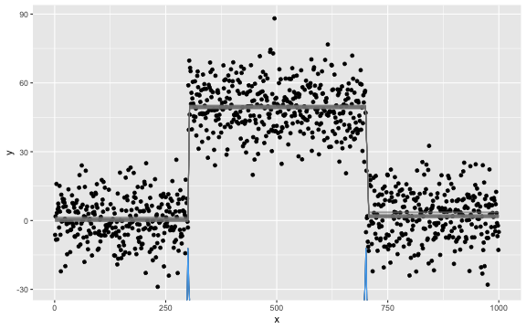

# Data setup

## Univariate mean change


```r
# Univariate mean change
set.seed(1)
p <- 1
mean_data_1 <- rbind(
  mvtnorm::rmvnorm(300, mean = rep(0, p), sigma = diag(100, p)),
  mvtnorm::rmvnorm(400, mean = rep(50, p), sigma = diag(100, p)),
  mvtnorm::rmvnorm(300, mean = rep(2, p), sigma = diag(100, p))
)

plot.ts(mean_data_1)
```


## Univariate mean and/or variance change


```r
# Univariate mean and/or variance change
set.seed(1)
p <- 1
mv_data_1 <- rbind(
  mvtnorm::rmvnorm(300, mean = rep(0, p), sigma = diag(1, p)),
  mvtnorm::rmvnorm(400, mean = rep(10, p), sigma = diag(1, p)),
  mvtnorm::rmvnorm(300, mean = rep(0, p), sigma = diag(100, p)),
  mvtnorm::rmvnorm(300, mean = rep(0, p), sigma = diag(1, p)),
  mvtnorm::rmvnorm(400, mean = rep(10, p), sigma = diag(1, p)),
  mvtnorm::rmvnorm(300, mean = rep(10, p), sigma = diag(100, p))
)

plot.ts(mv_data_1)
```


## Multivariate mean change


```r
# Multivariate mean change
set.seed(1)
p <- 3
mean_data_3 <- rbind(
  mvtnorm::rmvnorm(300, mean = rep(0, p), sigma = diag(100, p)),
  mvtnorm::rmvnorm(400, mean = rep(50, p), sigma = diag(100, p)),
  mvtnorm::rmvnorm(300, mean = rep(2, p), sigma = diag(100, p))
)

plot.ts(mean_data_3)
```


## Multivariate mean and/or variance change


```r
# Multivariate mean and/or variance change
set.seed(1)
p <- 4
mv_data_3 <- rbind(
  mvtnorm::rmvnorm(300, mean = rep(0, p), sigma = diag(1, p)),
  mvtnorm::rmvnorm(400, mean = rep(10, p), sigma = diag(1, p)),
  mvtnorm::rmvnorm(300, mean = rep(0, p), sigma = diag(100, p)),
  mvtnorm::rmvnorm(300, mean = rep(0, p), sigma = diag(1, p)),
  mvtnorm::rmvnorm(400, mean = rep(10, p), sigma = diag(1, p)),
  mvtnorm::rmvnorm(300, mean = rep(10, p), sigma = diag(100, p))
)

plot.ts(mv_data_3)
```


## Linear regression


```r
# Linear regression
set.seed(1)
n <- 300
p <- 4
x <- mvtnorm::rmvnorm(n, rep(0, p), diag(p))
theta_0 <- rbind(c(1, 3.2, -1, 0), c(-1, -0.5, 2.5, -2), c(0.8, 0, 1, 2))
y <- c(
  x[1:100, ] %*% theta_0[1, ] + rnorm(100, 0, 3),
  x[101:200, ] %*% theta_0[2, ] + rnorm(100, 0, 3),
  x[201:n, ] %*% theta_0[3, ] + rnorm(100, 0, 3)
)
lm_data <- data.frame(y = y, x = x)

plot.ts(lm_data)
```


## Logistic regression


```r
# Logistic regression
set.seed(1)
n <- 500
p <- 4
x <- mvtnorm::rmvnorm(n, rep(0, p), diag(p))
theta <- rbind(rnorm(p, 0, 1), rnorm(p, 2, 1))
y <- c(
  rbinom(300, 1, 1 / (1 + exp(-x[1:300, ] %*% theta[1, ]))),
  rbinom(200, 1, 1 / (1 + exp(-x[301:n, ] %*% theta[2, ])))
)
binomial_data <- data.frame(y = y, x = x)

plot.ts(binomial_data)
```


## Poisson regression


```r
# Poisson regression
set.seed(1)
n <- 1100
p <- 3
x <- mvtnorm::rmvnorm(n, rep(0, p), diag(p))
delta <- rnorm(p)
theta_0 <- c(1, 0.3, -1)
y <- c(
  rpois(500, exp(x[1:500, ] %*% theta_0)),
  rpois(300, exp(x[501:800, ] %*% (theta_0 + delta))),
  rpois(200, exp(x[801:1000, ] %*% theta_0)),
  rpois(100, exp(x[1001:1100, ] %*% (theta_0 - delta)))
)
poisson_data <- data.frame(y = y, x = x)

plot.ts(log(poisson_data$y))
```


```r
plot.ts(poisson_data[, -1])
```


## Lasso


```r
# Lasso
set.seed(1)
n <- 480
p_true <- 6
p <- 50
x <- mvtnorm::rmvnorm(n, rep(0, p), diag(p))
theta_0 <- rbind(
  runif(p_true, -5, -2),
  runif(p_true, -3, 3),
  runif(p_true, 2, 5),
  runif(p_true, -5, 5)
)
theta_0 <- cbind(theta_0, matrix(0, ncol = p - p_true, nrow = 4))
y <- c(
  x[1:80, ] %*% theta_0[1, ] + rnorm(80, 0, 1),
  x[81:200, ] %*% theta_0[2, ] + rnorm(120, 0, 1),
  x[201:320, ] %*% theta_0[3, ] + rnorm(120, 0, 1),
  x[321:n, ] %*% theta_0[4, ] + rnorm(160, 0, 1)
)
lasso_data <- data.frame(y = y, x = x)

plot.ts(lasso_data[, seq_len(p_true + 1)])
```


## AR(3)


```r
# AR(3)
set.seed(1)
n <- 1000
x <- rep(0, n + 3)
for (i in 1:600) {
  x[i + 3] <- 0.6 * x[i + 2] - 0.2 * x[i + 1] + 0.1 * x[i] + rnorm(1, 0, 3)
}
for (i in 601:1000) {
  x[i + 3] <- 0.3 * x[i + 2] + 0.4 * x[i + 1] + 0.2 * x[i] + rnorm(1, 0, 3)
}
ar_data <- x[-seq_len(3)]

plot.ts(ar_data)
```


## GARCH(1, 1)


```r
# GARCH(1, 1)
set.seed(1)
n <- 400
sigma_2 <- rep(1, n + 1)
x <- rep(0, n + 1)
for (i in seq_len(200)) {
  sigma_2[i + 1] <- 20 + 0.5 * x[i]^2 + 0.1 * sigma_2[i]
  x[i + 1] <- rnorm(1, 0, sqrt(sigma_2[i + 1]))
}
for (i in 201:400) {
  sigma_2[i + 1] <- 1 + 0.1 * x[i]^2 + 0.5 * sigma_2[i]
  x[i + 1] <- rnorm(1, 0, sqrt(sigma_2[i + 1]))
}
garch_data <- x[-1]

plot.ts(garch_data)
```


## VAR(2)


```r
# VAR(2)
set.seed(1)
n <- 800
p <- 2
theta_1 <- matrix(c(-0.3, 0.6, -0.5, 0.4, 0.2, 0.2, 0.2, -0.2), nrow = p)
theta_2 <- matrix(c(0.3, -0.4, 0.1, -0.5, -0.5, -0.2, -0.5, 0.2), nrow = p)
x <- matrix(0, n + 2, p)
for (i in 1:500) {
  x[i + 2, ] <- theta_1 %*% c(x[i + 1, ], x[i, ]) + rnorm(p, 0, 1)
}
for (i in 501:n) {
  x[i + 2, ] <- theta_2 %*% c(x[i + 1, ], x[i, ]) + rnorm(p, 0, 1)
}
var_data <- x[-seq_len(2), ]

plot.ts(var_data)
```


# Univariate mean change

The true change points are 300 and 700.
Some methods are plotted due to the un-retrievable change points.


```r
results[["mean_data_1"]][["fastcpd"]] <-
  fastcpd::fastcpd.mean(mean_data_1, r.progress = FALSE)@cp_set
```


```r
results[["mean_data_1"]][["fastcpd"]]
#> [1] 300 700
```


```r
results[["mean_data_1"]][["CptNonPar"]] <-
  CptNonPar::np.mojo(mean_data_1, G = floor(length(mean_data_1) / 6))$cpts
```


```r
results[["mean_data_1"]][["CptNonPar"]]
#> [1] 300 700
```


```r
results[["mean_data_1"]][["strucchange"]] <-
  strucchange::breakpoints(y ~ 1, data = data.frame(y = mean_data_1))$breakpoints
```


```r
results[["mean_data_1"]][["strucchange"]]
#> [1] 300 700
```


```r
results[["mean_data_1"]][["ecp"]] <- ecp::e.divisive(mean_data_1)$estimates
```


```r
results[["mean_data_1"]][["ecp"]]
#> [1]    1  301  701 1001
```


```r
results[["mean_data_1"]][["changepoint"]] <-
  changepoint::cpt.mean(c(mean_data_1))@cpts
```


```r
results[["mean_data_1"]][["changepoint"]]
#> [1]  300 1000
```


```r
results[["mean_data_1"]][["breakfast"]] <-
  breakfast::breakfast(mean_data_1)$cptmodel.list[[6]]$cpts
```


```r
results[["mean_data_1"]][["breakfast"]]
#> [1] 300 700
```


```r
results[["mean_data_1"]][["wbs"]] <-
  wbs::wbs(mean_data_1)$cpt$cpt.ic$mbic.penalty
```


```r
results[["mean_data_1"]][["wbs"]]
#> [1] 300 700
```


```r
results[["mean_data_1"]][["mosum"]] <-
  mosum::mosum(c(mean_data_1), G = 40)$cpts.info$cpts
```


```r
results[["mean_data_1"]][["mosum"]]
#> [1] 300 700
```


```r
results[["mean_data_1"]][["fpop"]] <-
  fpop::Fpop(mean_data_1, nrow(mean_data_1))$t.est
```


```r
results[["mean_data_1"]][["fpop"]]
#> [1]  300  700 1000
```


```r
results[["mean_data_1"]][["gfpop"]] <-
  gfpop::gfpop(
    data = mean_data_1,
    mygraph = gfpop::graph(
      penalty = 2 * log(nrow(mean_data_1)) * gfpop::sdDiff(mean_data_1) ^ 2,
      type = "updown"
    ),
    type = "mean"
  )$changepoints
```


```r
results[["mean_data_1"]][["gfpop"]]
#> [1]  300  700 1000
```


```r
results[["mean_data_1"]][["InspectChangepoint"]] <- InspectChangepoint::inspect(
  t(mean_data_1),
  threshold = InspectChangepoint::compute.threshold(
    nrow(mean_data_1), ncol(mean_data_1)
  )
)$changepoints[, "location"]
```


```r
results[["mean_data_1"]][["InspectChangepoint"]]
#> [1] 300 700
```


```r
results[["mean_data_1"]][["jointseg"]] <-
  jointseg::jointSeg(mean_data_1, K = 2)$bestBkp
```


```r
results[["mean_data_1"]][["jointseg"]]
#> [1] 300 700
```


```r
results[["mean_data_1"]][["Rbeast"]] <-
  Rbeast::beast(
    mean_data_1, season = "none", print.progress = FALSE, quiet = TRUE
  )$trend$cp
```


```r
results[["mean_data_1"]][["Rbeast"]]
#>  [1] 701 301 NaN NaN NaN NaN NaN NaN NaN NaN
```


```r
results[["mean_data_1"]][["stepR"]] <-
  stepR::stepFit(mean_data_1, alpha = 0.5)$rightEnd
```


```r
results[["mean_data_1"]][["stepR"]]
#> [1]  300  700 1000
```


```r
results[["mean_data_1"]][["cpm"]] <-
  cpm::processStream(mean_data_1, cpmType = "Student")$changePoints
```


```r
results[["mean_data_1"]][["cpm"]]
#> [1] 299 699
```


```r
results[["mean_data_1"]][["segmented"]] <-
  segmented::stepmented(
    as.numeric(mean_data_1), npsi = 2
  )$psi[, "Est."]
```


```r
results[["mean_data_1"]][["segmented"]]
#> psi1.index psi2.index 
#>   298.1981   699.1524
```


```r
results[["mean_data_1"]][["mcp"]] <- mcp::mcp(
  list(y ~ 1, ~ 1, ~ 1),
  data = data.frame(y = mean_data_1, x = seq_len(nrow(mean_data_1))),
  par_x = "x"
)
```


```r
if (requireNamespace("mcp", quietly = TRUE)) {
  plot(results[["mean_data_1"]][["mcp"]])
}
```




```r
results[["mean_data_1"]][["not"]] <-
  not::not(mean_data_1, contrast = "pcwsConstMean")
```


```r
if (requireNamespace("not", quietly = TRUE)) {
  plot(results[["mean_data_1"]][["not"]])
}
```


```r
results[["mean_data_1"]][["bcp"]] <- bcp::bcp(mean_data_1)
```


```r
if (requireNamespace("bcp", quietly = TRUE)) {
  plot(results[["mean_data_1"]][["bcp"]])
}
```


# Univariate mean and/or variance change

The true change points are 300, 700, 1000, 1300 and 1700.
Some methods are plotted due to the un-retrievable change points.


```r
results[["mv_data_1"]][["fastcpd"]] <-
  fastcpd::fastcpd.mv(mv_data_1, r.progress = FALSE)@cp_set
```


```r
results[["mv_data_1"]][["fastcpd"]]
#> [1]  300  700 1001 1300 1700
```


```r
results[["mv_data_1"]][["ecp"]] <- ecp::e.divisive(mv_data_1)$estimates
```


```r
results[["mv_data_1"]][["ecp"]]
#> [1]    1  301  701 1001 1301 1701 2001
```


```r
results[["mv_data_1"]][["changepoint"]] <-
  changepoint::cpt.meanvar(c(mv_data_1))@cpts
```


```r
results[["mv_data_1"]][["changepoint"]]
#> [1]  300 2000
```


```r
results[["mv_data_1"]][["CptNonPar"]] <-
  CptNonPar::np.mojo(mv_data_1, G = floor(length(mv_data_1) / 6))$cpts
```


```r
results[["mv_data_1"]][["CptNonPar"]]
#> [1]  333  700 1300
```


```r
results[["mv_data_1"]][["cpm"]] <-
  cpm::processStream(mv_data_1, cpmType = "GLR")$changePoints
```


```r
results[["mv_data_1"]][["cpm"]]
#>  [1]  293  300  403  408  618  621  696 1000 1021 1024 1293 1300 1417 1693 1700
#> [16] 1981
```


```r
results[["mv_data_1"]][["InspectChangepoint"]] <- InspectChangepoint::inspect(
  t(mv_data_1),
  threshold = InspectChangepoint::compute.threshold(
    nrow(mv_data_1), ncol(mv_data_1)
  )
)$changepoints[, "location"]
```


```r
results[["mv_data_1"]][["InspectChangepoint"]]
#>   [1]  300  700  701  702  704  707  708  712  715  716  717  718  721  722  723
#>  [16]  726  727  729  731  732  734  736  740  742  744  746  748  750  753  755
#>  [31]  756  757  759  760  762  764  765  766  768  769  771  772  774  776  777
#>  [46]  784  785  786  789  791  792  794  797  798  799  801  802  803  807  809
#>  [61]  810  813  815  817  819  826  827  828  829  831  833  835  836  837  838
#>  [76]  840  841  842  843  845  848  849  852  854  860  862  864  866  868  870
#>  [91]  872  875  879  881  884  886  887  888  889  896  897  898  899  901  903
#> [106]  904  905  906  909  910  912  913  915  917  919  921  922  923  925  927
#> [121]  928  932  934  936  937  940  944  945  947  948  949  951  956  958  959
#> [136]  961  962  963  964  966  967  968  972  974  976  978  979  986  988  990
#> [151]  992  995  998 1000 1300 1700 1702 1703 1704 1705 1708 1710 1712 1714 1716
#> [166] 1717 1718 1720 1721 1723 1725 1726 1727 1729 1731 1733 1735 1736 1737 1739
#> [181] 1742 1745 1747 1748 1752 1754 1756 1758 1759 1760 1766 1768 1770 1771 1773
#> [196] 1775 1778 1782 1784 1785 1790 1792 1793 1795 1796 1797 1799 1800 1802 1803
#> [211] 1804 1805 1806 1807 1808 1809 1813 1815 1816 1818 1821 1824 1825 1827 1828
#> [226] 1829 1833 1835 1837 1840 1841 1842 1848 1849 1851 1852 1854 1855 1857 1859
#> [241] 1860 1862 1863 1865 1867 1868 1876 1878 1879 1880 1882 1883 1884 1886 1887
#> [256] 1889 1894 1898 1899 1905 1906 1907 1908 1909 1912 1919 1920 1921 1923 1924
#> [271] 1926 1927 1928 1930 1933 1934 1935 1936 1938 1940 1941 1944 1947 1950 1952
#> [286] 1954 1955 1956 1960 1962 1963 1965 1966 1967 1969 1970 1974 1976 1977 1978
#> [301] 1980 1985 1987 1988 1990 1996 1997 1998
```


```r
results[["mv_data_1"]][["Rbeast"]] <-
  Rbeast::beast(
    mv_data_1, season = "none", print.progress = FALSE, quiet = TRUE
  )$trend$cp
```


```r
results[["mv_data_1"]][["Rbeast"]]
#>  [1] 1855 1794 1301 1986  301  703 1981 1769 1860  709
```


```r
results[["mv_data_1"]][["mcp"]] <- mcp::mcp(
  list(y ~ 1, ~ 1, ~ 1, ~ 1, ~ 1, ~ 1),
  data = data.frame(y = mv_data_1, x = seq_len(nrow(mv_data_1))),
  par_x = "x"
)
```


```r
if (requireNamespace("mcp", quietly = TRUE)) {
  plot(results[["mv_data_1"]][["mcp"]])
}
```


```r
results[["mv_data_1"]][["not"]] <-
  not::not(mv_data_1, contrast = "pcwsConstMeanVar")
```


```r
if (requireNamespace("not", quietly = TRUE)) {
  plot(results[["mv_data_1"]][["not"]])
}
```


```
#> Press [enter] to continue
```


# Multivariate mean change

The true change points are 300 and 700.
Some methods are plotted due to the un-retrievable change points.


```r
results[["mean_data_3"]][["fastcpd"]] <-
  fastcpd::fastcpd.mean(mean_data_3, r.progress = FALSE)@cp_set
```


```r
results[["mean_data_3"]][["fastcpd"]]
#> [1] 300 700
```


```r
results[["mean_data_3"]][["CptNonPar"]] <-
  CptNonPar::np.mojo(mean_data_3, G = floor(nrow(mean_data_3) / 6))$cpts
```


```r
results[["mean_data_3"]][["CptNonPar"]]
#> [1] 300 700
```


```r
results[["mean_data_3"]][["InspectChangepoint"]] <- InspectChangepoint::inspect(
  t(mean_data_3),
  threshold = InspectChangepoint::compute.threshold(
    nrow(mean_data_3), ncol(mean_data_3)
  )
)$changepoints[, "location"]
```


```r
results[["mean_data_3"]][["InspectChangepoint"]]
#> [1] 300 700
```


```r
results[["mean_data_3"]][["jointseg"]] <-
  jointseg::jointSeg(mean_data_3, K = 2)$bestBkp
```


```r
results[["mean_data_3"]][["jointseg"]]
#> [1] 300 700
```


```r
results[["mean_data_3"]][["Rbeast"]] <-
  Rbeast::beast123(
    mean_data_3,
    metadata = list(whichDimIsTime = 1),
    season = "none"
  )$trend$cp
```


```r
results[["mean_data_3"]][["Rbeast"]]
#>       [,1] [,2] [,3]
#>  [1,]  301  701  301
#>  [2,]  701  301  701
#>  [3,]  142  117  926
#>  [4,]  305  NaN  NaN
#>  [5,]  705  NaN  NaN
#>  [6,]  694  NaN  NaN
#>  [7,]  NaN  NaN  NaN
#>  [8,]  NaN  NaN  NaN
#>  [9,]  NaN  NaN  NaN
#> [10,]  NaN  NaN  NaN
```


```r
results[["mean_data_3"]][["strucchange"]] <-
  strucchange::breakpoints(
    cbind(y.1, y.2, y.3) ~ 1, data = data.frame(y = mean_data_3)
  )$breakpoints
```


```r
results[["mean_data_3"]][["strucchange"]]
#> [1] 300 700
```


```r
results[["mean_data_3"]][["ecp"]] <- ecp::e.divisive(mean_data_3)$estimates
```


```r
results[["mean_data_3"]][["ecp"]]
#> [1]    1  301  701 1001
```


```r
results[["mean_data_3"]][["bcp"]] <- bcp::bcp(mean_data_3)
```


```r
if (requireNamespace("bcp", quietly = TRUE)) {
  plot(results[["mean_data_3"]][["bcp"]])
}
```


# Multivariate mean and/or variance change

The true change points are 300, 700, 1000, 1300 and 1700.
Some methods are plotted due to the un-retrievable change points.


```r
results[["mv_data_3"]][["fastcpd"]] <-
  fastcpd::fastcpd.mv(mv_data_3, r.progress = FALSE)@cp_set
```


```r
results[["mv_data_3"]][["fastcpd"]]
#> [1]  300  700 1000 1300 1700
```


```r
results[["mv_data_3"]][["ecp"]] <- ecp::e.divisive(mv_data_3)$estimates
```


```r
results[["mv_data_3"]][["ecp"]]
#> [1]    1  301  701 1001 1301 1701 2001
```


```r
results[["mv_data_3"]][["InspectChangepoint"]] <- InspectChangepoint::inspect(
  t(mv_data_3),
  threshold = InspectChangepoint::compute.threshold(
    nrow(mv_data_3), ncol(mv_data_3)
  )
)$changepoints[, "location"]
```


```r
results[["mv_data_3"]][["InspectChangepoint"]]
#>   [1]  300  700  701  703  705  707  708  709  711  712  714  715  717  718  720
#>  [16]  721  723  724  726  727  729  731  733  734  736  737  739  740  742  743
#>  [31]  744  746  747  749  750  752  753  754  755  756  758  760  762  763  765
#>  [46]  766  767  769  770  772  773  774  775  777  779  780  782  784  786  788
#>  [61]  790  791  793  795  797  799  801  803  804  806  809  810  811  813  814
#>  [76]  816  817  818  820  821  823  825  827  828  830  831  833  835  836  837
#>  [91]  838  840  842  843  845  846  848  849  850  852  853  854  855  856  858
#> [106]  859  860  862  863  865  866  868  869  871  872  874  876  877  878  879
#> [121]  881  883  885  887  888  889  891  893  894  895  897  898  900  901  903
#> [136]  904  906  908  909  911  913  914  916  917  918  920  921  923  924  925
#> [151]  927  928  929  931  932  934  936  937  938  939  941  942  943  945  946
#> [166]  947  949  950  952  954  955  956  957  958  959  961  962  964  965  967
#> [181]  968  970  972  973  974  975  977  979  981  982  984  985  986  987  988
#> [196]  990  991  992  994  995  997  999 1000 1300 1700 1702 1703 1704 1705 1706
#> [211] 1708 1709 1710 1712 1713 1714 1715 1717 1719 1721 1722 1723 1725 1727 1729
#> [226] 1730 1732 1734 1735 1737 1738 1739 1741 1742 1744 1746 1748 1750 1752 1753
#> [241] 1754 1755 1757 1758 1759 1761 1762 1763 1764 1766 1767 1769 1770 1771 1773
#> [256] 1774 1775 1777 1779 1781 1782 1783 1785 1786 1788 1789 1791 1793 1794 1796
#> [271] 1798 1800 1803 1804 1805 1806 1808 1809 1811 1812 1814 1815 1817 1818 1819
#> [286] 1821 1822 1824 1825 1827 1828 1829 1831 1833 1835 1836 1838 1839 1841 1843
#> [301] 1844 1846 1847 1848 1850 1851 1853 1854 1856 1857 1858 1859 1860 1862 1863
#> [316] 1864 1865 1867 1869 1870 1872 1873 1874 1876 1878 1879 1881 1882 1884 1885
#> [331] 1887 1889 1891 1893 1894 1896 1898 1899 1900 1901 1902 1904 1906 1907 1909
#> [346] 1911 1913 1914 1916 1917 1918 1919 1921 1923 1924 1925 1927 1928 1930 1932
#> [361] 1933 1935 1936 1938 1939 1941 1942 1944 1946 1948 1950 1951 1952 1954 1956
#> [376] 1957 1959 1961 1963 1965 1967 1968 1970 1972 1973 1974 1976 1977 1979 1981
#> [391] 1982 1984 1985 1987 1989 1990 1992 1993 1995 1996 1998
```


```r
results[["mv_data_3"]][["Rbeast"]] <-
  Rbeast::beast123(
    mv_data_3,
    metadata = list(whichDimIsTime = 1),
    season = "none"
  )$trend$cp
```


```r
results[["mv_data_3"]][["Rbeast"]]
#>       [,1] [,2] [,3] [,4]
#>  [1,]  701 1301  301 1301
#>  [2,] 1301  301 1301  710
#>  [3,]  301  701 1829  301
#>  [4,] 1968 1993  702  886
#>  [5,] 1994  884 1822 1975
#>  [6,]  814  755  810 1915
#>  [7,] 1962  781  845  778
#>  [8,] 1978  767 1738 1985
#>  [9,] 1870  747 1754  792
#> [10,] 1843  722  771  953
```


# Linear regression

The true change points are 100 and 200.


```r
results[["lm_data"]][["fastcpd"]] <-
  fastcpd::fastcpd.lm(lm_data, r.progress = FALSE)@cp_set
```


```r
results[["lm_data"]][["fastcpd"]]
#> [1]  97 201
```


```r
results[["lm_data"]][["strucchange"]] <-
  strucchange::breakpoints(y ~ . - 1, data = lm_data)$breakpoints
```


```r
results[["lm_data"]][["strucchange"]]
#> [1] 100 201
```


```r
results[["lm_data"]][["segmented"]] <-
  segmented::segmented(
    lm(
      y ~ . - 1, data.frame(y = lm_data$y, x = lm_data[, -1], index = seq_len(nrow(lm_data)))
    ),
    seg.Z = ~ index
  )$psi[, "Est."]
```


```r
results[["lm_data"]][["segmented"]]
#> [1] 233
```


# Logistic regression

The true change point is 300.


```r
results[["binomial_data"]][["fastcpd"]] <-
  fastcpd::fastcpd.binomial(binomial_data, r.progress = FALSE)@cp_set
```


```r
results[["binomial_data"]][["fastcpd"]]
#> [1] 302
```


```r
results[["binomial_data"]][["strucchange"]] <-
  strucchange::breakpoints(y ~ . - 1, data = binomial_data)$breakpoints
```


```r
results[["binomial_data"]][["strucchange"]]
#> [1] 297
```


# Poisson regression

The true change points are 500, 800 and 1000.


```r
results[["poisson_data"]][["fastcpd"]] <-
  fastcpd::fastcpd.poisson(poisson_data, r.progress = FALSE)@cp_set
```


```r
results[["poisson_data"]][["fastcpd"]]
#> [1]  498  805 1003
```


```r
results[["poisson_data"]][["strucchange"]] <-
  strucchange::breakpoints(y ~ . - 1, data = poisson_data)$breakpoints
```


```r
results[["poisson_data"]][["strucchange"]]
#> [1] 935
```


# Lasso

The true change points are 80, 200 and 320.


```r
results[["lasso_data"]][["fastcpd"]] <-
  fastcpd::fastcpd.lasso(lasso_data, r.progress = FALSE)@cp_set
```


```r
results[["lasso_data"]][["fastcpd"]]
#> [1]  79 199 321
```


```r
results[["lasso_data"]][["strucchange"]] <-
  strucchange::breakpoints(y ~ . - 1, data = lasso_data)$breakpoints
```


```r
results[["lasso_data"]][["strucchange"]]
#> [1]  80 200 321
```


# AR(3)

The true change point is 600.
Some methods are plotted due to the un-retrievable change points.


```r
results[["ar_data"]][["fastcpd"]] <-
  fastcpd::fastcpd.ar(ar_data, 3, r.progress = FALSE)@cp_set
```


```r
results[["ar_data"]][["fastcpd"]]
#> [1] 614
```


```r
results[["ar_data"]][["CptNonPar"]] <-
  CptNonPar::np.mojo(ar_data, G = floor(length(ar_data) / 6))$cpts
```


```r
results[["ar_data"]][["CptNonPar"]]
#> numeric(0)
```


```r
results[["ar_data"]][["segmented"]] <-
  segmented::segmented(
    lm(
      y ~ x + 1, data.frame(y = ar_data, x = seq_along(ar_data))
    ),
    seg.Z = ~ x
  )$psi[, "Est."]
```


```r
results[["ar_data"]][["segmented"]]
#> [1] 690
```


```r
results[["ar_data"]][["mcp"]] <-
  mcp::mcp(
    list(y ~ 1 + ar(3), ~ 0 + ar(3)),
    data = data.frame(y = ar_data, x = seq_along(ar_data)),
    par_x = "x"
  )
```


```r
if (requireNamespace("mcp", quietly = TRUE)) {
  plot(results[["ar_data"]][["mcp"]])
}
```


# GARCH(1, 1)

The true change point is 200.


```r
results[["garch_data"]][["fastcpd"]] <-
  fastcpd::fastcpd.garch(garch_data, c(1, 1), r.progress = FALSE)@cp_set
```


```r
results[["garch_data"]][["fastcpd"]]
#> [1] 205
```


```r
results[["garch_data"]][["CptNonPar"]] <-
  CptNonPar::np.mojo(garch_data, G = floor(length(garch_data) / 6))$cpts
```


```r
results[["garch_data"]][["CptNonPar"]]
#> [1] 206
```


```r
results[["garch_data"]][["strucchange"]] <-
  strucchange::breakpoints(x ~ 1, data = data.frame(x = garch_data))$breakpoints
```


```r
results[["garch_data"]][["strucchange"]]
#> [1] NA
```


# VAR(2)

The true change points is 500.


```r
results[["var_data"]][["fastcpd"]] <-
  fastcpd::fastcpd.var(var_data, 2, r.progress = FALSE)@cp_set
```


```r
results[["var_data"]][["fastcpd"]]
#> [1] 500
```


```r
results[["var_data"]][["VARDetect"]] <- VARDetect::tbss(var_data)$cp
```


```r
results[["var_data"]][["VARDetect"]]
#> [1] 501
```


# Detection comparison using `well_log`


```r
well_log <- fastcpd::well_log
```


```r
well_log <- well_log[well_log > 1e5]

results[["well_log"]] <- list(
  fastcpd = fastcpd.mean(well_log, trim = 0.003)@cp_set,
  changepoint = changepoint::cpt.mean(well_log)@cpts,
  CptNonPar =
    CptNonPar::np.mojo(well_log, G = floor(length(well_log) / 6))$cpts,
  strucchange = strucchange::breakpoints(
    y ~ 1, data = data.frame(y = well_log)
  )$breakpoints,
  ecp = ecp::e.divisive(matrix(well_log))$estimates,
  breakfast = breakfast::breakfast(well_log)$cptmodel.list[[6]]$cpts,
  wbs = wbs::wbs(well_log)$cpt$cpt.ic$mbic.penalty,
  mosum = mosum::mosum(c(well_log), G = 40)$cpts.info$cpts,
  # fpop = fpop::Fpop(well_log, length(well_log))$t.est,  # meaningless
  gfpop = gfpop::gfpop(
    data = well_log,
    mygraph = gfpop::graph(
      penalty = 2 * log(length(well_log)) * gfpop::sdDiff(well_log) ^ 2,
      type = "updown"
    ),
    type = "mean"
  )$changepoints,
  InspectChangepoint = InspectChangepoint::inspect(
    well_log,
    threshold = InspectChangepoint::compute.threshold(length(well_log), 1)
  )$changepoints[, "location"],
  jointseg = jointseg::jointSeg(well_log, K = 12)$bestBkp,
  Rbeast = Rbeast::beast(
    well_log, season = "none", print.progress = FALSE, quiet = TRUE
  )$trend$cp,
  stepR = stepR::stepFit(well_log, alpha = 0.5)$rightEnd
)
```


```r
results[["well_log"]]
#> $fastcpd
#>  [1]   12  572  704  776 1021 1057 1198 1347 1406 1502 1660 1842 2023 2202 2384
#> [16] 2445 2507 2567 2749 2926 3094 3107 3509 3622 3709 3820 3976
#> 
#> $changepoint
#> [1] 2738 3989
#> 
#> $CptNonPar
#> [1] 1021 1681 2022 2738
#> 
#> $strucchange
#> [1] 1057 1660 2568 3283
#> 
#> $ecp
#>  [1]    1   33  315  435  567  705  803 1026 1058 1348 1503 1662 1843 2024 2203
#> [16] 2386 2446 2508 2569 2745 2780 2922 3073 3136 3252 3465 3500 3554 3623 3710
#> [31] 3821 3868 3990
#> 
#> $breakfast
#>  [1]   33  310  434  572  704  779 1021 1057 1347 1502 1659 1842 2021 2032 2202
#> [16] 2384 2446 2507 2567 2747 2779 2926 3094 3106 3125 3283 3464 3499 3622 3709
#> [31] 3806 3835 3848 3877 3896 3976
#> 
#> $wbs
#>  [1] 2568 1057 1661 1842 2385 2023 2445 1502 2744    6 2507 1021 3709 3820 1402
#> [16]  434 1408 3131 3976 3509 3622  776 1197 3094  704 3104 1347  314 2921 3251
#> [31] 3464 3848 3906 2779 1663 3636   60 3904 2202  566   12 3639 1200    7 1671
#> [46]  706
#> 
#> $mosum
#>  [1]    6  434  704 1017 1057 1325 1502 1661 1842 2023 2385 2445 2507 2567 2744
#> [16] 3060 3438 3509 3610 3697 3820 3867 3976
#> 
#> $gfpop
#>  [1]    6    7    8   12  314  434  556  560  704  776 1021 1057 1197 1200 1347
#> [16] 1364 1405 1407 1491 1502 1661 1842 2023 2385 2445 2507 2567 2664 2747 2752
#> [31] 2921 3094 3104 3125 3251 3464 3499 3622 3709 3820 3976 3989
#> 
#> $InspectChangepoint
#>  [1]    6    8   15   71  314  434  521  704  706  776  830 1021 1057 1059 1347
#> [16] 1402 1405 1408 1412 1502 1520 1659 1661 1663 1694 1842 1848 2022 2202 2384
#> [31] 2387 2445 2507 2567 2568 2673 2738 2746 2752 2779 2921 3131 3251 3464 3509
#> [46] 3609 3658 3709 3806 3976
#> 
#> $jointseg
#>  [1]    6 1021 1057 1502 1661 1842 2022 2384 2445 2507 2568 2738
#> 
#> $Rbeast
#>  [1] 1058 1662    7 1022 2447 2386 2023 1503 2745 3710
#> 
#> $stepR
#>  [1]    7   14  314  434  566  704  776 1021 1057 1197 1200 1347 1405 1407 1502
#> [16] 1661 1694 1842 2023 2202 2385 2445 2507 2567 2747 2752 2921 3094 3104 3125
#> [31] 3251 3464 3499 3609 3658 3709 3820 3867 3905 3976 3989
```


```r
package_list <- sort(names(results[["well_log"]]), decreasing = TRUE)
comparison_table <- NULL
for (package_index in seq_along(package_list)) {
  package <- package_list[[package_index]]
  comparison_table <- rbind(
    comparison_table,
    data.frame(
      change_point = results[["well_log"]][[package]],
      package = package,
      y_offset = (package_index - 1) * 1000
    )
  )
}

most_selected <- sort(table(comparison_table$change_point), decreasing = TRUE)
most_selected <- sort(as.numeric(names(most_selected[most_selected >= 4])))
for (i in seq_len(length(most_selected) - 1)) {
  if (most_selected[i + 1] - most_selected[i] < 2) {
    most_selected[i] <- NA
    most_selected[i + 1] <- most_selected[i + 1] - 0.5
  }
}
(most_selected <- most_selected[!is.na(most_selected)])
#>  [1]    6.5  314.0  434.0  704.0  776.0 1021.0 1057.0 1347.0 1502.0 1661.0
#> [11] 1842.0 2023.0 2202.0 2384.5 2445.0 2507.0 2567.5 2738.0 2921.0 3094.0
#> [21] 3251.0 3464.0 3509.0 3622.0 3709.0 3820.0 3976.0
```


```r
if (requireNamespace("ggplot2", quietly = TRUE)) {
  ggplot2::ggplot() +
    ggplot2::geom_point(
      data = data.frame(x = seq_along(well_log), y = c(well_log)),
      ggplot2::aes(x = x, y = y)
    ) +
    ggplot2::geom_vline(
      xintercept = most_selected,
      color = "black",
      linetype = "dashed",
      alpha = 0.2
    ) +
    ggplot2::geom_point(
      data = comparison_table,
      ggplot2::aes(x = change_point, y = 50000 + y_offset, color = package),
      shape = 17,
      size = 1.9
    ) +
    ggplot2::geom_hline(
      data = comparison_table,
      ggplot2::aes(yintercept = 50000 + y_offset, color = package),
      linetype = "dashed",
      alpha = 0.1
    ) +
    ggplot2::coord_cartesian(
      ylim = c(50000 - 500, max(well_log) + 1000),
      xlim = c(-200, length(well_log) + 200),
      expand = FALSE
    ) +
    ggplot2::theme(
      panel.background = ggplot2::element_blank(),
      panel.border = ggplot2::element_rect(colour = "black", fill = NA),
      panel.grid.major = ggplot2::element_blank(),
      panel.grid.minor = ggplot2::element_blank()
    ) +
    ggplot2::xlab(NULL) + ggplot2::ylab(NULL)
}
```


# Time comparison using `well_log`


```r
results[["microbenchmark"]] <- microbenchmark::microbenchmark(
  fastcpd = fastcpd::fastcpd.mean(well_log, trim = 0.003, r.progress = FALSE),
  changepoint = changepoint::cpt.mean(well_log, method = "PELT"),
  CptNonPar = CptNonPar::np.mojo(well_log, G = floor(length(well_log) / 6)),
  strucchange =
    strucchange::breakpoints(y ~ 1, data = data.frame(y = well_log)),
  ecp = ecp::e.divisive(matrix(well_log)),
  breakfast = breakfast::breakfast(well_log),
  wbs = wbs::wbs(well_log),
  mosum = mosum::mosum(c(well_log), G = 40),
  fpop = fpop::Fpop(well_log, nrow(well_log)),
  gfpop = gfpop::gfpop(
    data = well_log,
    mygraph = gfpop::graph(
      penalty = 2 * log(length(well_log)) * gfpop::sdDiff(well_log) ^ 2,
      type = "updown"
    ),
    type = "mean"
  ),
  InspectChangepoint = InspectChangepoint::inspect(
    well_log,
    threshold = InspectChangepoint::compute.threshold(length(well_log), 1)
  ),
  jointseg = jointseg::jointSeg(well_log, K = 12),
  Rbeast = Rbeast::beast(
    well_log, season = "none", print.progress = FALSE, quiet = TRUE
  ),
  stepR = stepR::stepFit(well_log, alpha = 0.5),
  not = not::not(well_log, contrast = "pcwsConstMean"),
  times = 10
)
```


```r
results[["microbenchmark"]]
#> Unit: milliseconds
#>                expr          min           lq         mean       median
#>             fastcpd 6.257120e+01 6.696175e+01 7.183964e+01 7.168669e+01
#>         changepoint 3.205076e+01 3.305076e+01 4.025595e+01 3.774400e+01
#>           CptNonPar 1.875995e+04 2.014073e+04 2.244910e+04 2.224506e+04
#>         strucchange 6.359889e+04 6.409690e+04 6.651444e+04 6.565439e+04
#>                 ecp 7.505232e+05 7.895889e+05 8.168647e+05 8.170952e+05
#>           breakfast 9.606171e+03 9.819381e+03 1.052611e+04 1.048197e+04
#>                 wbs 1.163237e+02 1.180537e+02 1.263443e+02 1.254133e+02
#>               mosum 1.059973e+00 1.147898e+00 2.175931e+00 1.409396e+00
#>                fpop 2.604002e+00 3.676689e+00 4.859312e+00 4.308841e+00
#>               gfpop 6.057383e+01 6.595090e+01 7.277643e+01 7.212125e+01
#>  InspectChangepoint 1.584727e+02 2.171007e+02 2.414921e+02 2.424665e+02
#>            jointseg 2.104403e+01 2.284920e+01 3.577861e+01 2.708083e+01
#>              Rbeast 6.545716e+02 6.913542e+02 7.993305e+02 7.504324e+02
#>               stepR 2.740003e+01 3.020269e+01 3.149624e+01 3.188329e+01
#>                 not 9.715867e+01 1.000287e+02 1.101258e+02 1.074475e+02
#>            uq          max neval
#>  7.689381e+01 8.332375e+01    10
#>  4.669485e+01 5.904173e+01    10
#>  2.380236e+04 2.705807e+04    10
#>  6.597650e+04 7.757488e+04    10
#>  8.259550e+05 8.834288e+05    10
#>  1.103289e+04 1.197235e+04    10
#>  1.276892e+02 1.455261e+02    10
#>  1.957312e+00 8.705062e+00    10
#>  5.107175e+00 1.085365e+01    10
#>  7.742432e+01 8.794816e+01    10
#>  3.060519e+02 3.145695e+02    10
#>  4.362760e+01 9.516090e+01    10
#>  8.539695e+02 1.163607e+03    10
#>  3.294534e+01 3.530981e+01    10
#>  1.147504e+02 1.331989e+02    10
```


```r
if (requireNamespace("ggplot2", quietly = TRUE) && requireNamespace("microbenchmark", quietly = TRUE)) {
  ggplot2::autoplot(results[["microbenchmark"]])
}
```


# Notes

This document is generated by the following code:

```shell
R -e 'knitr::knit("vignettes/comparison-packages.Rmd.original", output = "vignettes/comparison-packages.Rmd")' && rm -rf vignettes/figure && mv -f figure vignettes
```

# Related issues

-   `mosum`: [[#4](https://github.com/doccstat/fastcpd/issues/4)].
-   `mcp`: [link 1](https://github.com/doccstat/fastcpd/actions/runs/7272426093/job/19814531091)
    and [link 2](https://github.com/doccstat/fastcpd/actions/runs/7272426093/job/19814531284).
-   `bcp`: [[#5](https://github.com/doccstat/fastcpd/issues/5)].
-   `gfpop`: [[#10](https://github.com/doccstat/fastcpd/issues/10)].

# Acknowledgements

-   [Dr. Vito Muggeo](https://www.unipa.it/persone/docenti/m/vito.muggeo),
    author of the `segmented` package for the tips about the piece-wise
    constant function.

# Appendix: all code snippets


```r
knitr::opts_chunk$set(
  collapse = TRUE, comment = "#>", eval = TRUE, cache = FALSE,
  warning = FALSE, fig.width = 8, fig.height = 5
)

if (requireNamespace("microbenchmark", quietly = TRUE)) {
  library(microbenchmark)
}

if (file.exists("comparison-packages-results.RData")) {
  # Available at https://pcloud.xingchi.li/comparison-packages-results.RData
  load("comparison-packages-results.RData")
} else {
  results <- list()
}
# Univariate mean change
set.seed(1)
p <- 1
mean_data_1 <- rbind(
  mvtnorm::rmvnorm(300, mean = rep(0, p), sigma = diag(100, p)),
  mvtnorm::rmvnorm(400, mean = rep(50, p), sigma = diag(100, p)),
  mvtnorm::rmvnorm(300, mean = rep(2, p), sigma = diag(100, p))
)

plot.ts(mean_data_1)
# Univariate mean and/or variance change
set.seed(1)
p <- 1
mv_data_1 <- rbind(
  mvtnorm::rmvnorm(300, mean = rep(0, p), sigma = diag(1, p)),
  mvtnorm::rmvnorm(400, mean = rep(10, p), sigma = diag(1, p)),
  mvtnorm::rmvnorm(300, mean = rep(0, p), sigma = diag(100, p)),
  mvtnorm::rmvnorm(300, mean = rep(0, p), sigma = diag(1, p)),
  mvtnorm::rmvnorm(400, mean = rep(10, p), sigma = diag(1, p)),
  mvtnorm::rmvnorm(300, mean = rep(10, p), sigma = diag(100, p))
)

plot.ts(mv_data_1)
# Multivariate mean change
set.seed(1)
p <- 3
mean_data_3 <- rbind(
  mvtnorm::rmvnorm(300, mean = rep(0, p), sigma = diag(100, p)),
  mvtnorm::rmvnorm(400, mean = rep(50, p), sigma = diag(100, p)),
  mvtnorm::rmvnorm(300, mean = rep(2, p), sigma = diag(100, p))
)

plot.ts(mean_data_3)
# Multivariate mean and/or variance change
set.seed(1)
p <- 4
mv_data_3 <- rbind(
  mvtnorm::rmvnorm(300, mean = rep(0, p), sigma = diag(1, p)),
  mvtnorm::rmvnorm(400, mean = rep(10, p), sigma = diag(1, p)),
  mvtnorm::rmvnorm(300, mean = rep(0, p), sigma = diag(100, p)),
  mvtnorm::rmvnorm(300, mean = rep(0, p), sigma = diag(1, p)),
  mvtnorm::rmvnorm(400, mean = rep(10, p), sigma = diag(1, p)),
  mvtnorm::rmvnorm(300, mean = rep(10, p), sigma = diag(100, p))
)

plot.ts(mv_data_3)
# Linear regression
set.seed(1)
n <- 300
p <- 4
x <- mvtnorm::rmvnorm(n, rep(0, p), diag(p))
theta_0 <- rbind(c(1, 3.2, -1, 0), c(-1, -0.5, 2.5, -2), c(0.8, 0, 1, 2))
y <- c(
  x[1:100, ] %*% theta_0[1, ] + rnorm(100, 0, 3),
  x[101:200, ] %*% theta_0[2, ] + rnorm(100, 0, 3),
  x[201:n, ] %*% theta_0[3, ] + rnorm(100, 0, 3)
)
lm_data <- data.frame(y = y, x = x)

plot.ts(lm_data)
# Logistic regression
set.seed(1)
n <- 500
p <- 4
x <- mvtnorm::rmvnorm(n, rep(0, p), diag(p))
theta <- rbind(rnorm(p, 0, 1), rnorm(p, 2, 1))
y <- c(
  rbinom(300, 1, 1 / (1 + exp(-x[1:300, ] %*% theta[1, ]))),
  rbinom(200, 1, 1 / (1 + exp(-x[301:n, ] %*% theta[2, ])))
)
binomial_data <- data.frame(y = y, x = x)

plot.ts(binomial_data)
# Poisson regression
set.seed(1)
n <- 1100
p <- 3
x <- mvtnorm::rmvnorm(n, rep(0, p), diag(p))
delta <- rnorm(p)
theta_0 <- c(1, 0.3, -1)
y <- c(
  rpois(500, exp(x[1:500, ] %*% theta_0)),
  rpois(300, exp(x[501:800, ] %*% (theta_0 + delta))),
  rpois(200, exp(x[801:1000, ] %*% theta_0)),
  rpois(100, exp(x[1001:1100, ] %*% (theta_0 - delta)))
)
poisson_data <- data.frame(y = y, x = x)

plot.ts(log(poisson_data$y))
plot.ts(poisson_data[, -1])
# Lasso
set.seed(1)
n <- 480
p_true <- 6
p <- 50
x <- mvtnorm::rmvnorm(n, rep(0, p), diag(p))
theta_0 <- rbind(
  runif(p_true, -5, -2),
  runif(p_true, -3, 3),
  runif(p_true, 2, 5),
  runif(p_true, -5, 5)
)
theta_0 <- cbind(theta_0, matrix(0, ncol = p - p_true, nrow = 4))
y <- c(
  x[1:80, ] %*% theta_0[1, ] + rnorm(80, 0, 1),
  x[81:200, ] %*% theta_0[2, ] + rnorm(120, 0, 1),
  x[201:320, ] %*% theta_0[3, ] + rnorm(120, 0, 1),
  x[321:n, ] %*% theta_0[4, ] + rnorm(160, 0, 1)
)
lasso_data <- data.frame(y = y, x = x)

plot.ts(lasso_data[, seq_len(p_true + 1)])
# AR(3)
set.seed(1)
n <- 1000
x <- rep(0, n + 3)
for (i in 1:600) {
  x[i + 3] <- 0.6 * x[i + 2] - 0.2 * x[i + 1] + 0.1 * x[i] + rnorm(1, 0, 3)
}
for (i in 601:1000) {
  x[i + 3] <- 0.3 * x[i + 2] + 0.4 * x[i + 1] + 0.2 * x[i] + rnorm(1, 0, 3)
}
ar_data <- x[-seq_len(3)]

plot.ts(ar_data)
# GARCH(1, 1)
set.seed(1)
n <- 400
sigma_2 <- rep(1, n + 1)
x <- rep(0, n + 1)
for (i in seq_len(200)) {
  sigma_2[i + 1] <- 20 + 0.5 * x[i]^2 + 0.1 * sigma_2[i]
  x[i + 1] <- rnorm(1, 0, sqrt(sigma_2[i + 1]))
}
for (i in 201:400) {
  sigma_2[i + 1] <- 1 + 0.1 * x[i]^2 + 0.5 * sigma_2[i]
  x[i + 1] <- rnorm(1, 0, sqrt(sigma_2[i + 1]))
}
garch_data <- x[-1]

plot.ts(garch_data)
# VAR(2)
set.seed(1)
n <- 800
p <- 2
theta_1 <- matrix(c(-0.3, 0.6, -0.5, 0.4, 0.2, 0.2, 0.2, -0.2), nrow = p)
theta_2 <- matrix(c(0.3, -0.4, 0.1, -0.5, -0.5, -0.2, -0.5, 0.2), nrow = p)
x <- matrix(0, n + 2, p)
for (i in 1:500) {
  x[i + 2, ] <- theta_1 %*% c(x[i + 1, ], x[i, ]) + rnorm(p, 0, 1)
}
for (i in 501:n) {
  x[i + 2, ] <- theta_2 %*% c(x[i + 1, ], x[i, ]) + rnorm(p, 0, 1)
}
var_data <- x[-seq_len(2), ]

plot.ts(var_data)
results[["mean_data_1"]][["fastcpd"]] <-
  fastcpd::fastcpd.mean(mean_data_1, r.progress = FALSE)@cp_set
results[["mean_data_1"]][["fastcpd"]]
testthat::expect_equal(results[["mean_data_1"]][["fastcpd"]], c(300, 700), tolerance = 0.2)
results[["mean_data_1"]][["CptNonPar"]] <-
  CptNonPar::np.mojo(mean_data_1, G = floor(length(mean_data_1) / 6))$cpts
results[["mean_data_1"]][["CptNonPar"]]
testthat::expect_equal(results[["mean_data_1"]][["CptNonPar"]], c(300, 700), tolerance = 0.2)
results[["mean_data_1"]][["strucchange"]] <-
  strucchange::breakpoints(y ~ 1, data = data.frame(y = mean_data_1))$breakpoints
results[["mean_data_1"]][["strucchange"]]
testthat::expect_equal(results[["mean_data_1"]][["strucchange"]], c(300, 700), tolerance = 0.2)
results[["mean_data_1"]][["ecp"]] <- ecp::e.divisive(mean_data_1)$estimates
results[["mean_data_1"]][["ecp"]]
testthat::expect_equal(results[["mean_data_1"]][["ecp"]], c(1, 301, 701, 1001), tolerance = 0.2)
results[["mean_data_1"]][["changepoint"]] <-
  changepoint::cpt.mean(c(mean_data_1))@cpts
results[["mean_data_1"]][["changepoint"]]
testthat::expect_equal(results[["mean_data_1"]][["changepoint"]], c(300, 1000), tolerance = 0.2)
results[["mean_data_1"]][["breakfast"]] <-
  breakfast::breakfast(mean_data_1)$cptmodel.list[[6]]$cpts
results[["mean_data_1"]][["breakfast"]]
testthat::expect_equal(results[["mean_data_1"]][["breakfast"]], c(300, 700), tolerance = 0.2)
results[["mean_data_1"]][["wbs"]] <-
  wbs::wbs(mean_data_1)$cpt$cpt.ic$mbic.penalty
results[["mean_data_1"]][["wbs"]]
testthat::expect_equal(results[["mean_data_1"]][["wbs"]], c(300, 700), tolerance = 0.2)
results[["mean_data_1"]][["mosum"]] <-
  mosum::mosum(c(mean_data_1), G = 40)$cpts.info$cpts
results[["mean_data_1"]][["mosum"]]
testthat::expect_equal(results[["mean_data_1"]][["mosum"]], c(300, 700), tolerance = 0.2)
results[["mean_data_1"]][["fpop"]] <-
  fpop::Fpop(mean_data_1, nrow(mean_data_1))$t.est
results[["mean_data_1"]][["fpop"]]
testthat::expect_equal(results[["mean_data_1"]][["fpop"]], c(300, 700, 1000), tolerance = 0.2)
results[["mean_data_1"]][["gfpop"]] <-
  gfpop::gfpop(
    data = mean_data_1,
    mygraph = gfpop::graph(
      penalty = 2 * log(nrow(mean_data_1)) * gfpop::sdDiff(mean_data_1) ^ 2,
      type = "updown"
    ),
    type = "mean"
  )$changepoints
results[["mean_data_1"]][["gfpop"]]
testthat::expect_equal(results[["mean_data_1"]][["gfpop"]], c(300, 700, 1000), tolerance = 0.2)
results[["mean_data_1"]][["InspectChangepoint"]] <- InspectChangepoint::inspect(
  t(mean_data_1),
  threshold = InspectChangepoint::compute.threshold(
    nrow(mean_data_1), ncol(mean_data_1)
  )
)$changepoints[, "location"]
results[["mean_data_1"]][["InspectChangepoint"]]
testthat::expect_equal(results[["mean_data_1"]][["InspectChangepoint"]], c(300, 700), tolerance = 0.2)
results[["mean_data_1"]][["jointseg"]] <-
  jointseg::jointSeg(mean_data_1, K = 2)$bestBkp
results[["mean_data_1"]][["jointseg"]]
testthat::expect_equal(results[["mean_data_1"]][["jointseg"]], c(300, 700), tolerance = 0.2)
results[["mean_data_1"]][["Rbeast"]] <-
  Rbeast::beast(
    mean_data_1, season = "none", print.progress = FALSE, quiet = TRUE
  )$trend$cp
results[["mean_data_1"]][["Rbeast"]]
testthat::expect_equal(results[["mean_data_1"]][["Rbeast"]], c(701, 301, NaN, NaN, NaN, NaN, NaN, NaN, NaN, NaN), tolerance = 0.2)
results[["mean_data_1"]][["stepR"]] <-
  stepR::stepFit(mean_data_1, alpha = 0.5)$rightEnd
results[["mean_data_1"]][["stepR"]]
testthat::expect_equal(results[["mean_data_1"]][["stepR"]], c(300, 700, 1000), tolerance = 0.2)
results[["mean_data_1"]][["cpm"]] <-
  cpm::processStream(mean_data_1, cpmType = "Student")$changePoints
results[["mean_data_1"]][["cpm"]]
testthat::expect_equal(results[["mean_data_1"]][["cpm"]], c(299, 699), tolerance = 0.2)
results[["mean_data_1"]][["segmented"]] <-
  segmented::stepmented(
    as.numeric(mean_data_1), npsi = 2
  )$psi[, "Est."]
results[["mean_data_1"]][["segmented"]]
testthat::expect_equal(results[["mean_data_1"]][["segmented"]], c(298, 699), ignore_attr = TRUE, tolerance = 0.2)
results[["mean_data_1"]][["mcp"]] <- mcp::mcp(
  list(y ~ 1, ~ 1, ~ 1),
  data = data.frame(y = mean_data_1, x = seq_len(nrow(mean_data_1))),
  par_x = "x"
)
if (requireNamespace("mcp", quietly = TRUE)) {
  plot(results[["mean_data_1"]][["mcp"]])
}
results[["mean_data_1"]][["not"]] <-
  not::not(mean_data_1, contrast = "pcwsConstMean")
if (requireNamespace("not", quietly = TRUE)) {
  plot(results[["mean_data_1"]][["not"]])
}
results[["mean_data_1"]][["bcp"]] <- bcp::bcp(mean_data_1)
if (requireNamespace("bcp", quietly = TRUE)) {
  plot(results[["mean_data_1"]][["bcp"]])
}
results[["mv_data_1"]][["fastcpd"]] <-
  fastcpd::fastcpd.mv(mv_data_1, r.progress = FALSE)@cp_set
results[["mv_data_1"]][["fastcpd"]]
testthat::expect_equal(results[["mv_data_1"]][["fastcpd"]], c(300, 700, 1001, 1300, 1700), tolerance = 0.2)
results[["mv_data_1"]][["ecp"]] <- ecp::e.divisive(mv_data_1)$estimates
results[["mv_data_1"]][["ecp"]]
testthat::expect_equal(results[["mv_data_1"]][["ecp"]], c(1, 301, 701, 1001, 1301, 1701, 2001), tolerance = 0.2)
results[["mv_data_1"]][["changepoint"]] <-
  changepoint::cpt.meanvar(c(mv_data_1))@cpts
results[["mv_data_1"]][["changepoint"]]
testthat::expect_equal(results[["mv_data_1"]][["changepoint"]], c(300, 2000), tolerance = 0.2)
results[["mv_data_1"]][["CptNonPar"]] <-
  CptNonPar::np.mojo(mv_data_1, G = floor(length(mv_data_1) / 6))$cpts
results[["mv_data_1"]][["CptNonPar"]]
testthat::expect_equal(results[["mv_data_1"]][["CptNonPar"]], c(333, 700, 1300), tolerance = 0.2)
results[["mv_data_1"]][["cpm"]] <-
  cpm::processStream(mv_data_1, cpmType = "GLR")$changePoints
results[["mv_data_1"]][["cpm"]]
testthat::expect_equal(results[["mv_data_1"]][["cpm"]], c(293, 300, 403, 408, 618, 621, 696, 1000, 1021, 1024, 1293, 1300, 1417, 1693, 1700, 1981), tolerance = 0.2)
results[["mv_data_1"]][["InspectChangepoint"]] <- InspectChangepoint::inspect(
  t(mv_data_1),
  threshold = InspectChangepoint::compute.threshold(
    nrow(mv_data_1), ncol(mv_data_1)
  )
)$changepoints[, "location"]
results[["mv_data_1"]][["InspectChangepoint"]]
testthat::expect_equal(results[["mv_data_1"]][["InspectChangepoint"]], c(
   300,  700,  701,  702,  704,  707,  708,  712,  715,  716,  717,  718,
   721,  722,  723,  726,  727,  729,  731,  732,  734,  736,  740,  742,
   744,  746,  748,  750,  753,  755,  756,  757,  759,  760,  762,  764,
   765,  766,  768,  769,  771,  772,  774,  776,  777,  784,  785,  786,
   789,  791,  792,  794,  797,  798,  799,  801,  802,  803,  807,  809,
   810,  813,  815,  817,  819,  826,  827,  828,  829,  831,  833,  835,
   836,  837,  838,  840,  841,  842,  843,  845,  848,  849,  852,  854,
   860,  862,  864,  866,  868,  870,  872,  875,  879,  881,  884,  886,
   887,  888,  889,  896,  897,  898,  899,  901,  903,  904,  905,  906,
   909,  910,  912,  913,  915,  917,  919,  921,  922,  923,  925,  927,
   928,  932,  934,  936,  937,  940,  944,  945,  947,  948,  949,  951,
   956,  958,  959,  961,  962,  963,  964,  966,  967,  968,  972,  974,
   976,  978,  979,  986,  988,  990,  992,  995,  998, 1000, 1300, 1700,
  1702, 1703, 1704, 1705, 1708, 1710, 1712, 1714, 1716, 1717, 1718, 1720,
  1721, 1723, 1725, 1726, 1727, 1729, 1731, 1733, 1735, 1736, 1737, 1739,
  1742, 1745, 1747, 1748, 1752, 1754, 1756, 1758, 1759, 1760, 1766, 1768,
  1770, 1771, 1773, 1775, 1778, 1782, 1784, 1785, 1790, 1792, 1793, 1795,
  1796, 1797, 1799, 1800, 1802, 1803, 1804, 1805, 1806, 1807, 1808, 1809,
  1813, 1815, 1816, 1818, 1821, 1824, 1825, 1827, 1828, 1829, 1833, 1835,
  1837, 1840, 1841, 1842, 1848, 1849, 1851, 1852, 1854, 1855, 1857, 1859,
  1860, 1862, 1863, 1865, 1867, 1868, 1876, 1878, 1879, 1880, 1882, 1883,
  1884, 1886, 1887, 1889, 1894, 1898, 1899, 1905, 1906, 1907, 1908, 1909,
  1912, 1919, 1920, 1921, 1923, 1924, 1926, 1927, 1928, 1930, 1933, 1934,
  1935, 1936, 1938, 1940, 1941, 1944, 1947, 1950, 1952, 1954, 1955, 1956,
  1960, 1962, 1963, 1965, 1966, 1967, 1969, 1970, 1974, 1976, 1977, 1978,
  1980, 1985, 1987, 1988, 1990, 1996, 1997, 1998
), tolerance = 0.2)
results[["mv_data_1"]][["Rbeast"]] <-
  Rbeast::beast(
    mv_data_1, season = "none", print.progress = FALSE, quiet = TRUE
  )$trend$cp
results[["mv_data_1"]][["Rbeast"]]
testthat::expect_equal(results[["mv_data_1"]][["Rbeast"]], c(1855, 1794, 1301, 1986, 301, 703, 1981, 1769, 1860, 709), tolerance = 0.2)
results[["mv_data_1"]][["mcp"]] <- mcp::mcp(
  list(y ~ 1, ~ 1, ~ 1, ~ 1, ~ 1, ~ 1),
  data = data.frame(y = mv_data_1, x = seq_len(nrow(mv_data_1))),
  par_x = "x"
)
if (requireNamespace("mcp", quietly = TRUE)) {
  plot(results[["mv_data_1"]][["mcp"]])
}
results[["mv_data_1"]][["not"]] <-
  not::not(mv_data_1, contrast = "pcwsConstMeanVar")
if (requireNamespace("not", quietly = TRUE)) {
  plot(results[["mv_data_1"]][["not"]])
}
results[["mean_data_3"]][["fastcpd"]] <-
  fastcpd::fastcpd.mean(mean_data_3, r.progress = FALSE)@cp_set
results[["mean_data_3"]][["fastcpd"]]
testthat::expect_equal(results[["mean_data_3"]][["fastcpd"]], c(300, 700), tolerance = 0.2)
results[["mean_data_3"]][["CptNonPar"]] <-
  CptNonPar::np.mojo(mean_data_3, G = floor(nrow(mean_data_3) / 6))$cpts
results[["mean_data_3"]][["CptNonPar"]]
testthat::expect_equal(results[["mean_data_3"]][["CptNonPar"]], c(300, 700), tolerance = 0.2)
results[["mean_data_3"]][["InspectChangepoint"]] <- InspectChangepoint::inspect(
  t(mean_data_3),
  threshold = InspectChangepoint::compute.threshold(
    nrow(mean_data_3), ncol(mean_data_3)
  )
)$changepoints[, "location"]
results[["mean_data_3"]][["InspectChangepoint"]]
testthat::expect_equal(results[["mean_data_3"]][["InspectChangepoint"]], c(300, 700), tolerance = 0.2)
results[["mean_data_3"]][["jointseg"]] <-
  jointseg::jointSeg(mean_data_3, K = 2)$bestBkp
results[["mean_data_3"]][["jointseg"]]
testthat::expect_equal(results[["mean_data_3"]][["jointseg"]], c(300, 700), tolerance = 0.2)
results[["mean_data_3"]][["Rbeast"]] <-
  Rbeast::beast123(
    mean_data_3,
    metadata = list(whichDimIsTime = 1),
    season = "none"
  )$trend$cp
results[["mean_data_3"]][["Rbeast"]]
testthat::expect_equal(results[["mean_data_3"]][["Rbeast"]], matrix(c(
  301, 701, 301,
  701, 301, 701,
  142, 117, 926,
  305, NaN, NaN,
  705, NaN, NaN,
  694, NaN, NaN,
  NaN, NaN, NaN,
  NaN, NaN, NaN,
  NaN, NaN, NaN,
  NaN, NaN, NaN
), nrow = 10, ncol = 3, byrow = TRUE), tolerance = 0.2)
results[["mean_data_3"]][["strucchange"]] <-
  strucchange::breakpoints(
    cbind(y.1, y.2, y.3) ~ 1, data = data.frame(y = mean_data_3)
  )$breakpoints
results[["mean_data_3"]][["strucchange"]]
testthat::expect_equal(results[["mean_data_3"]][["strucchange"]], c(300, 700), tolerance = 0.2)
results[["mean_data_3"]][["ecp"]] <- ecp::e.divisive(mean_data_3)$estimates
results[["mean_data_3"]][["ecp"]]
testthat::expect_equal(results[["mean_data_3"]][["ecp"]], c(1, 301, 701, 1001), tolerance = 0.2)
results[["mean_data_3"]][["bcp"]] <- bcp::bcp(mean_data_3)
if (requireNamespace("bcp", quietly = TRUE)) {
  plot(results[["mean_data_3"]][["bcp"]])
}
results[["mv_data_3"]][["fastcpd"]] <-
  fastcpd::fastcpd.mv(mv_data_3, r.progress = FALSE)@cp_set
results[["mv_data_3"]][["fastcpd"]]
testthat::expect_equal(results[["mv_data_3"]][["fastcpd"]], c(300, 700, 1000, 1300, 1700), tolerance = 0.2)
results[["mv_data_3"]][["ecp"]] <- ecp::e.divisive(mv_data_3)$estimates
results[["mv_data_3"]][["ecp"]]
testthat::expect_equal(results[["mv_data_3"]][["ecp"]], c(1, 301, 701, 1001, 1301, 1701, 2001), tolerance = 0.2)
results[["mv_data_3"]][["InspectChangepoint"]] <- InspectChangepoint::inspect(
  t(mv_data_3),
  threshold = InspectChangepoint::compute.threshold(
    nrow(mv_data_3), ncol(mv_data_3)
  )
)$changepoints[, "location"]
results[["mv_data_3"]][["InspectChangepoint"]]
testthat::expect_equal(results[["mv_data_3"]][["InspectChangepoint"]], c(
   300,  700,  701,  703,  705,  707,  708,  709,  711,  712,  714,  715,
   717,  718,  720,  721,  723,  724,  726,  727,  729,  731,  733,  734,
   736,  737,  739,  740,  742,  743,  744,  746,  747,  749,  750,  752,
   753,  754,  755,  756,  758,  760,  762,  763,  765,  766,  767,  769,
   770,  772,  773,  774,  775,  777,  779,  780,  782,  784,  786,  788,
   790,  791,  793,  795,  797,  799,  801,  803,  804,  806,  809,  810,
   811,  813,  814,  816,  817,  818,  820,  821,  823,  825,  827,  828,
   830,  831,  833,  835,  836,  837,  838,  840,  842,  843,  845,  846,
   848,  849,  850,  852,  853,  854,  855,  856,  858,  859,  860,  862,
   863,  865,  866,  868,  869,  871,  872,  874,  876,  877,  878,  879,
   881,  883,  885,  887,  888,  889,  891,  893,  894,  895,  897,  898,
   900,  901,  903,  904,  906,  908,  909,  911,  913,  914,  916,  917,
   918,  920,  921,  923,  924,  925,  927,  928,  929,  931,  932,  934,
   936,  937,  938,  939,  941,  942,  943,  945,  946,  947,  949,  950,
   952,  954,  955,  956,  957,  958,  959,  961,  962,  964,  965,  967,
   968,  970,  972,  973,  974,  975,  977,  979,  981,  982,  984,  985,
   986,  987,  988,  990,  991,  992,  994,  995,  997,  999, 1000, 1300,
  1700, 1702, 1703, 1704, 1705, 1706, 1708, 1709, 1710, 1712, 1713, 1714,
  1715, 1717, 1719, 1721, 1722, 1723, 1725, 1727, 1729, 1730, 1732, 1734,
  1735, 1737, 1738, 1739, 1741, 1742, 1744, 1746, 1748, 1750, 1752, 1753,
  1754, 1755, 1757, 1758, 1759, 1761, 1762, 1763, 1764, 1766, 1767, 1769,
  1770, 1771, 1773, 1774, 1775, 1777, 1779, 1781, 1782, 1783, 1785, 1786,
  1788, 1789, 1791, 1793, 1794, 1796, 1798, 1800, 1803, 1804, 1805, 1806,
  1808, 1809, 1811, 1812, 1814, 1815, 1817, 1818, 1819, 1821, 1822, 1824,
  1825, 1827, 1828, 1829, 1831, 1833, 1835, 1836, 1838, 1839, 1841, 1843,
  1844, 1846, 1847, 1848, 1850, 1851, 1853, 1854, 1856, 1857, 1858, 1859,
  1860, 1862, 1863, 1864, 1865, 1867, 1869, 1870, 1872, 1873, 1874, 1876,
  1878, 1879, 1881, 1882, 1884, 1885, 1887, 1889, 1891, 1893, 1894, 1896,
  1898, 1899, 1900, 1901, 1902, 1904, 1906, 1907, 1909, 1911, 1913, 1914,
  1916, 1917, 1918, 1919, 1921, 1923, 1924, 1925, 1927, 1928, 1930, 1932,
  1933, 1935, 1936, 1938, 1939, 1941, 1942, 1944, 1946, 1948, 1950, 1951,
  1952, 1954, 1956, 1957, 1959, 1961, 1963, 1965, 1967, 1968, 1970, 1972,
  1973, 1974, 1976, 1977, 1979, 1981, 1982, 1984, 1985, 1987, 1989, 1990,
  1992, 1993, 1995, 1996, 1998
), tolerance = 0.2)
results[["mv_data_3"]][["Rbeast"]] <-
  Rbeast::beast123(
    mv_data_3,
    metadata = list(whichDimIsTime = 1),
    season = "none"
  )$trend$cp
results[["mv_data_3"]][["Rbeast"]]
testthat::expect_equal(results[["mv_data_3"]][["Rbeast"]], matrix(c(
   701, 1301,  301, 1301,
  1301,  301, 1301,  710,
   301,  701, 1829,  301,
  1968, 1993,  702,  886,
  1994,  884, 1822, 1975,
   814,  755,  810, 1915,
  1962,  781,  845,  778,
  1978,  767, 1738, 1985,
  1870,  747, 1754,  792,
  1843,  722,  771,  953
), nrow = 10, ncol = 4, byrow = TRUE), tolerance = 0.2)
results[["lm_data"]][["fastcpd"]] <-
  fastcpd::fastcpd.lm(lm_data, r.progress = FALSE)@cp_set
results[["lm_data"]][["fastcpd"]]
testthat::expect_equal(results[["lm_data"]][["fastcpd"]], c(97, 201), tolerance = 0.2)
results[["lm_data"]][["strucchange"]] <-
  strucchange::breakpoints(y ~ . - 1, data = lm_data)$breakpoints
results[["lm_data"]][["strucchange"]]
testthat::expect_equal(results[["lm_data"]][["strucchange"]], c(100, 201), tolerance = 0.2)
results[["lm_data"]][["segmented"]] <-
  segmented::segmented(
    lm(
      y ~ . - 1, data.frame(y = lm_data$y, x = lm_data[, -1], index = seq_len(nrow(lm_data)))
    ),
    seg.Z = ~ index
  )$psi[, "Est."]
results[["lm_data"]][["segmented"]]
testthat::expect_equal(results[["lm_data"]][["segmented"]], c(233), ignore_attr = TRUE, tolerance = 0.2)
results[["binomial_data"]][["fastcpd"]] <-
  fastcpd::fastcpd.binomial(binomial_data, r.progress = FALSE)@cp_set
results[["binomial_data"]][["fastcpd"]]
testthat::expect_equal(results[["binomial_data"]][["fastcpd"]], 302, tolerance = 0.2)
results[["binomial_data"]][["strucchange"]] <-
  strucchange::breakpoints(y ~ . - 1, data = binomial_data)$breakpoints
results[["binomial_data"]][["strucchange"]]
testthat::expect_equal(results[["binomial_data"]][["strucchange"]], 297, tolerance = 0.2)
results[["poisson_data"]][["fastcpd"]] <-
  fastcpd::fastcpd.poisson(poisson_data, r.progress = FALSE)@cp_set
results[["poisson_data"]][["fastcpd"]]
testthat::expect_equal(results[["poisson_data"]][["fastcpd"]], c(498, 805, 1003), tolerance = 0.2)
results[["poisson_data"]][["strucchange"]] <-
  strucchange::breakpoints(y ~ . - 1, data = poisson_data)$breakpoints
results[["poisson_data"]][["strucchange"]]
testthat::expect_equal(results[["poisson_data"]][["strucchange"]], 935, tolerance = 0.2)
results[["lasso_data"]][["fastcpd"]] <-
  fastcpd::fastcpd.lasso(lasso_data, r.progress = FALSE)@cp_set
results[["lasso_data"]][["fastcpd"]]
testthat::expect_equal(results[["lasso_data"]][["fastcpd"]], c(79, 199, 320), tolerance = 0.2)
results[["lasso_data"]][["strucchange"]] <-
  strucchange::breakpoints(y ~ . - 1, data = lasso_data)$breakpoints
results[["lasso_data"]][["strucchange"]]
testthat::expect_equal(results[["lasso_data"]][["strucchange"]], c(80, 200, 321), tolerance = 0.2)
results[["ar_data"]][["fastcpd"]] <-
  fastcpd::fastcpd.ar(ar_data, 3, r.progress = FALSE)@cp_set
results[["ar_data"]][["fastcpd"]]
testthat::expect_equal(results[["ar_data"]][["fastcpd"]], c(614), tolerance = 0.2)
results[["ar_data"]][["CptNonPar"]] <-
  CptNonPar::np.mojo(ar_data, G = floor(length(ar_data) / 6))$cpts
results[["ar_data"]][["CptNonPar"]]
testthat::expect_equal(results[["ar_data"]][["CptNonPar"]], numeric(0), tolerance = 0.2)
results[["ar_data"]][["segmented"]] <-
  segmented::segmented(
    lm(
      y ~ x + 1, data.frame(y = ar_data, x = seq_along(ar_data))
    ),
    seg.Z = ~ x
  )$psi[, "Est."]
results[["ar_data"]][["segmented"]]
testthat::expect_equal(results[["ar_data"]][["segmented"]], c(690), ignore_attr = TRUE, tolerance = 0.2)
results[["ar_data"]][["mcp"]] <-
  mcp::mcp(
    list(y ~ 1 + ar(3), ~ 0 + ar(3)),
    data = data.frame(y = ar_data, x = seq_along(ar_data)),
    par_x = "x"
  )
if (requireNamespace("mcp", quietly = TRUE)) {
  plot(results[["ar_data"]][["mcp"]])
}
results[["garch_data"]][["fastcpd"]] <-
  fastcpd::fastcpd.garch(garch_data, c(1, 1), r.progress = FALSE)@cp_set
results[["garch_data"]][["fastcpd"]]
testthat::expect_equal(results[["garch_data"]][["fastcpd"]], c(205), tolerance = 0.2)
results[["garch_data"]][["CptNonPar"]] <-
  CptNonPar::np.mojo(garch_data, G = floor(length(garch_data) / 6))$cpts
results[["garch_data"]][["CptNonPar"]]
testthat::expect_equal(results[["garch_data"]][["CptNonPar"]], c(206), tolerance = 0.2)
results[["garch_data"]][["strucchange"]] <-
  strucchange::breakpoints(x ~ 1, data = data.frame(x = garch_data))$breakpoints
results[["garch_data"]][["strucchange"]]
testthat::expect_equal(results[["garch_data"]][["strucchange"]], NA, tolerance = 0.2)
results[["var_data"]][["fastcpd"]] <-
  fastcpd::fastcpd.var(var_data, 2, r.progress = FALSE)@cp_set
results[["var_data"]][["fastcpd"]]
testthat::expect_equal(results[["var_data"]][["fastcpd"]], c(500), tolerance = 0.2)
results[["var_data"]][["VARDetect"]] <- VARDetect::tbss(var_data)$cp
results[["var_data"]][["VARDetect"]]
testthat::expect_equal(results[["var_data"]][["VARDetect"]], c(501), tolerance = 0.2)
well_log <- fastcpd::well_log
well_log <- well_log[well_log > 1e5]

results[["well_log"]] <- list(
  fastcpd = fastcpd.mean(well_log, trim = 0.003)@cp_set,
  changepoint = changepoint::cpt.mean(well_log)@cpts,
  CptNonPar =
    CptNonPar::np.mojo(well_log, G = floor(length(well_log) / 6))$cpts,
  strucchange = strucchange::breakpoints(
    y ~ 1, data = data.frame(y = well_log)
  )$breakpoints,
  ecp = ecp::e.divisive(matrix(well_log))$estimates,
  breakfast = breakfast::breakfast(well_log)$cptmodel.list[[6]]$cpts,
  wbs = wbs::wbs(well_log)$cpt$cpt.ic$mbic.penalty,
  mosum = mosum::mosum(c(well_log), G = 40)$cpts.info$cpts,
  # fpop = fpop::Fpop(well_log, length(well_log))$t.est,  # meaningless
  gfpop = gfpop::gfpop(
    data = well_log,
    mygraph = gfpop::graph(
      penalty = 2 * log(length(well_log)) * gfpop::sdDiff(well_log) ^ 2,
      type = "updown"
    ),
    type = "mean"
  )$changepoints,
  InspectChangepoint = InspectChangepoint::inspect(
    well_log,
    threshold = InspectChangepoint::compute.threshold(length(well_log), 1)
  )$changepoints[, "location"],
  jointseg = jointseg::jointSeg(well_log, K = 12)$bestBkp,
  Rbeast = Rbeast::beast(
    well_log, season = "none", print.progress = FALSE, quiet = TRUE
  )$trend$cp,
  stepR = stepR::stepFit(well_log, alpha = 0.5)$rightEnd
)
results[["well_log"]]
package_list <- sort(names(results[["well_log"]]), decreasing = TRUE)
comparison_table <- NULL
for (package_index in seq_along(package_list)) {
  package <- package_list[[package_index]]
  comparison_table <- rbind(
    comparison_table,
    data.frame(
      change_point = results[["well_log"]][[package]],
      package = package,
      y_offset = (package_index - 1) * 1000
    )
  )
}

most_selected <- sort(table(comparison_table$change_point), decreasing = TRUE)
most_selected <- sort(as.numeric(names(most_selected[most_selected >= 4])))
for (i in seq_len(length(most_selected) - 1)) {
  if (most_selected[i + 1] - most_selected[i] < 2) {
    most_selected[i] <- NA
    most_selected[i + 1] <- most_selected[i + 1] - 0.5
  }
}
(most_selected <- most_selected[!is.na(most_selected)])
if (requireNamespace("ggplot2", quietly = TRUE)) {
  ggplot2::ggplot() +
    ggplot2::geom_point(
      data = data.frame(x = seq_along(well_log), y = c(well_log)),
      ggplot2::aes(x = x, y = y)
    ) +
    ggplot2::geom_vline(
      xintercept = most_selected,
      color = "black",
      linetype = "dashed",
      alpha = 0.2
    ) +
    ggplot2::geom_point(
      data = comparison_table,
      ggplot2::aes(x = change_point, y = 50000 + y_offset, color = package),
      shape = 17,
      size = 1.9
    ) +
    ggplot2::geom_hline(
      data = comparison_table,
      ggplot2::aes(yintercept = 50000 + y_offset, color = package),
      linetype = "dashed",
      alpha = 0.1
    ) +
    ggplot2::coord_cartesian(
      ylim = c(50000 - 500, max(well_log) + 1000),
      xlim = c(-200, length(well_log) + 200),
      expand = FALSE
    ) +
    ggplot2::theme(
      panel.background = ggplot2::element_blank(),
      panel.border = ggplot2::element_rect(colour = "black", fill = NA),
      panel.grid.major = ggplot2::element_blank(),
      panel.grid.minor = ggplot2::element_blank()
    ) +
    ggplot2::xlab(NULL) + ggplot2::ylab(NULL)
}
results[["microbenchmark"]] <- microbenchmark::microbenchmark(
  fastcpd = fastcpd::fastcpd.mean(well_log, trim = 0.003, r.progress = FALSE),
  changepoint = changepoint::cpt.mean(well_log, method = "PELT"),
  CptNonPar = CptNonPar::np.mojo(well_log, G = floor(length(well_log) / 6)),
  strucchange =
    strucchange::breakpoints(y ~ 1, data = data.frame(y = well_log)),
  ecp = ecp::e.divisive(matrix(well_log)),
  breakfast = breakfast::breakfast(well_log),
  wbs = wbs::wbs(well_log),
  mosum = mosum::mosum(c(well_log), G = 40),
  fpop = fpop::Fpop(well_log, nrow(well_log)),
  gfpop = gfpop::gfpop(
    data = well_log,
    mygraph = gfpop::graph(
      penalty = 2 * log(length(well_log)) * gfpop::sdDiff(well_log) ^ 2,
      type = "updown"
    ),
    type = "mean"
  ),
  InspectChangepoint = InspectChangepoint::inspect(
    well_log,
    threshold = InspectChangepoint::compute.threshold(length(well_log), 1)
  ),
  jointseg = jointseg::jointSeg(well_log, K = 12),
  Rbeast = Rbeast::beast(
    well_log, season = "none", print.progress = FALSE, quiet = TRUE
  ),
  stepR = stepR::stepFit(well_log, alpha = 0.5),
  not = not::not(well_log, contrast = "pcwsConstMean"),
  times = 10
)
results[["microbenchmark"]]
if (requireNamespace("ggplot2", quietly = TRUE) && requireNamespace("microbenchmark", quietly = TRUE)) {
  ggplot2::autoplot(results[["microbenchmark"]])
}
if (!file.exists("comparison-packages-results.RData")) {
  save(results, file = "comparison-packages-results.RData")
}
```
