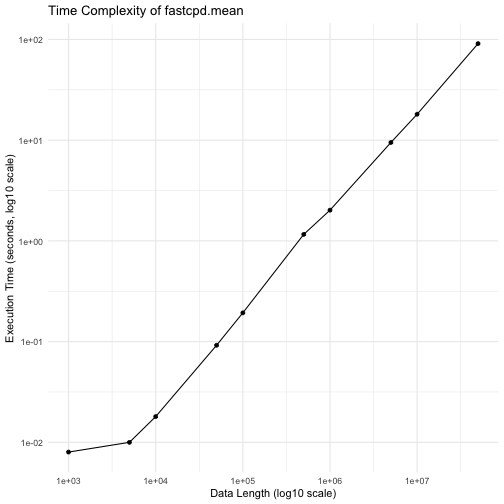

# Introduction

This vignette examines two aspects of the **fastcpd** package:

1. **Time Complexity of `fastcpd.mean()`:**
   We assess how the execution time scales with the length of the data.

2. **Impact of SeDG in `fastcpd.lasso()`:**
   We simulate a Lasso regression setting with multiple change points and compare the detected change points under two settings of the `vanilla_percentage` parameter. This highlights the performance improvement provided by SeDG.

# Time Complexity Simulation for `fastcpd.mean()`

In this section, we generate multivariate normal data with varying lengths and measure the execution time of the `fastcpd.mean()` function. We then create a log-log plot of the execution times and perform a linear regression on the log-transformed data to estimate the power law coefficient.


``` r
# Load necessary libraries
library(ggplot2)
library(fastcpd)

# Set a seed for reproducibility
set.seed(1)

# Define a sequence of data lengths
ns <- 1e+3 * c(1, 5, 10, 50, 100, 500, 1000, 5000, 1e+4, 5e+4)
p <- 4  # Dimensionality of the data

# Evaluate execution times for each data length
execution_times <- numeric(length(ns))

for (i in seq_along(ns)) {
  execution_times[i] <- system.time(fastcpd.mean(
    mvtnorm::rmvnorm(ns[i], mean = rep(0, p), sigma = diag(1, p)),
    r.progress = FALSE,
    cp_only = TRUE
  ))[[1]]
}

# Prepare data for plotting
time_data <- data.frame(
  n = ns,
  time = execution_times
)

# Plot execution times on a log-log scale
ggplot(time_data, aes(x = n, y = time)) +
  geom_point() +
  geom_line() +
  scale_x_log10() +
  scale_y_log10() +
  labs(
    title = "Time Complexity of fastcpd.mean",
    x = "Data Length (log10 scale)",
    y = "Execution Time (seconds, log10 scale)"
  ) +
  theme_minimal()
```



``` r

# Log-transform the data for linear regression
log_ns <- log10(ns)
log_times <- log10(execution_times)

# Perform linear regression to estimate the power coefficient
regression_model <- lm(log_times ~ log_ns)
summary(regression_model)
#> 
#> Call:
#> lm(formula = log_times ~ log_ns)
#> 
#> Residuals:
#>      Min       1Q   Median       3Q      Max 
#> -0.18758 -0.11814  0.01454  0.03862  0.38958 
#> 
#> Coefficients:
#>             Estimate Std. Error t value Pr(>|t|)    
#> (Intercept) -5.27452    0.21144  -24.95 7.13e-09 ***
#> log_ns       0.92934    0.03814   24.37 8.58e-09 ***
#> ---
#> Signif. codes:  0 '***' 0.001 '**' 0.01 '*' 0.05 '.' 0.1 ' ' 1
#> 
#> Residual standard error: 0.1757 on 8 degrees of freedom
#> Multiple R-squared:  0.9867,	Adjusted R-squared:  0.985 
#> F-statistic: 593.8 on 1 and 8 DF,  p-value: 8.582e-09

# Extract and display the slope (power coefficient)
power_coefficient <- coef(regression_model)[2]
power_coefficient
#>   log_ns 
#> 0.929341
```

# Impact of SeDG in `fastcpd.lasso()`

In this section, we simulate a Lasso regression model with change points. We compare the performance of the vanilla approach (without SeDG) and the SeDG-enhanced approach by varying the `vanilla_percentage` parameter. The detected change points are extracted for both settings.


``` r
# Load required libraries
library(fastcpd)

# Set seed for reproducibility
set.seed(1)

# Simulation parameters
n <- 480         # Total number of observations
p_true <- 6      # Number of true predictors with non-zero coefficients
p <- 50          # Total number of predictors

# Generate design matrix with n observations and p predictors
x <- mvtnorm::rmvnorm(n, rep(0, p), diag(p))

# Create true coefficient matrix for 4 segments
theta_0 <- rbind(
  runif(p_true, -5, -2),
  runif(p_true, -3, 3),
  runif(p_true, 2, 5),
  runif(p_true, -5, 5)
)
# Pad the coefficient matrix with zeros for the remaining predictors
theta_0 <- cbind(theta_0, matrix(0, ncol = p - p_true, nrow = 4))

# Simulate response variable with change points across segments
y <- c(
  x[1:80, ] %*% theta_0[1, ] + rnorm(80, 0, 2),
  x[81:200, ] %*% theta_0[2, ] + rnorm(120, 0, 2),
  x[201:320, ] %*% theta_0[3, ] + rnorm(120, 0, 2),
  x[321:n, ] %*% theta_0[4, ] + rnorm(160, 0, 2)
)

# Combine response and predictors into a data frame
lasso_data <- data.frame(y = y, x = x)

# Detect change points using fastcpd.lasso without SeDG (vanilla_percentage = 0)
system.time(result_seg_non_vanilla <- fastcpd.lasso(lasso_data, vanilla_percentage = 0, r.progress = FALSE))
#>    user  system elapsed 
#>   5.556   0.794   6.364
cat("Change points with SeDG (vanilla_percentage = 0):\n")
#> Change points with SeDG (vanilla_percentage = 0):
result_seg_non_vanilla@cp_set
#> [1]  79 203 320

# Detect change points using fastcpd.lasso with the vanilla approach (vanilla_percentage = 1)
system.time(result_seg_vanilla <- fastcpd.lasso(lasso_data, vanilla_percentage = 1, r.progress = FALSE))
#>    user  system elapsed 
#> 112.649   5.302 118.156
cat("Change points with vanilla approach (vanilla_percentage = 1):\n")
#> Change points with vanilla approach (vanilla_percentage = 1):
result_seg_vanilla@cp_set
#> [1] 200 321
```

# Notes

This document is generated by the following code:

```shell
R -e 'knitr::knit("vignettes/time-complexity.Rmd.original", output = "vignettes/time-complexity.Rmd")' && rm -rf vignettes/time-complexity && mv -f time-complexity vignettes
```

# Appendix: all code snippets


``` r
knitr::opts_chunk$set(
  collapse = TRUE, comment = "#>", eval = TRUE, warning = FALSE,
  fig.path="time-complexity/"
)
library(fastcpd)
# Load necessary libraries
library(ggplot2)
library(fastcpd)

# Set a seed for reproducibility
set.seed(1)

# Define a sequence of data lengths
ns <- 1e+3 * c(1, 5, 10, 50, 100, 500, 1000, 5000, 1e+4, 5e+4)
p <- 4  # Dimensionality of the data

# Evaluate execution times for each data length
execution_times <- numeric(length(ns))

for (i in seq_along(ns)) {
  execution_times[i] <- system.time(fastcpd.mean(
    mvtnorm::rmvnorm(ns[i], mean = rep(0, p), sigma = diag(1, p)),
    r.progress = FALSE,
    cp_only = TRUE
  ))[[1]]
}

# Prepare data for plotting
time_data <- data.frame(
  n = ns,
  time = execution_times
)

# Plot execution times on a log-log scale
ggplot(time_data, aes(x = n, y = time)) +
  geom_point() +
  geom_line() +
  scale_x_log10() +
  scale_y_log10() +
  labs(
    title = "Time Complexity of fastcpd.mean",
    x = "Data Length (log10 scale)",
    y = "Execution Time (seconds, log10 scale)"
  ) +
  theme_minimal()

# Log-transform the data for linear regression
log_ns <- log10(ns)
log_times <- log10(execution_times)

# Perform linear regression to estimate the power coefficient
regression_model <- lm(log_times ~ log_ns)
summary(regression_model)

# Extract and display the slope (power coefficient)
power_coefficient <- coef(regression_model)[2]
power_coefficient
# Load required libraries
library(fastcpd)

# Set seed for reproducibility
set.seed(1)

# Simulation parameters
n <- 480         # Total number of observations
p_true <- 6      # Number of true predictors with non-zero coefficients
p <- 50          # Total number of predictors

# Generate design matrix with n observations and p predictors
x <- mvtnorm::rmvnorm(n, rep(0, p), diag(p))

# Create true coefficient matrix for 4 segments
theta_0 <- rbind(
  runif(p_true, -5, -2),
  runif(p_true, -3, 3),
  runif(p_true, 2, 5),
  runif(p_true, -5, 5)
)
# Pad the coefficient matrix with zeros for the remaining predictors
theta_0 <- cbind(theta_0, matrix(0, ncol = p - p_true, nrow = 4))

# Simulate response variable with change points across segments
y <- c(
  x[1:80, ] %*% theta_0[1, ] + rnorm(80, 0, 2),
  x[81:200, ] %*% theta_0[2, ] + rnorm(120, 0, 2),
  x[201:320, ] %*% theta_0[3, ] + rnorm(120, 0, 2),
  x[321:n, ] %*% theta_0[4, ] + rnorm(160, 0, 2)
)

# Combine response and predictors into a data frame
lasso_data <- data.frame(y = y, x = x)

# Detect change points using fastcpd.lasso without SeDG (vanilla_percentage = 0)
system.time(result_seg_non_vanilla <- fastcpd.lasso(lasso_data, vanilla_percentage = 0, r.progress = FALSE))
cat("Change points with SeDG (vanilla_percentage = 0):\n")
result_seg_non_vanilla@cp_set

# Detect change points using fastcpd.lasso with the vanilla approach (vanilla_percentage = 1)
system.time(result_seg_vanilla <- fastcpd.lasso(lasso_data, vanilla_percentage = 1, r.progress = FALSE))
cat("Change points with vanilla approach (vanilla_percentage = 1):\n")
result_seg_vanilla@cp_set
```
